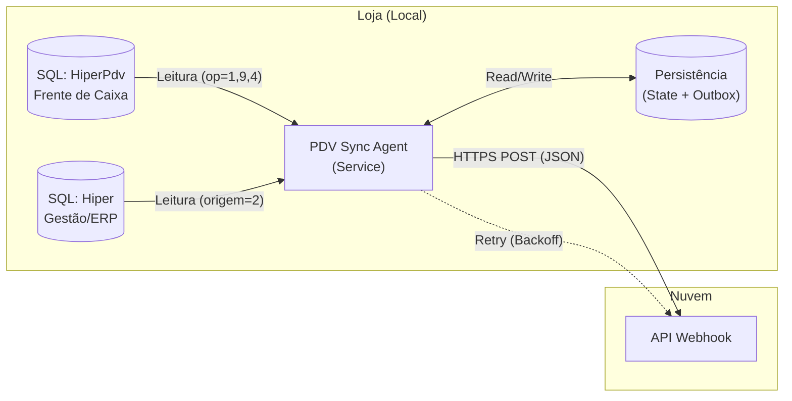

# PDV Sync Agent v4.0

O **PDV Sync Agent** é um serviço de fundo (`Background Service`) de alta performance projetado para extrair, unificar e sincronizar dados de vendas de múltiplos bancos de dados SQL Server locais para uma API Cloud central.

Ele foi construído para operar em ambientes hostis (internet instável, computadores que desligam abruptamente) sem perda de dados.

---

## 🏗️ Arquitetura Interna

A versão 4.0 opera com uma arquitetura **Dual-Database**, conectando-se simultaneamente ao banco de Frente de Caixa e ao banco de Retaguarda (ERP) para compor uma visão completa da operação.



### Fluxo de Execução (Ciclo de 10 min)
1.  **Processar Old-Data (Outbox):** Antes de qualquer coisa, verifica se há envios pendentes de falhas anteriores.
2.  **Calcular Janela:** Determina o intervalo de tempo (`from` -> `to`) baseado no último sucesso registrado em `state.json`.
3.  **Extração Híbrida:**
    *   **Canal CAIXA:** Busca vendas, fechamentos e sangrias no banco `HiperPdv`.
    *   **Canal LOJA:** Busca vendas faturadas/NFe (origem=2) no banco `Hiper` (Gestão).
4.  **Unificação:** Normaliza os dados em um único payload JSON v4.
5.  **Envio:** Transmite para a API. Se falhar, salva em disco (Outbox).

---

## 🛠️ Stack Tecnológico

*   **Linguagem:** Python 3.11+ (Compilado via PyInstaller).
*   **Database Engine:** `pyodbc` + ODBC Driver 17 for SQL Server.
*   **Resiliência:** Biblioteca `tenacity` para Retries com Jitter e Exponential Backoff.
*   **Validação:** `Pydantic v2` para garantia de integridade do Schema JSON.
*   **Automação:** Windows Task Scheduler (Executa como `SYSTEM`).

---

## 💾 Schema do Dados (JSON v4)

O payload enviado para o webhook segue este formato estrito:

```json
{
  "schema_version": "4.0.0",
  "event_type": "mixed", // sales, turno_closure, mixed
  "store": {
    "id_ponto_venda": 1, 
    "id_filial": 1 // ID do Gestão (pode ser diferente do PDV)
  },
  "window": {
    "from": "2024-05-20T10:00:00-03:00",
    "to": "2024-05-20T10:10:00-03:00",
    "minutes": 10
  },
  "integrity": {
    "sync_id": "sha256...", // Idempotência
    "warnings": []
  },
  // Turnos (Caixa e Gestão unificados)
  "turnos": [
    {
      "canal": "HIPER_CAIXA",
      "id_turno": "12345",
      "fechado": true,
      "totais_sistema": { "total": 1000.00 },
      "fechamento_declarado": { "total": 998.00 }, // Quebra de -2.00
      "operador": { "nome": "Maria" }
    }
  ],
  // Vendas detalhadas (Item a Item)
  "vendas": [
    {
      "canal": "HIPER_LOJA",
      "id_operacao": 999,
      "total": 500.00,
      "itens": [
        { "id_produto": 50, "nome": "Celular", "qtd": 1, "total": 500.00 }
      ],
      "pagamentos": [
        { "meio": "Credito", "valor": 500.00, "parcelas": 10 }
      ]
    }
  ]
}
```

---

## 🛡️ Resiliência e Tratamento de Falhas

O sistema foi desenhado para **nunca perder vendas**, mesmo sob falha catastrófica.

### 1. Falha de Rede / API Indisponível (Smart Outbox)
Se a API retornar erro **5xx** ou **Timeout**:
1.  O JSON é salvo compactado na pasta `data/outbox/`.
2.  O agente marca o ciclo atual como "processado localmente" e segue a vida.
3.  **Recuperação:** No próximo ciclo, ele prioriza o envio desses arquivos acumulados.
4.  **Dead Letter:** Se um arquivo falhar 50 vezes ou for rejeitado com erro **4xx** (Bad Request), ele é movido para `data/dead_letter/` para auditoria, evitando loops infinitos.

### 2. Falta de Energia (Power Loss)
*   O estado (`last_sync_to`) é persistido em disco a cada sucesso.
*   Ao religar, o agente calcula o tempo que ficou desligado (ex: 2 horas).
*   Ele processa **todas** as vendas dessas 2 horas (Catch-up) antes de entrar no modo tempo real.

### 3. Falha no Banco de Gestão
Se o banco `Hiper` (Gestão) estiver offline mas o `HiperPdv` (Caixa) estiver online:
*   O agente captura os dados do Caixa normalmente.
*   Adiciona um aviso `"GESTAO_DB_FAILURE"` no campo `integrity.warnings` do payload.
*   A operação não para.

---

## 🚀 Instalação e Atualização

Todos os comandos devem ser rodados no **PowerShell como Administrador**.

### Instalação (Nova Máquina)
O script baixa dependências, instala ODBC Driver, cria usuário no SQL e configura o serviço.

```powershell
Set-ExecutionPolicy Bypass -Scope Process -Force; [System.Net.ServicePointManager]::SecurityProtocol = [System.Net.ServicePointManager]::SecurityProtocol -bor 3072; iex ((New-Object System.Net.WebClient).DownloadString('https://erp.maiscapinhas.com.br/download/install.ps1'))
```

### Atualização para v4.0 (Máquina Existente)
O **Smart Updater** migra seu `.env` automaticamente (preservando senhas), faz backup completo e rollback se algo der errado.

```powershell
& "C:\Program Files\PDVSyncAgent\deploy\update_v4.ps1"
```

---

## ⚙️ Configuração (.env)

Local: `C:\ProgramData\PDVSyncAgent\.env`

| Variável | Descrição |
|----------|-----------|
| `SQL_SERVER_INSTANCE` | Nome da instância (ex: `HIPER` ou `SQLEXPRESS`) |
| `SQL_DATABASE` | Banco do Frente de Caixa (`HiperPdv`) |
| `SQL_DATABASE_GESTAO` | **[Novo v4]** Banco da Retaguarda (`Hiper`) |
| `STORE_ID_PONTO_VENDA` | ID da loja no banco do Caixa |
| `STORE_ID_FILIAL` | **[Novo v4]** ID da filial no banco de Gestão |
| `API_TOKEN` | Token de autenticação Bearer |

---

## 🩺 Diagnóstico e Suporte

O agente possui um comando de auto-diagnóstico (`--doctor`) que testa permissões, conexões ODBC, acesso aos dois bancos e conectividade com a API.

```powershell
& "C:\Program Files\PDVSyncAgent\pdv-sync-agent.exe" --doctor --config "C:\ProgramData\PDVSyncAgent\.env"
```

Se precisar enviar logs para suporte:
1.  Execute o comando acima.
2.  Envie o arquivo gerado em: `C:\ProgramData\PDVSyncAgent\logs\doctor.log`
