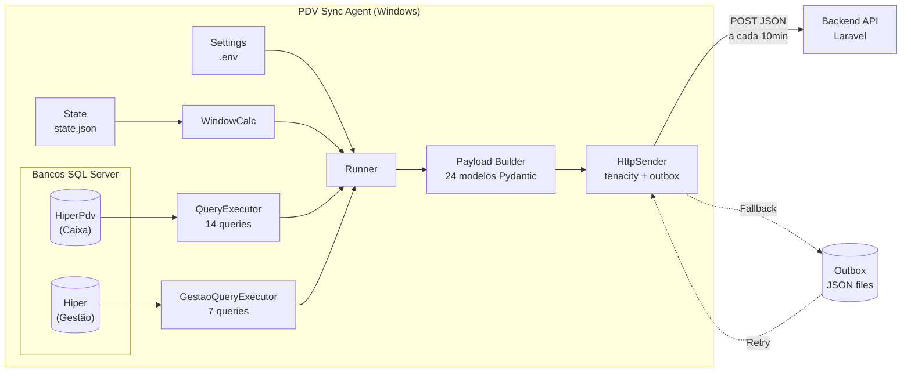
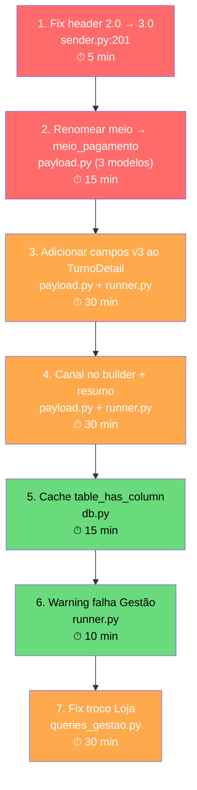

# Análise Completa — PDV Sync Agent v3.0

**Data:** 2026-02-12
**Projeto:** `pdv-sync-agent` (Python 3.11+)
**Versão:** 3.0.0 | Schema: 3.0
**Módulos analisados:** 9 arquivos, 3.098 linhas

---

## Arquitetura Atual



### Fluxo de Execução (runner.py)

```
1. Process outbox queue (retry payloads pendentes)
2. Calculate sync window (last_sync_to → now)
3. [HiperPdv] get_operation_ids() → ops_ids (HIPER_CAIXA)
4. [HiperPdv] _build_turnos() → TurnoDetail[] (com sistema/declarado/falta)
5. [HiperPdv] _build_sale_details() → SaleDetail[] marcados HIPER_CAIXA
6. [HiperPdv] get_sales_by_vendor() + get_payments_by_method() → resumo PDV
7. [Gestão] get_loja_operation_ids() → loja_ids (HIPER_LOJA)
8. [Gestão] _build_loja_sale_details() → SaleDetail[] marcados HIPER_LOJA
9. [Gestão] get_loja_sales_by_vendor() + get_loja_payments_by_method() → resumo Loja
10. Merge vendas = vendas_pdv + vendas_loja
11. Merge resumos = lists concatenados (sem tag canal!)
12. _build_turno_snapshots() → últimos 10 turnos fechados
13. _build_venda_snapshots_combined() → top 10 vendas recentes (PDV + Loja)
14. Decide if POST needed (has_sales OR has_closed_turno)
15. Send via HttpSender → API
16. mark_success(dt_to) se ok
```

---

## 🔴 Bugs Confirmados

### BUG-1: Header `X-PDV-Schema-Version` hardcoded como `"2.0"`

| | |
|---|---|
| **Arquivo** | [sender.py:201](file:///c:/Users/Usuario/Desktop/maiscapinhas/chupacabra/pdv-sync-agent/src/sender.py#L201) |
| **Impacto** | 🔴 P0 — O backend valida header vs body. Header diz `2.0`, body diz `3.0` → deveria dar 422 |
| **Gravidade** | Bug funcional que pode ou não estar sendo swallowed pelo backend |

```python
# ATUAL (sender.py:201)
"X-PDV-Schema-Version": "2.0",

# CORRETO
from . import SCHEMA_VERSION
"X-PDV-Schema-Version": SCHEMA_VERSION,  # "3.0"
```

### BUG-2: `TurnoDetail` não envia campos v3 que o backend espera

| | |
|---|---|
| **Arquivo** | [payload.py:124-136](file:///c:/Users/Usuario/Desktop/maiscapinhas/chupacabra/pdv-sync-agent/src/payload.py#L124-L136) |
| **Impacto** | 🟡 P1 — Backend lê `turno.duracao_minutos`, `turno.periodo`, `turno.qtd_vendas`, `turno.total_vendas`, `turno.qtd_vendedores` mas eles são NULL/0 |

O backend (`ProcessPdvSyncJob.php:298-308`) extrai esses campos dos `turnos[]`:

```php
'duracao_minutos' => $this->asInt(data_get($turno, 'duracao_minutos')),
'periodo' => $this->asString(data_get($turno, 'periodo')),
'qtd_vendas' => max(0, (int) data_get($turno, 'qtd_vendas', 0)),
'total_vendas' => $this->asDecimal(data_get($turno, 'total_vendas', 0), 2),
'qtd_vendedores' => max(0, (int) data_get($turno, 'qtd_vendedores', 0)),
```

Mas o `TurnoDetail` não tem esses campos — eles só existem no `TurnoSnapshot`:

| Campo | `TurnoDetail` | `TurnoSnapshot` | Backend lê de |
|---|---|---|---|
| `duracao_minutos` | ❌ | ✅ | `turnos[]` |
| `periodo` | ❌ | ✅ | `turnos[]` |
| `qtd_vendas` | ❌ | ✅ | `turnos[]` |
| `total_vendas` | ❌ | ✅ | `turnos[]` |
| `qtd_vendedores` | ❌ | ✅ | `turnos[]` |

**Resultado:** Colunas `duracao_minutos`, `periodo`, `qtd_vendas`, `total_vendas`, `qtd_vendedores` em `pdv_turnos` estão **sempre NULL/0** quando vêm de eventos, e só são populadas via `processSnapshotTurnos()`. Isso funciona, mas com atraso — os valores corretos só chegam quando o turno aparece no snapshot.

### BUG-3: `table_has_column()` sem cache — executa query a cada chamada

| | |
|---|---|
| **Arquivo** | [db.py:161-164](file:///c:/Users/Usuario/Desktop/maiscapinhas/chupacabra/pdv-sync-agent/src/db.py#L161-L164) |
| **Impacto** | 🟡 Performance — Cada chamada a `get_sale_payments()`, `get_turno_closure_values()`, etc. gera uma query `INFORMATION_SCHEMA.COLUMNS` |

```python
# ATUAL — executa SELECT COLUMN_NAME FROM INFORMATION_SCHEMA.COLUMNS toda vez
def table_has_column(self, table_name: str, column_name: str) -> bool:
    columns = self.get_table_columns(table_name)
    return column_name.lower() in [c.lower() for c in columns]
```

Chamado em **5 métodos** diferentes (`get_store_info`, `get_turno_closure_values`, `get_turno_shortage_values`, `get_payments_by_method`, `get_sale_payments`), resultando em **5+ queries extras** por ciclo de sync.

---

## 🟡 Gaps Estruturais no JSON

### GAP-1: `resumo` não discrimina por canal

| | |
|---|---|
| **Arquivo** | [runner.py:190-192](file:///c:/Users/Usuario/Desktop/maiscapinhas/chupacabra/pdv-sync-agent/src/runner.py#L190-L192) |
| **Impacto** | 🟡 — Backend não processa `resumo`, mas quando processar, não saberá separar |

```python
# ATUAL — concatena listas cegamente
vendas = vendas_pdv + vendas_loja
sales_by_vendor = sales_by_vendor_pdv + sales_by_vendor_loja  # ← sem tag canal!
payments_by_method = payments_by_method_pdv + payments_by_method_loja  # ← idem
```

As listas de `by_vendor` e `by_payment` contêm vendedores de **ambos os canais misturados**. Se o mesmo `id_usuario_vendedor` vendeu via Caixa e via Loja, aparecem como entradas separadas mas sem indicar de qual canal veio cada uma.

**Fix proposto:** Adicionar campo `canal` em `VendorSale` e `PaymentMethod`:

```python
class VendorSale(BaseModel):
    canal: str = "HIPER_CAIXA"  # ← NOVO
    id_usuario: Optional[int] = None
    nome: Optional[str] = None
    qtd_cupons: int = 0
    total_vendido: Decimal = Decimal("0.00")
```

### GAP-2: `SalePayment.meio` vs `meio_pagamento` — nome inconsistente

O agente envia `"meio"` (linha 164 de payload.py), mas o backend lê `'meio_pagamento'`:

```php
// ProcessPdvSyncJob.php:567
'meio_pagamento' => $this->asString(data_get($pay, 'meio_pagamento')),
```

O campo `meio` do JSON nunca chega ao backend. Ele precisa ser renomeado ou o backend precisa ler `meio`.

> [!CAUTION]
> Este gap faz com que a coluna `meio_pagamento` em `pdv_venda_pagamentos` fique **sempre NULL** para pagamentos individuais.

### GAP-3: `PaymentTotal.meio` — mesmo problema no turno

```python
# payload.py:97
class PaymentTotal(BaseModel):
    meio: Optional[str] = None  # Agente envia "meio"
```

```php
// ProcessPdvSyncJob.php:329 (buildTurnoPagamentoRows)
'meio_pagamento' => $this->asString(data_get($entry, 'meio_pagamento')),
```

O backend lê `meio_pagamento` mas o agente envia `meio`. **Resultado:** Coluna `meio_pagamento` em `pdv_turno_pagamentos` também fica NULL.

### GAP-4: Vendas Loja sem `line_no` no pagamento

| | |
|---|---|
| **Arquivo** | [queries_gestao.py:168-191](file:///c:/Users/Usuario/Desktop/maiscapinhas/chupacabra/pdv-sync-agent/src/queries_gestao.py#L168-L191) |
| **Impacto** | 🟡 — Backend confia em `line_no` como fallback key |

```sql
-- queries_gestao.py: get_loja_sale_payments()
SELECT
    fo.id_finalizador_operacao_pdv AS line_id,
    fo.id_operacao,
    fo.id_finalizador,
    fpv.nome AS meio_pagamento,
    fo.valor,
    ops.valor_troco_op AS valor_troco,
    fo.parcela
-- ⚠️ NÃO tem line_no!
```

O campo `line_no` não é selecionado para pagamentos da Gestão. O `SalePayment` não tem `line_no` de qualquer forma, então a query PDV (`queries.py:504-524`) também não seleciona. Mas o backend usa `line_no` como parte da unique constraint fallback.

### GAP-5: `build_sale_details()` não seta `canal` — patch pós-build

| | |
|---|---|
| **Arquivo** | [payload.py:406-491](file:///c:/Users/Usuario/Desktop/maiscapinhas/chupacabra/pdv-sync-agent/src/payload.py#L406-L491) |

```python
# runner.py:419-422 — canal é settado DEPOIS do build
vendas = build_sale_details(sale_items, sale_payments)
for v in vendas:
    v.canal = canal  # ← patch manual
```

Funciona, mas é frágil. Se alguém chamar `build_sale_details()` diretamente sem o patch, o canal fica como default `"HIPER_CAIXA"`.

### GAP-6: `troco` em pagamentos Loja é por operação, não por linha

```sql
-- queries_gestao.py:170
SELECT id_operacao, ISNULL(ValorTroco, 0) AS valor_troco_op
-- ↑ troco da OPERAÇÃO inteira, não por finalizador

-- queries_gestao.py:185
ops.valor_troco_op AS valor_troco
-- ↑ TODOS os finalizadores da mesma venda recebem o MESMO troco
```

Se uma venda Loja tem 2 pagamentos (Dinheiro + Cartão), ambos terão `valor_troco` = total da operação. Deveria ser **0 para cartão** e o troco real só para dinheiro.

---

## 🟢 Melhorias de Performance

### PERF-1: Subqueries correlacionadas nos snapshots

| | |
|---|---|
| **Arquivo** | [queries.py:581-630](file:///c:/Users/Usuario/Desktop/maiscapinhas/chupacabra/pdv-sync-agent/src/queries.py#L581-L630) |
| **Impacto** | Lentidão em lojas com muitos turnos |

`get_turno_snapshot()` usa **5 subqueries correlacionadas** (qtd_vendas, total_vendas, id_responsavel, nome_responsavel, qtd_vendedores). Para 10 turnos, são 50 subqueries.

**Fix:** Reescrever com CTEs e JOINs:

```sql
WITH turno_stats AS (
    SELECT t.id_turno,
           COUNT(DISTINCT op.id_operacao) AS qtd_vendas,
           SUM(it.valor_total_liquido) AS total_vendas,
           COUNT(DISTINCT it.id_usuario_vendedor) AS qtd_vendedores
    FROM dbo.turno t
    JOIN dbo.operacao_pdv op ON op.id_turno = t.id_turno AND op.operacao = 1 AND op.cancelado = 0
    JOIN dbo.item_operacao_pdv it ON it.id_operacao = op.id_operacao AND it.cancelado = 0
    WHERE t.id_ponto_venda = ? AND t.fechado = 1
    GROUP BY t.id_turno
),
responsavel AS (
    SELECT id_turno, id_usuario, nome,
           ROW_NUMBER() OVER (PARTITION BY id_turno ORDER BY cnt DESC, total DESC, id_usuario ASC) AS rn
    FROM (
        SELECT ov.id_turno, uv.id_usuario, uv.nome,
               COUNT(*) AS cnt, SUM(iv.valor_total_liquido) AS total
        FROM dbo.operacao_pdv ov
        JOIN dbo.item_operacao_pdv iv ON iv.id_operacao = ov.id_operacao
        JOIN dbo.usuario uv ON uv.id_usuario = iv.id_usuario_vendedor
        WHERE ov.operacao = 1 AND ov.cancelado = 0 AND iv.cancelado = 0
        GROUP BY ov.id_turno, uv.id_usuario, uv.nome
    ) sub
)
SELECT TOP 10 ...
```

### PERF-2: Sem cache de schema — `table_has_column` redundante

Cada ciclo executa ~5 queries `INFORMATION_SCHEMA.COLUMNS` idênticas. Fix simples:

```python
class DatabaseConnection:
    def __init__(self, settings):
        self._column_cache: dict[str, list[str]] = {}
    
    def get_table_columns(self, table_name: str) -> list[str]:
        if table_name not in self._column_cache:
            # ... execute query ...
            self._column_cache[table_name] = columns
        return self._column_cache[table_name]
```

### PERF-3: Sem paginação — janelas grandes podem explodir memória

Se o agente ficou offline por 24h e reconecta, a janela pode conter **milhares de vendas**. O `get_sale_items()` retorna tudo na memória de uma vez.

**Solução sugerida:** Chunking por blocos de tempo (1h) quando a janela > 2h:

```python
def _build_payload_chunked(self, dt_from, dt_to):
    delta = dt_to - dt_from
    if delta > timedelta(hours=2):
        # Split into 1-hour windows
        chunks = split_window(dt_from, dt_to, hours=1)
        for chunk_from, chunk_to in chunks:
            yield self._build_payload(chunk_from, chunk_to)
```

---

## 🟢 Melhorias de Resiliência

### RES-1: Falha Gestão é silenciosa — sem health check

```python
# runner.py:180-185
except Exception as e:
    logger.warning(f"[Gestão] Failed to fetch Loja data: {e}")
    loja_ids = []
    vendas_loja = []
    # ← Nenhuma warning no payload!
```

Se a conexão Gestão falha, o agente envia o payload **sem nenhuma indicação** de que dados Loja estão faltando. O backend não sabe que viu dados parciais.

**Fix:** Adicionar warning ao payload:

```python
except Exception as e:
    logger.warning(f"[Gestão] Failed to fetch Loja data: {e}")
    warnings.append(f"GESTAO_DB_FAILURE: {str(e)[:100]}")
```

### RES-2: Sem health check de conexão antes de iniciar

O agente não valida se as conexões estão ok antes de começar a coletar. Se o SQL Server travou entre ciclos, a falha só aparece na primeira query.

**Fix:** Adicionar check na inicialização do `run()`:

```python
def run(self):
    # Pre-flight check
    if not self.db.test_connection()[0]:
        logger.error("HiperPdv connection failed — skipping cycle")
        return False
```

### RES-3: Outbox retry processa todos sem backoff entre payloads

```python
# sender.py:306 — loop processa todos sequencialmente
for filepath in pending:
    # envia imediatamente, sem delay entre retries
```

Se houver 50 payloads pendentes e o backend está sobrecarregado, o agente dispara 50 POSTs em rajada. Deveria ter backoff entre retries:

```python
import time

for i, filepath in enumerate(pending):
    if i > 0:
        time.sleep(2)  # 2s entre retries
```

### RES-4: Estado é perdido se agente crashar mid-sync

O `mark_success(dt_to)` só acontece **após** o POST ser bem sucedido. Se o agente crashar entre step 3 (build payload) e step 4 (send), na próxima execução ele reprocessa a mesma janela — que é correto (idempotência). Mas se crashar durante o `mark_success`, a janela já foi enviada mas o state não foi atualizado. O payload será enviado **novamente** no próximo ciclo.

Isso é ok graças ao `sync_id` ser determinístico (SHA256 de store+from+to), que garante dedup no backend — **mas só se o backend usar `sync_id` como constraint**, o que ele faz via `pdv_syncs.sync_id` unique.

---

## 🟢 Melhorias Estruturais

### STRUCT-1: `TurnoInfo` legado ainda no código

```python
# payload.py:253-262 — morto, nunca usado
class TurnoInfo(BaseModel):
    """Legacy turno info (kept for reference, not used in v2 payload)."""
```

Pode ser removido. Polui o namespace e confunde leitura.

### STRUCT-2: Docstrings desatualizadas

```python
# payload.py:1-2
"""Pydantic models for the sync payload v2.0."""  # ← deveria ser v3.0

# payload.py:82-83
# Turno Models (NEW in v2.0)  # ← são v2.0 mesmo

# payload.py:139-141
# Sale Detail Models (NEW in v2.0)  # ← idem
```

### STRUCT-3: Sem tipagem de retorno para queries SQL

```python
# queries.py retorna list[dict[str, Any]] para tudo
# Não há TypedDict ou dataclass para as rows
```

Isso dificulta refatoração e autocompletion. Sugestão para v3.1:

```python
class TurnoRow(TypedDict):
    id_turno: str
    sequencial: int
    fechado: bool
    data_hora_inicio: datetime
    data_hora_termino: Optional[datetime]
    id_operador: int
    nome_operador: str
```

### STRUCT-4: Falta testes unitários

Apenas **1 test file** encontrado: `test_pr09_turno_aware.py`. Sem cobertura para:
- `build_sale_details()` (canal propagation)
- `build_turno_detail()` (fechamento/falta)
- `OutboxManager` (save/load/retry cycle)
- `WindowCalculator` (edge cases: midnight, DST, etc.)
- `json_dumps` (Decimal serialization)

---

## Tabela de Prioridades

| # | Issue | Tipo | Esforço | Risco se ignorar |
|---|---|---|---|---|
| BUG-1 | Header hardcoded `2.0` | 🔴 Bug | 5 min | Payloads rejeitados |
| GAP-2/3 | `meio` vs `meio_pagamento` | 🔴 Gap | 15 min | Colunas NULL |
| BUG-2 | TurnoDetail sem campos v3 | 🟡 Bug | 30 min | Dados atrasados |
| GAP-1 | Resumo sem canal | 🟡 Gap | 20 min | Dados misturados |
| GAP-5 | Canal não settado no builder | 🟡 Gap | 10 min | Fragilidade |
| GAP-6 | Troco Loja duplicado | 🟡 Gap | 30 min | Valores incorretos |
| RES-1 | Gestão failure silenciosa | 🟡 Resiliência | 10 min | Dados parciais |
| BUG-3 | table_has_column sem cache | 🟢 Perf | 15 min | Queries extras |
| PERF-1 | Subqueries correlacionadas | 🟢 Perf | 45 min | Lentidão |
| RES-2 | Sem health check | 🟢 Resiliência | 15 min | Falha tardia |
| RES-3 | Outbox sem backoff | 🟢 Resiliência | 5 min | Rajada de requests |
| PERF-3 | Sem chunking janelas grandes | 🟢 Perf | 1h | OOM em backlogs |
| STRUCT-1/2 | Cleanup legacy + docs | 🟢 Cleanup | 15 min | Confusão |
| STRUCT-3 | TypedDict para rows | 🟢 Typing | 2h | DX ruim |
| STRUCT-4 | Testes unitários | 🟢 Quality | 4h+ | Regressões |

---

## Resumo do JSON Atual vs Ideal

### Campos que o agente envia mas o backend ignora

| Campo | Local | Observação |
|---|---|---|
| `resumo.by_vendor[]` | payload root | Backend não processa — ignora silenciosamente |
| `resumo.by_payment[]` | payload root | Idem |
| `snapshot_vendas[].turno_seq` | snapshot | Null para Loja, opcional para PDV |
| `integrity.warnings[]` | payload root | Backend salva mas não atua |

### Campos que o backend lê mas o agente envia com nome errado

| Backend espera | Agente envia | Local |
|---|---|---|
| `meio_pagamento` | `meio` | `vendas[].pagamentos[].meio` |
| `meio_pagamento` | `meio` | `turnos[].totais_sistema.por_pagamento[].meio` |
| `meio_pagamento` | `meio` | `turnos[].fechamento_declarado.por_pagamento[].meio` |
| `meio_pagamento` | `meio` | `turnos[].falta_caixa.por_pagamento[].meio` |

### Campos que o backend lê mas o agente não envia

| Campo | Local backend | O que acontece |
|---|---|---|
| `turnos[].duracao_minutos` | Job:298 | NULL/0 |
| `turnos[].periodo` | Job:299 | NULL |
| `turnos[].qtd_vendas` | Job:306 | 0 |
| `turnos[].total_vendas` | Job:307 | 0.00 |
| `turnos[].qtd_vendedores` | Job:308 | 0 |

---

## Ordem de Fix Recomendada



**Steps 1-2 são blockers funcionais** — sem eles, dados chegam incorretos ou são rejeitados.
