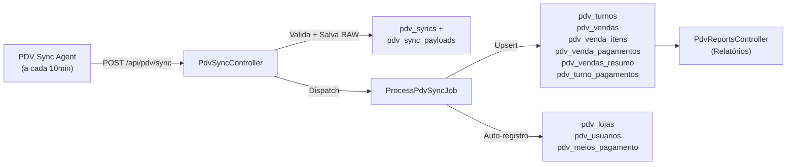

# Análise Completa do Backend PHP — Consumo do Webhook PDV Sync

> **Data:** 2026-02-12  
> **Escopo:** Rastreamento completo do fluxo de dados desde a recepção do webhook até a persistência em banco e consumo nos relatórios.

---

## 1. Arquitetura Geral



---

## 2. Fluxo de Ingestão (`PdvSyncController`)

| Etapa | O que faz | Risco |
|-------|-----------|-------|
| **1. Idempotência** | Busca sync existente por `sync_id` (UUID). Se já existe e `status=processed`, retorna 200 sem reprocessar | ✅ Seguro |
| **2. Validação schema** | Verifica campos obrigatórios: `agent`, `store`, `window` | ✅ Seguro |
| **3. Store Resolution** | `PdvStoreResolver::resolveFromPayload()` — resolve `store_pdv_id` → `store_id` (tabela ERP) | ⚠️ Ver seção 4 |
| **4. Persistência RAW** | Salva JSON completo em `pdv_sync_payloads.payload` (TEXT/LONGTEXT) | ✅ Auditável |
| **5. Criação PdvSync** | Cria registro em `pdv_syncs` com status `received`, schema_version, event_type, etc. | ✅ Seguro |
| **6. Dispatch Job** | `ProcessPdvSyncJob::dispatch($sync->id)` com retry policy (5 tentativas, backoff [10,30,60,120]s) | ✅ Resiliente |

> [!TIP]
> O payload RAW é **sempre preservado** independente do processamento. Isto é excelente para auditoria e reprocessamento futuro.

---

## 3. Fluxo de Processamento (`ProcessPdvSyncJob`)

### 3.1 Método `handle()` — Orchestração

```
1. Busca PdvSync + payload
2. Lock por loja (Cache::lock, 30s)
3. DB::transaction:
   a. resolveStoreContext()    → store_pdv_id + store_id
   b. processMasterData()      → auto-registra lojas, usuários, meios pgto
   c. resolveUserMappings()    → carrega pdv_user_mappings
   d. processTurnos()          → upsert pdv_turnos + pdv_turno_pagamentos
   e. processSnapshotTurnos()  → upsert pdv_turnos (snapshot data)
   f. processVendas()          → upsert pdv_vendas + itens + pagamentos
   g. processSnapshotVendas()  → upsert pdv_vendas_resumo
   h. mergeRuntimeRiskFlags()  → salva flags no sync
4. Mark status = "processed"
```

### 3.2 Estratégia de Upsert (Chaves Únicas)

| Tabela | Unique By | Implicação |
|--------|-----------|------------|
| `pdv_turnos` | `store_pdv_id`, `id_turno` | Turno é atualizado a cada sync. Último sync "vence". |
| `pdv_turno_pagamentos` | `store_pdv_id`, `id_turno`, `tipo`, `id_finalizador` | Pagamentos por turno são atualizados. |
| `pdv_vendas` | `store_pdv_id`, `canal`, `id_operacao` | Venda é **idempotente** — mesmo id_operacao não duplica. |
| `pdv_venda_itens` (c/ line_id) | `store_pdv_id`, `canal`, `line_id` | Item com line_id é **estável**. |
| `pdv_venda_itens` (fallback) | `store_pdv_id`, `canal`, `id_operacao`, `row_hash` | Item sem line_id usa hash do conteúdo. |
| `pdv_venda_pagamentos` | Idêntico ao padrão itens | Mesmo mecanismo line_id/row_hash. |
| `pdv_vendas_resumo` | `store_pdv_id`, `canal`, `id_operacao` | Snapshot venda é atualizado. |

> [!IMPORTANT]
> **O agente envia vendas do `window_from` ao `window_to`**. Se uma venda foi enviada em um ciclo anterior e apparece novamente, o upsert simplesmente atualiza — **não há duplicação, mas também não há DELETE**. Itens removidos no PDV local permanecem no ERP.

### 3.3 Canal de Venda

Duas constantes:
- `HIPER_CAIXA` — vendas do caixa (PDV)
- `HIPER_LOJA` — vendas da Gestão (loja)

O canal é resolvido no `resolveVendaCanal()` e defaults para `HIPER_CAIXA` se inválido.

---

## 4. Resolução de Loja (`PdvStoreResolver`)

### Cadeia de Fallback (em ordem):

```
1. CNPJ (se disponível) → match exato por CNPJ normalizado (apenas dígitos)
2. Alias (se disponível) → match case-insensitive por alias
3. Nome (se disponível) → match case-insensitive por nome vs alias mapeado  
4. pdv_store_id only → fallback por ID numérico apenas
```

### Resultados possíveis:

| Status | Significado | `store_id` | Ação |
|--------|-------------|------------|------|
| `resolved` | Match único encontrado | ✅ Preenchido | Dados vinculados à loja ERP |
| `ambiguous` | Múltiplos matches | ❌ null | Dados salvos SEM vínculo à loja |
| `missing` | Nenhum match | ❌ null | Dados salvos SEM vínculo à loja |

> [!WARNING]
> **Quando `store_id` é null, os dados de vendas/turnos são salvos com `store_id = null`**. Isso significa que os relatórios que filtram por `store_id` **NÃO vão mostrar esses dados**. Eles existem no banco mas são "invisíveis" nos reports.

### Risk Flags gerados:
- `store_mapping_missing` — nenhum mapping existe
- `store_mapping_ambiguous` — múltiplos mappings
- `store_mapping_by_id_fallback` — match apenas por ID numérico (menos confiável)
- `store_alias_mismatch` — alias do payload difere do alias mapeado

---

## 5. Resolução de Usuário (`PdvUserResolver`)

### Cadeia de Resolução:

```
1. Login normalizado (lowercase) → busca em pdv_user_mappings.pdv_user_login
2. pdv_user_id → busca em pdv_user_mappings.pdv_user_id (fallback)
3. Detecção de conflito: se login e ID resolvem para users diferentes → flag "user_login_mismatch"
4. Detecção de operador: se is_store_operator=true → retorna null (operador não é vendedor)
```

### Resultados:
| Status | `user_id` | Significado |
|--------|-----------|-------------|
| `resolved` | ✅ int | Usuário mapeado ao ERP |
| `operator` | null | É operador de caixa, não vendedor |
| `missing` | null | Sem mapping no `pdv_user_mappings` |
| `empty` | null | Sem `id_usuario` nem `login` no payload |

> [!CAUTION]
> **Se o mapping não existe em `pdv_user_mappings`, o `vendedor_user_id` / `operador_user_id` será NULL nos dados persistidos.** Isso afeta diretamente os relatórios por vendedor. O vendedor aparece pelo nome (`vendedor_nome`) mas sem linkagem ao ERP.

---

## 6. Auto-Registro de Dados Mestre (`processMasterData`)

O Job **automaticamente** registra/atualiza 3 tabelas de catálogo:

### 6.1 `pdv_lojas`
- Busca/cria por `id_ponto_venda`
- Salva `nome_hiper`, `alias`
- **Não sobrescreve** `nome_padronizado` (mantém nome editado manualmente)

### 6.2 `pdv_usuarios`
- Observa todos os `id_usuario` de: turnos, vendas (itens), snapshots, resumo
- Busca/cria por `id_usuario_hiper`
- Salva `nome_hiper`, `papel` (OPERADOR/VENDEDOR), `login_hiper`
- Backfill de login: se o payload não trouxe login, tenta buscar do `pdv_user_mappings`
- **Papel só é promovido** para OPERADOR, nunca rebaixado

### 6.3 `pdv_meios_pagamento`
- Observa todos `id_finalizador` de turnos, vendas
- Auto-categoriza: PIX, DEBITO, CREDITO, DINHEIRO, VALE, CHEQUE
- **Não sobrescreve** `categoria` se já preenchida

---

## 7. Snapshot Cross-Reference (`touchLastSeenInSnapshot`)

Quando snapshots de vendas são processados, o Job marca em `pdv_vendas` o campo `last_seen_in_snapshot_at` para cada venda que apareceu no snapshot.

**Utilidade:** Permite detectar vendas que foram registradas (`pdv_vendas`) mas que NÃO apareceram no snapshot mais recente — possível indicador de venda que existe no banco local mas não é mais visível.

---

## 8. Vetores de Risco de Perda de Dados

### 🔴 RISCO ALTO

| # | Vetor | Descrição | Impacto |
|---|-------|-----------|---------|
| R1 | **Store não mapeada** | Se `pdv_store_mappings` não tem o `store_pdv_id`, `store_id` fica null. Vendas são salvas mas invisíveis nos relatórios. | Vendas "desaparecem" dos reports |
| R2 | **User não mapeado** | Se `pdv_user_mappings` não tem o vendedor, `vendedor_user_id` fica null. Relatórios por vendedor não consideram essas vendas. | Ranking de vendedores incompleto |
| R3 | **Payload total > limite** | Se JSON exceder MAX_ALLOWED_PACKET do MySQL ou limites de corpo HTTP, o webhook falha silenciosamente. | Sync inteiro perdido |

### 🟡 RISCO MÉDIO

| # | Vetor | Descrição | Impacto |
|---|-------|-----------|---------|
| R4 | **Lock timeout** | Se o lock de 30s expira enquanto outra sync está processando, o job é re-enqueued com delay de 10s. Com alto volume, pode causar fila. | Atraso no processamento |
| R5 | **Turno antigo sem data filter** | Turnos `fechado=false` sem filtro de data são enviados em todo payload. Consome espaço e processa desnecessariamente. | Performance |
| R6 | **Canal default** | Se canal é inválido, defaults para `HIPER_CAIXA`. Se era um canal novo não implementado, dados podem ficar com canal errado. | Categorização errada |

### 🟢 RISCO BAIXO (Mitigado)

| # | Vetor | Descrição | Mitigação |
|---|-------|-----------|-----------|
| R7 | Sync duplicada | Mesmo `sync_id` reenviado | Idempotência por sync_id no Controller |
| R8 | Venda duplicada | Mesma venda em múltiplos ciclos | Upsert por `store_pdv_id+canal+id_operacao` |
| R9 | Job falha | Exceção durante processamento | 5 retries com backoff exponencial |

---

## 9. Fluxo de Relatórios (`PdvReportsController`)

### 9.1 Endpoints Identificados

| Endpoint | Fonte de Dados | Filtros |
|----------|---------------|---------|
| Turnos | `pdv_turnos` | `store_id`, datas, operador |
| Vendas | `pdv_vendas` + joins para itens/pagamentos | `store_id`, datas, vendedor |
| Ranking | `pdv_vendas_resumo` ou `pdv_venda_itens` | `store_id`, datas, vendedor |

> [!WARNING]
> **Todos os relatórios filtram por `store_id`**. Se a loja não foi resolvida (R1), os dados NÃO aparecem nos reports. Isso pode criar uma falsa impressão de "zero vendas" quando na verdade os dados existem mas sem linkagem.

---

## 10. Perguntas para o Time de Backend

### P1 — Monitoramento de Mappings Faltantes

> Existe algum dashboard ou alerta monitorando os registros `pdv_syncs` com `risk_flags` contendo `store_mapping_missing` ou `user_mapping_missing`? Se não, como garantimos que vendas com `store_id=null` serão eventualmente vinculadas?

### P2 — Reprocessamento Retroativo

> Quando um novo `pdv_store_mapping` ou `pdv_user_mapping` é criado, existe alguma rotina que reprocessa os syncs anteriores que ficaram com `store_id=null` ou `vendedor_user_id=null`? Ou os dados históricos ficam permanentemente "desvinculados"?

### P3 — Limite de Payload

> Qual é o limite configurado para o tamanho do corpo do POST no NGINX/PHP? Temos lojas com muitas vendas por ciclo (10min). Se um payload exceder o limite, temos log/alerta disso?

### P4 — Contagem de Itens Não Mapeados

> É possível rodar uma query rápida para verificar quantos registros em `pdv_vendas` têm `store_id IS NULL` e quantos em `pdv_venda_itens` têm `vendedor_user_id IS NULL`? Isso nos daria uma dimensão do gap.

**Query sugerida:**
```sql
-- Vendas sem store_id
SELECT COUNT(*) as vendas_sem_loja, 
       COUNT(DISTINCT store_pdv_id) as lojas_afetadas
FROM pdv_vendas 
WHERE store_id IS NULL;

-- Itens sem vendedor_user_id
SELECT COUNT(*) as itens_sem_vendedor,
       COUNT(DISTINCT vendedor_pdv_id) as vendedores_afetados
FROM pdv_venda_itens 
WHERE vendedor_user_id IS NULL 
  AND vendedor_pdv_id IS NOT NULL;

-- Syncs com risk flags
SELECT risk_flags, COUNT(*) as total
FROM pdv_syncs
WHERE risk_flags IS NOT NULL 
  AND risk_flags != '[]'
GROUP BY risk_flags
ORDER BY total DESC;
```

### P5 — Snapshot vs Vendas

> O campo `last_seen_in_snapshot_at` em `pdv_vendas` é utilizado em algum relatório ou alerta? Existem vendas que foram registradas mas nunca apareceram em snapshot? Isso indicaria inconsistência entre dados do agente e dados do banco local.

### P6 — Turnos Antigos

> Conforme documentado em `ANALISE_TURNOS_E_LOGIN_NULL.md`, o agente envia turnos antigos não fechados (`fechado=false`) em todo payload. O backend está filtrando esses turnos nos relatórios por data? Ou eles inflam os totais?

### P7 — Tabela `pdv_user_mappings`

> Quantos registros ativos existem em `pdv_user_mappings`? Todos os vendedores de todas as lojas estão mapeados? Existe um processo para manter essa tabela atualizada quando novos vendedores são cadastrados no HiperPdv?

---

## 11. Recomendações

### Curto Prazo (Imediato)
1. **Executar queries P4** para dimensionar o gap de mappings faltantes
2. **Criar alerta** para syncs com `risk_flags` não-vazios (pode ser n8n workflow)
3. **Verificar** `pdv_store_mappings` — garantir que todas as lojas ativas estão mapeadas

### Médio Prazo
4. **Implementar reprocessamento retroativo**: quando um novo mapping é criado, um job varre syncs anteriores e atualiza `store_id`/`user_id`
5. **Adicionar filtro de data** na query de turnos do agente (já recomendado em análise anterior)
6. **Dashboard de integridade**: relatório mostrando syncs recebidos vs processados vs com risk_flags

### Longo Prazo
7. **Migrar para CNPJ como chave primária de store** — elimina dependência de `pdv_store_mappings`
8. **Migrar para login como chave primária de user** — elimina dependência de `pdv_user_mappings`
