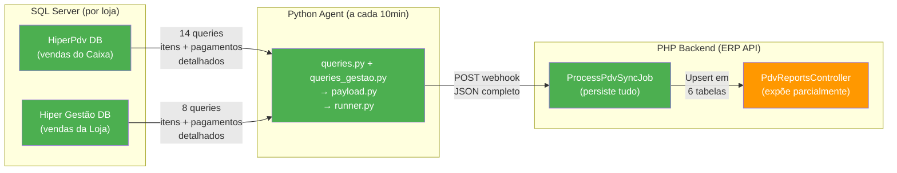

# Análise de Cobertura Cruzada — Python Agent × SQL Server × PHP Backend

> **Data:** 2026-02-12  
> **Escopo:** Verificação completa se o webhook de 10 minutos cobre todos os detalhes de vendas das 12 lojas, e o que o PHP já faz vs. o que falta.

---

## 1. Resumo Executivo



> [!IMPORTANT]
> **O agente Python JÁ envia TODOS os dados granulares** (itens com nome do produto, código de barras, preço unitário, desconto, vendedor + pagamentos com meio, valor, troco, parcelas) de AMBOS os canais (PDV Caixa + Gestão Loja). **O PHP JÁ persiste tudo no banco.** O gap está apenas na **exposição via API** — o endpoint de vendas retorna apenas contadores agregados.

---

## 2. O que o Python Agent Coleta do SQL Server

### 2.1 Canal HIPER_CAIXA (HiperPdv DB)

| Query | Dados Coletados | Campos Detalhados |
|-------|----------------|-------------------|
| `get_store_info` | Identificação da loja | `id_ponto_venda`, `nome`, `cnpj` |
| `get_turnos_with_activity` | Turnos ativos na janela | `id_turno`, `sequencial`, `fechado`, datas, `id_operador`, `nome_operador`, **`login_operador`** |
| `get_payments_by_method_for_turno` | Totais sistema por turno | `id_finalizador`, `meio_pagamento`, `qtd_vendas`, `total_pago` |
| `get_turno_closure_values` | Valores declarados (op=9) | `id_finalizador`, `meio_pagamento`, `total_declarado` |
| `get_turno_shortage_values` | Falta de caixa (op=4) | `id_finalizador`, `meio_pagamento`, `total_falta` |
| `get_turno_responsavel` | Vendedor principal | `id_usuario`, `nome`, **`login`** |
| **`get_sale_items`** | **Itens individuais** | **`line_id`, `line_no`, `id_produto`, `codigo_barras`, `nome_produto`, `qtd`, `preco_unit`, `total_item`, `desconto_item`, `id_usuario_vendedor`, `nome_vendedor`, `login_vendedor`** |
| **`get_sale_payments`** | **Pagamentos individuais** | **`line_id`, `id_finalizador`, `meio_pagamento`, `valor`, `valor_troco`, `parcela`** |
| `get_operation_ids` | IDs para deduplicação | `id_operacao` |
| `get_sales_by_vendor` | Resumo por vendedor | `id_usuario_vendedor`, `vendedor_nome`, **`vendedor_login`**, `qtd_cupons`, `total_vendido` |
| `get_payments_by_method` | Resumo por meio pgto | `id_finalizador`, `meio_pagamento`, `qtd_vendas`, `total_pago` |
| `get_turno_snapshot` | Últimos 10 turnos fechados | Dados completos com login |
| `get_vendas_snapshot` | Últimas 10 vendas | Resumo com vendedor e login |

### 2.2 Canal HIPER_LOJA (Hiper Gestão DB)

| Query | Dados Coletados | Diferença do PDV |
|-------|----------------|-----------------|
| `get_loja_operation_ids` | IDs para deduplição | Filtra `origem=2`, `id_filial` |
| **`get_loja_sale_items`** | **Itens individuais** | Mesmos campos exceto **sem `login_vendedor`** |
| **`get_loja_sale_payments`** | **Pagamentos individuais** | `valor_troco` vem de `operacao_pdv.ValorTroco` (não de `finalizador_operacao_pdv`) |
| `get_loja_sales_by_vendor` | Resumo por vendedor | **Sem `vendedor_login`** |
| `get_loja_payments_by_method` | Resumo por meio pgto | Idêntico |
| `get_loja_vendas_snapshot` | Últimas 10 vendas Loja | Sem `login_vendedor` |

> [!WARNING]
> **O canal HIPER_LOJA (Gestão) NÃO envia `login_vendedor`** nos itens de venda. A query `get_loja_sale_items` busca `uv.nome` mas não `uv.login`. Isso dificulta o mapping de vendedores via login para vendas Loja.

---

## 3. O que o Webhook Envia (Payload JSON)

### Estrutura completa por webhook (a cada 10 min):

```json
{
  "schema_version": "3.0",
  "event_type": "sales|turno_closure|mixed",
  "agent": { "version", "machine", "sent_at" },
  "store": { "id_ponto_venda", "nome", "alias", "cnpj" },
  "window": { "from", "to", "minutes" },
  "turnos": [{
    "id_turno", "sequencial", "fechado", "data_hora_inicio/termino",
    "duracao_minutos", "periodo",
    "operador": { "id_usuario", "nome", "login" },
    "responsavel": { "id_usuario", "nome", "login" },
    "qtd_vendas", "total_vendas", "qtd_vendedores",
    "totais_sistema": { "total", "qtd_vendas", "por_pagamento[]" },
    "fechamento_declarado": { "total", "por_pagamento[]" },
    "falta_caixa": { "total", "por_pagamento[]" }
  }],
  "vendas": [{
    "id_operacao", "canal", "data_hora", "id_turno", "total",
    "itens": [{
      "line_id", "line_no", "id_produto", "codigo_barras",
      "nome", "qtd", "preco_unit", "total", "desconto",
      "vendedor": { "id_usuario", "nome", "login" }
    }],
    "pagamentos": [{
      "line_id", "id_finalizador", "meio", "valor", "troco", "parcelas"
    }]
  }],
  "resumo": {
    "by_vendor": [{ "id_usuario", "nome", "login", "qtd_cupons", "total_vendido" }],
    "by_payment": [{ "id_finalizador", "meio", "total" }]
  },
  "snapshot_turnos": [/* últimos 10 turnos fechados */],
  "snapshot_vendas": [/* últimas 10 vendas (PDV+Loja combinadas) */],
  "ops": { "count", "ids[]", "loja_count", "loja_ids[]" },
  "integrity": { "sync_id", "warnings[]" }
}
```

> [!TIP]
> **Cada venda inclui a lista COMPLETA de itens e pagamentos.** O webhook NÃO é apenas um resumo — ele é um extrato granular completo.

---

## 4. O que o PHP Persiste (✅ Correto)

### 4.1 Tabelas de Dados de Vendas

| Tabela | Dados Persistidos | Unique By |
|--------|------------------|-----------|
| `pdv_vendas` | id_operacao, canal, data_hora, total, id_turno, store_pdv_id, store_id | `store_pdv_id + canal + id_operacao` |
| `pdv_venda_itens` | **line_id, line_no, id_produto, codigo_barras, nome_produto, qtd, preco_unit, total, desconto, vendedor_pdv_id, vendedor_nome, vendedor_user_id** | `store_pdv_id + canal + line_id` (ou row_hash) |
| `pdv_venda_pagamentos` | **line_id, id_finalizador, meio_pagamento, valor, troco, parcelas** | `store_pdv_id + canal + line_id` (ou row_hash) |
| `pdv_turnos` | id_turno + todos os campos do turno + totais | `store_pdv_id + id_turno` |
| `pdv_turno_pagamentos` | sistema/declarado/falta por finalizador | `store_pdv_id + id_turno + tipo + id_finalizador` |
| `pdv_vendas_resumo` | Snapshot vendas (resumo) | `store_pdv_id + canal + id_operacao` |

### 4.2 Tabelas de Dados Mestre (Auto-registradas)

| Tabela | Dados | Fonte |
|--------|-------|-------|
| `pdv_lojas` | id_ponto_venda, nome_hiper, alias | payload.store |
| `pdv_usuarios` | id_usuario_hiper, nome_hiper, login_hiper, papel | Coletado de turnos, vendas, snapshots |
| `pdv_meios_pagamento` | id_finalizador, nome_hiper, categoria (auto) | Coletado de turnos, vendas |

> [!NOTE]
> **O PHP persiste TODOS os campos do webhook nos detalhes de vendas.** Os dados granulares (nome do produto, código de barras, preço unitário, desconto, vendedor por item, meio de pagamento individual, troco, parcelas) estão todos no banco.

---

## 5. Matriz de Cobertura: O que EXISTE em cada Sistema

| Dado | SQL Server | Webhook | PHP Banco | PHP API | Status |
|------|:----------:|:-------:|:---------:|:-------:|--------|
| **Venda: id_operacao** | ✅ | ✅ | ✅ | ✅ | ✅ Completo |
| **Venda: total** | ✅ | ✅ | ✅ | ✅ | ✅ Completo |
| **Venda: data_hora** | ✅ | ✅ | ✅ | ✅ | ✅ Completo |
| **Venda: canal** | ✅ | ✅ | ✅ | ✅ | ✅ Completo |
| **Venda: id_turno** | ✅ | ✅ | ✅ | ✅ | ✅ Completo |
| **Item: nome_produto** | ✅ | ✅ | ✅ | ❌ | ⚠️ API não expõe |
| **Item: codigo_barras** | ✅ | ✅ | ✅ | ❌ | ⚠️ API não expõe |
| **Item: qtd** | ✅ | ✅ | ✅ | ❌ (soma) | ⚠️ API só soma |
| **Item: preco_unit** | ✅ | ✅ | ✅ | ❌ | ⚠️ API não expõe |
| **Item: desconto** | ✅ | ✅ | ✅ | ❌ | ⚠️ API não expõe |
| **Item: vendedor (id, nome, login)** | ✅ | ✅ | ✅ (id, nome) | ❌ | ⚠️ API não expõe |
| **Pgto: meio_pagamento** | ✅ | ✅ | ✅ | ❌ | ⚠️ API não expõe |
| **Pgto: valor individual** | ✅ | ✅ | ✅ | ❌ (soma) | ⚠️ API só soma |
| **Pgto: troco** | ✅ | ✅ | ✅ | ❌ | ⚠️ API não expõe |
| **Pgto: parcelas** | ✅ | ✅ | ✅ | ❌ | ⚠️ API não expõe |
| **Turno: totais sistema** | ✅ | ✅ | ✅ | ✅ | ✅ Completo |
| **Turno: declarado** | ✅ | ✅ | ✅ | ✅ | ✅ Completo |
| **Turno: falta** | ✅ | ✅ | ✅ | ✅ | ✅ Completo |
| **Turno: pagamentos por tipo** | ✅ | ✅ | ✅ | ✅ | ✅ Completo |
| **Store: CNPJ** | ✅ | ✅ | ✅ (resolver) | ❌ | ⚠️ Não no reports |
| **User: login** | ✅ | ✅ | ✅ (pdv_usuarios) | ❌ | ⚠️ Não no reports |
| **Ranking vendedores** | n/a | ✅ (resumo) | ✅ | ✅ | ✅ Completo |
| **Histórico por vendedor** | n/a | ✅ | ✅ | ✅ (filtro) | ✅ Completo |
| **Histórico por loja** | n/a | ✅ | ✅ | ✅ (filtro) | ✅ Completo |
| **Histórico por período** | n/a | ✅ | ✅ | ✅ (from/to) | ✅ Completo |
| **Histórico por forma pgto** | n/a | ✅ | ✅ | ✅ (filtro) | ✅ Completo |

---

## 6. Cobertura das 12 Lojas

### Como funciona o modelo de deploy:

```
Loja 1  → [Agente Python] → POST /api/v1/pdv/sync → [PHP Queue] → DB
Loja 2  → [Agente Python] → POST /api/v1/pdv/sync → [PHP Queue] → DB
...
Loja 12 → [Agente Python] → POST /api/v1/pdv/sync → [PHP Queue] → DB
```

- **Cada loja tem sua própria instância do agente** rodando localmente
- **Cada agente envia seu webhook a cada 10 minutos** via `scheduled_task.py`
- **O PHP identifica a loja** pelo `store.id_ponto_venda` + `store.cnpj` + `store.alias`
- **Os dados são segregados** por `store_pdv_id` e `store_id` em todas as tabelas

> [!IMPORTANT]
> **Se todas as 12 lojas têm o agente instalado e configurado, TODAS as vendas são cobertas.** O webhook é incremental — cada ciclo de 10 min envia apenas as vendas novas (dentro da janela `window.from` → `window.to`). Vendas anteriores não são reenviadas (exceto em caso de reprocessamento de outbox).

### Verificação necessária:

Para confirmar que todas as 12 lojas estão sincronizando:

```sql
-- No PHP/MySQL: verificar última sync de cada loja
SELECT 
    store_pdv_id,
    store_alias,
    store_id,
    MAX(received_at) AS ultimo_sync,
    TIMESTAMPDIFF(MINUTE, MAX(received_at), NOW()) AS minutos_sem_sync,
    COUNT(*) AS total_syncs
FROM pdv_syncs
GROUP BY store_pdv_id, store_alias, store_id
ORDER BY ultimo_sync DESC;
```

---

## 7. O que o AGENTE Cobre e o PHP NÃO Expõe

### 7.1 Extrato Detalhado de Venda (PRINCIPAL GAP)

| Campo | Agente Envia? | PHP Persiste? | PHP Expõe na API? |
|-------|:------------:|:------------:|:------------------:|
| Lista de itens por venda | ✅ | ✅ `pdv_venda_itens` | ❌ **NÃO** |
| Lista de pagamentos por venda | ✅ | ✅ `pdv_venda_pagamentos` | ❌ **NÃO** |
| Nome do produto | ✅ | ✅ `nome_produto` | ❌ **NÃO** |
| Código de barras | ✅ | ✅ `codigo_barras` | ❌ **NÃO** |
| Preço unitário | ✅ | ✅ `preco_unit` | ❌ **NÃO** |
| Desconto por item | ✅ | ✅ `desconto` | ❌ **NÃO** |
| Vendedor por item | ✅ | ✅ `vendedor_pdv_id` + `vendedor_nome` | ❌ **NÃO** |
| Meio de pgto individual | ✅ | ✅ `meio_pagamento` | ❌ **NÃO** |
| Valor do pagamento | ✅ | ✅ `valor` | ❌ **NÃO** |
| Troco | ✅ | ✅ `troco` | ❌ **NÃO** |
| Parcelas | ✅ | ✅ `parcelas` | ❌ **NÃO** |

> [!CAUTION]
> **TODO O TRABALHO DE COLETA E PERSISTÊNCIA JÁ ESTÁ FEITO.** O agente Python coleta, o webhook envia, e o PHP Job persiste. O único problema é que o `PdvReportsController` não criou o endpoint para expor esses dados. **Isso é puramente um gap de API**, não de dados.

### 7.2 Login do Vendedor

- **Agente envia**: `vendedor.login` em cada item de venda
- **PHP persiste**: `vendedor_login` no `pdv_venda_itens` (se a coluna existe)
- **PHP expõe**: ❌ Não aparece nos relatórios

### 7.3 Login do Operador/Responsável

- **Agente envia**: `operador.login` e `responsavel.login` nos turnos
- **PHP persiste**: `operador_login` e `responsavel_login` no `pdv_turnos` (se colunas existem)
- **PHP expõe**: ❌ Não aparece nos relatórios de turnos

---

## 8. O que PODEMOS Fazer (Sem Depender do Backend PHP)

### 8.1 Melhorias que SÓ Dependem do Agente Python

| # | Melhoria | Esforço | Impacto |
|---|----------|---------|---------|
| M1 | Adicionar `login_vendedor` nas queries Gestão/Loja | Baixo | Resolve gap de login para canal HIPER_LOJA |
| M2 | Adicionar `login` no `get_loja_vendas_snapshot` | Baixo | Snapshot mais completo |
| M3 | Adicionar filtro de data em turnos antigos | Baixo | Reduz payload desnecessário (já recomendado) |

### 8.2 Melhorias que Precisam do Time PHP

| # | Melhoria | Esforço | Impacto |
|---|----------|---------|---------|
| P1 | **Endpoint de extrato detalhado** `/vendas/{id}/detalhe` | Médio | 🔴 **Crítico** — dados já estão no banco |
| P2 | CRUD de store_mappings | Médio | 🔴 Gestão de lojas pelo admin |
| P3 | CRUD de user_mappings | Médio | 🔴 Gestão de vendedores pelo admin |
| P4 | Reprocessamento de sync | Médio | 🔴 Corrigir mappings retroativos |
| P5 | Dashboard de integridade | Médio | 🟡 Visão de gaps |
| P6 | Expor `login` nos relatórios de turnos | Baixo | 🟡 Útil para debugging |
| P7 | Catálogo de dados mestre | Baixo | 🟡 Gerenciar nomes/categorias |

---

## 9. Gap Login Vendedor — Canal HIPER_LOJA

O agente para Loja (`queries_gestao.py`) **não busca `uv.login`** em `get_loja_sale_items`:

```diff
# queries_gestao.py, linha ~136
  LEFT JOIN dbo.usuario uv ON uv.id_usuario = it.id_usuario_vendedor
  WHERE it.cancelado = 0
```

**Correção proposta (agente Python):**
```diff
  SELECT
      ...
      it.id_usuario_vendedor,
-     uv.nome AS nome_vendedor
+     uv.nome AS nome_vendedor,
+     uv.login AS login_vendedor
  FROM ops
  JOIN dbo.item_operacao_pdv it ON it.id_operacao = ops.id_operacao
```

Mesma correção em `get_loja_sales_by_vendor` e `get_loja_vendas_snapshot`.

---

## 10. Conclusão Final

```
┌─────────────────────────────────┐
│ SQL Server  → ✅ TUDO coletado  │
│ Python Agent → ✅ TUDO enviado   │  
│ PHP Job     → ✅ TUDO persistido │
│ PHP API     → ⚠️ SÓ RESUMO     │ ◄── AQUI está o gap
└─────────────────────────────────┘
```

### Prioridades:

1. **🔴 Para o time PHP**: Criar endpoint de extrato detalhado — os dados **já estão no banco**, só faltam SELECTs com JOINs nas tabelas `pdv_venda_itens` e `pdv_venda_pagamentos`

2. **🟡 Para nós (agente Python)**: Adicionar `login_vendedor` nas queries Gestão para fechar o gap de login no canal HIPER_LOJA

3. **🟡 Para administração**: CRUDs de mappings (store + user) e endpoint de reprocessamento para resolver dados com `store_id=null` ou `vendedor_user_id=null`
