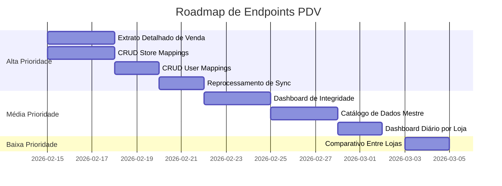

# Análise de Endpoints PDV — Extrato Detalhado e Recomendações para o Painel Admin

> **Data:** 2026-02-12  
> **Escopo:** Auditoria completa dos endpoints existentes, análise de granularidade do extrato de vendas, e recomendações de endpoints novos para gestão e correção de inconsistências.

---

## 1. Mapa Completo dos Endpoints Existentes

### 1.1 Ingestão (Webhook)

| Método | Rota | Controller | Autenticação |
|--------|------|-----------|-------------|
| `POST` | `/api/v1/pdv/sync` | `PdvSyncController@ingest` | Signature + Throttle |

**O que faz:** Recebe o payload do agente, valida schema, resolve loja, salva JSON bruto, e enfileira `ProcessPdvSyncJob`.

---

### 1.2 Relatórios (4 endpoints)

Todos requerem `auth:sanctum`. Usuários comuns veem apenas lojas vinculadas; super admin vê tudo.

#### ① `GET /api/v1/pdv/reports/turnos`

**Filtros disponíveis:**

| Filtro | Tipo | Obrigatório | Exemplo |
|--------|------|:-----------:|---------|
| `store_id` | int | ✅ (ou `store_pdv_id`) | `1` |
| `store_pdv_id` | int | ✅ (ou `store_id`) | `13` |
| `store_alias` | string | ❌ | `Loja 8 - MC Mata Atlântica` |
| `date` | date | ✅ | `2026-02-12` |
| `sequencial` | int | ❌ | `2` |
| `periodo` | string | ❌ | `MATUTINO`, `VESPERTINO`, `NOTURNO` |
| `fechado` | bool | ❌ | `true` |
| `operador_id` | int | ❌ | `12` |
| `responsavel_id` | int | ❌ | `80` |

**Dados retornados:**
- ✅ Dados do turno (datas, duração, período, sequencial)
- ✅ Operador e responsável (id, nome)
- ✅ Totais: sistema, declarado, falta, qtd_vendas, qtd_vendedores
- ✅ **Pagamentos por tipo** (sistema/declarado/falta) com id_finalizador, meio_pagamento, total, qtd_vendas
- ✅ Summary com contadores de falta/sobra/conferido
- ❌ **Não tem**: Login do operador/responsável

**Veredicto:** ✅ **Endpoint BOM para análise de fechamento de caixa**

---

#### ② `GET /api/v1/pdv/reports/vendas`

**Filtros disponíveis:**

| Filtro | Tipo | Obrigatório | Default | Exemplo |
|--------|------|:-----------:|---------|---------|
| `store_id` | int | ❌ | - | `1` |
| `store_pdv_id` | int | ❌ | - | `13` |
| `store_alias` | string | ❌ | - | `Loja 8` |
| `from` | date | ❌ | hoje-30d | `2026-02-01` |
| `to` | date | ❌ | hoje | `2026-02-12` |
| `vendedor_id` | int | ❌ | - | `80` |
| `canal` | string | ❌ | - | `HIPER_CAIXA` |
| `id_turno` | string | ❌ | - | UUID |
| `id_finalizador` | int | ❌ | - | `5` (Pix) |
| `meio_pagamento` | string | ❌ | - | `Pix` |
| `per_page` | int | ❌ | `25` | `1-100` |
| `sort` | string | ❌ | `desc` | `asc` ou `desc` |

**Dados retornados POR VENDA:**
- ✅ `id_operacao`, `canal`, `id_turno`, `data_hora`, `total`
- ✅ **Itens** — MAS **apenas agregados**: `qtd_linhas`, `qtd_total`, `valor_total`
- ✅ **Pagamentos** — MAS **apenas agregados**: `qtd_linhas`, `valor_total`
- ✅ Summary: `total_vendas`, `total_vendido`
- ❌ **NÃO TEM**: Lista detalhada de itens (nome produto, código barras, preço unitário, desconto)
- ❌ **NÃO TEM**: Lista detalhada de pagamentos (meio, valor individual, troco, parcelas)
- ❌ **NÃO TEM**: Vendedor (nome ou login) — só filtra por vendedor_id

> [!CAUTION]
> **Este endpoint NÃO é um extrato granular.** Ele retorna uma visão "cardada" (resumo) de cada venda, sem os detalhes de itens e pagamentos. Para uma gestão real de vendas, falta muita informação.

**Veredicto:** ⚠️ **Endpoint INSUFICIENTE para extrato detalhado de vendas**

---

#### ③ `GET /api/v1/pdv/reports/ranking-vendedores`

**Filtros disponíveis:**

| Filtro | Tipo | Default | Exemplo |
|--------|------|---------|---------|
| `mode` | string | `monthly` | `daily`, `weekly`, `monthly` |
| `reference_date` | date | hoje | `2026-02-12` |
| `from` / `to` | date | - | Prevalece sobre `mode` |
| `store_id` | int | - | `1` |
| `store_pdv_id` | int | - | `13` |
| `canal` | string | - | `HIPER_CAIXA` |
| `limit` | int | `50` | `1-200` |

**Dados retornados:**
- ✅ Position, vendedor_id, vendedor_nome
- ✅ qtd_vendas, total_vendido, total_itens
- ✅ Usa `nome_padronizado` do `pdv_usuarios` (nome limpo pelo admin)
- ❌ **Não tem**: Login, ticket médio calculado, evolução temporal

**Veredicto:** ✅ **Endpoint BOM para ranking simples**

---

#### ④ `GET /api/v1/pdv/reports/ranking-vendedor-loja`

**Filtros disponíveis:**

| Filtro | Tipo | Obrigatório | Exemplo |
|--------|------|:-----------:|---------|
| `from` | date | ✅ | `2026-02-01` |
| `to` | date | ✅ | `2026-02-12` |
| `store_id` | int | ❌ | `1` |
| `vendedor_id` | int | ❌ | `80` |
| `canal` | string | ❌ | `HIPER_CAIXA` |
| `sort_by` | string | ❌ | `total_vendido`, `qtd_vendas`, `total_itens` |
| `sort` | string | ❌ | `asc`, `desc` |
| `per_page` | int | ❌ | `1-200` |

**Dados retornados:**
- ✅ Combinação loja × vendedor
- ✅ store_nome, vendedor_nome, qtd_vendas, total_vendido, total_itens

**Veredicto:** ✅ **Endpoint BOM para análise cruzada**

---

### 1.3 Admin / Observabilidade (2 endpoints)

Requerem super admin ou role `admin` em alguma loja.

#### ⑤ `GET /api/v1/admin/pdv/syncs`

**Filtros:** status, event_type, sync_id, schema_version, request_id, risk_flag, store_pdv_id, store_id, from, to, per_page

**Dados:** Lista paginada de syncs com latência (queue_delay_ms, processing_ms, end_to_end_ms), risk_flags, contadores de operações.

**Veredicto:** ✅ **Excelente para troubleshooting**

---

#### ⑥ `GET /api/v1/admin/pdv/syncs/metrics`

**Dados:** Dashboard completo com:
- Breakdown por status, event_type, schema_version, canal
- Risk flags com contadores (16 flags rastreadas)
- **Identity resolution metrics** (24h): taxa de resolução de loja e usuário
- Latência média de fila e processamento
- **Saúde por loja**: lojas ativas, lojas "silent" (sem sync recente)
- Métricas de snapshots

**Veredicto:** ✅ **Dashboard operacional robusto**

---

### 1.4 Comandos Agendados (Console)

| Comando | Periodicidade | Função |
|---------|:------------:|--------|
| `pdv:scheduler:heartbeat` | a cada 10 min | Marca "alive" no cache |
| `pdv:purge-raw-payloads` | diário | Limpa payloads antigos |
| `pdv:retry-failed` | a cada 5 min | Re-enfileira syncs falhos |
| `pdv:ops-monitor` | a cada 15 min | Monitor operacional |
| `pdv:stale-vendas-check` | a cada 30 min | Verifica vendas sem snapshot |
| `pdv:queue-consume` | a cada 1 min | Consumer de fila CRON-based |

---

## 2. Análise de Gaps — O que FALTA

### 🔴 Gap Crítico 1: Extrato Detalhado de Vendas

O endpoint `/vendas` retorna **apenas contadores agregados** de itens e pagamentos. Para gestão real, o admin precisa:

| Informação | Disponível Hoje? | Onde Está no Banco? |
|-----------|:-----------------:|-------------------|
| Nome do produto | ❌ | `pdv_venda_itens.nome_produto` |
| Código de barras | ❌ | `pdv_venda_itens.codigo_barras` |
| Preço unitário | ❌ | `pdv_venda_itens.preco_unit` |
| Qtd por item | ❌ | `pdv_venda_itens.qtd` |
| Desconto por item | ❌ | `pdv_venda_itens.desconto` |
| Vendedor por item | ❌ | `pdv_venda_itens.vendedor_nome` |
| Meio de pagamento | ❌ | `pdv_venda_pagamentos.meio_pagamento` |
| Valor do pagamento | ❌ | `pdv_venda_pagamentos.valor` |
| Troco | ❌ | `pdv_venda_pagamentos.troco` |
| Parcelas | ❌ | `pdv_venda_pagamentos.parcelas` |

### 🔴 Gap Crítico 2: Gestão de Mappings (Store e User)

Não existe **nenhum endpoint CRUD** para gerenciar:
- `pdv_store_mappings` — vínculo loja PDV ↔ loja ERP
- `pdv_user_mappings` — vínculo vendedor PDV ↔ usuário ERP

Hoje essas tabelas só são manipuladas diretamente no banco.

### 🔴 Gap Crítico 3: Reprocessamento de Syncs

Não existe endpoint para:
- Reprocessar um sync que falhou ou ficou com `store_id=null`
- Aplicar retroativamente um novo mapping a syncs antigos

### 🟡 Gap Médio 4: Resumo Diário/Semanal por Loja

Não existe endpoint para:
- Dashboard consolidado de vendas por dia/semana/mês por loja
- Comparativo entre lojas

### 🟡 Gap Médio 5: Catálogo de Dados Mestre

Os dados auto-registrados em `pdv_lojas`, `pdv_usuarios`, `pdv_meios_pagamento` não têm endpoints de consulta ou edição.

---

## 3. Endpoints Recomendados para o Painel Super Admin

### 3.1 Extrato Detalhado de Venda (ALTA PRIORIDADE)

```
GET /api/v1/pdv/reports/vendas/{store_pdv_id}/{canal}/{id_operacao}
```

**Resposta proposta:**
```json
{
  "venda": {
    "id_operacao": 12345,
    "canal": "HIPER_CAIXA",
    "id_turno": "UUID-...",
    "data_hora": "2026-02-12T09:55:00-03:00",
    "total": 129.90,
    "sync_id": "abc-123",
    "last_window_to": "2026-02-12T10:00:00-03:00"
  },
  "itens": [
    {
      "line_no": 1,
      "id_produto": 500,
      "codigo_barras": "7891234567890",
      "nome_produto": "Capinha Galaxy S24",
      "qtd": 2.000,
      "preco_unit": 49.90,
      "total": 99.80,
      "desconto": 0.00,
      "vendedor": {
        "id_usuario": 80,
        "nome": "Daren",
        "login": "daren"
      }
    }
  ],
  "pagamentos": [
    {
      "id_finalizador": 5,
      "meio_pagamento": "Pix",
      "valor": 129.90,
      "troco": 0.00,
      "parcelas": 1
    }
  ]
}
```

**Justificativa:** Permite ao gestor ver exatamente o que foi vendido item a item, por quem, e como foi pago. Essencial para auditoria e reclamação de clientes.

---

### 3.2 CRUD de Store Mappings (ALTA PRIORIDADE)

```
GET    /api/v1/admin/pdv/store-mappings              # Listar todos
POST   /api/v1/admin/pdv/store-mappings              # Criar novo
PUT    /api/v1/admin/pdv/store-mappings/{id}          # Editar
DELETE /api/v1/admin/pdv/store-mappings/{id}          # Desativar
```

**Filtros no GET:** `pdv_store_id`, `store_id`, `active`, `cnpj`

**Campos editáveis:** `pdv_store_id`, `store_id`, `alias`, `cnpj`, `active`

**Justificativa:** Hoje, para vincular uma loja PDV à loja ERP, é necessário manipular o banco direto. Se o mapping não existe, todas as vendas daquela loja ficam invisíveis nos relatórios (ver R1 na análise anterior).

---

### 3.3 CRUD de User Mappings (ALTA PRIORIDADE)

```
GET    /api/v1/admin/pdv/user-mappings               # Listar todos
POST   /api/v1/admin/pdv/user-mappings               # Criar novo
PUT    /api/v1/admin/pdv/user-mappings/{id}           # Editar
DELETE /api/v1/admin/pdv/user-mappings/{id}           # Desativar
```

**Filtros no GET:** `pdv_user_id`, `user_id`, `pdv_user_login`, `active`, `is_store_operator`

**Campos editáveis:** `pdv_user_id`, `user_id`, `pdv_user_login`, `pdv_user_name`, `is_store_operator`, `confidence`, `active`

**Justificativa:** Sem o mapping de usuário, o vendedor aparece com `vendedor_user_id=null` e fica fora do ranking ERP.

---

### 3.4 Reprocessamento de Sync (ALTA PRIORIDADE)

```
POST /api/v1/admin/pdv/syncs/{id}/reprocess
```

**O que faz:**
1. Re-enfileira o `ProcessPdvSyncJob` para o sync especificado
2. Usa mappings atualizados (se novos foram criados)
3. Atualiza `store_id` e `vendedor_user_id` em cascata

**Justificativa:** Quando um novo mapping é criado, os syncs anteriores ficam permanentemente com `store_id=null` ou `vendedor_user_id=null`. Este endpoint corrige retroativamente.

---

### 3.5 Dashboard de Integridade (MÉDIA PRIORIDADE)

```
GET /api/v1/admin/pdv/integrity
```

**Resposta proposta:**
```json
{
  "vendas_sem_loja": {
    "total": 0,
    "lojas_afetadas": [],
    "exemplo_store_pdv_ids": [13, 15]
  },
  "itens_sem_vendedor": {
    "total": 0,
    "vendedores_pdv_ids": [80, 90]
  },
  "turnos_sem_loja": {
    "total": 0
  },
  "syncs_com_risk_flags": {
    "total": 5,
    "top_flags": {"user_mapping_missing": 3, "store_mapping_by_id_fallback": 2}
  },
  "vendas_nunca_vistas_em_snapshot": {
    "total": 2,
    "exemplo_ids": [100, 200]
  },
  "usuarios_pdv_sem_mapping": [
    {"id_usuario_hiper": 80, "nome": "Daren", "login": "daren", "vendas_count": 45}
  ],
  "lojas_pdv_sem_mapping": [
    {"id_ponto_venda": 15, "nome": "Loja Nova", "syncs_count": 12}
  ]
}
```

**Justificativa:** Um único endpoint que o admin pode consultar para ver "o que está faltando" no sistema. Essencial para prevenção de perda de dados.

---

### 3.6 Catálogo de Dados Mestre (MÉDIA PRIORIDADE)

```
GET /api/v1/admin/pdv/lojas                     # Lista pdv_lojas
GET /api/v1/admin/pdv/usuarios                  # Lista pdv_usuarios
GET /api/v1/admin/pdv/meios-pagamento           # Lista pdv_meios_pagamento
PUT /api/v1/admin/pdv/lojas/{id}                # Editar nome_padronizado
PUT /api/v1/admin/pdv/usuarios/{id}             # Editar nome_padronizado, papel
PUT /api/v1/admin/pdv/meios-pagamento/{id}      # Editar categoria, nome_padronizado
```

**Justificativa:** Os dados mestre são auto-registrados pelo Job mas podem ter nomes incorretos. O admin precisa poder corrigir `nome_padronizado` e `categoria` sem acessar o banco diretamente.

---

### 3.7 Dashboard Diário por Loja (MÉDIA PRIORIDADE)

```
GET /api/v1/pdv/reports/resumo-diario
```

**Filtros:** `store_id`, `store_pdv_id`, `from`, `to`, `canal`

**Resposta proposta:**
```json
{
  "days": [
    {
      "date": "2026-02-12",
      "total_vendas": 45,
      "total_vendido": 5890.50,
      "ticket_medio": 130.90,
      "qtd_itens": 120,
      "turnos_abertos": 2,
      "turnos_fechados": 1,
      "total_falta_caixa": -10.90,
      "by_payment": [
        {"meio": "Pix", "total": 3200.00, "qtd": 25},
        {"meio": "Cartão Crédito", "total": 1890.50, "qtd": 15}
      ]
    }
  ]
}
```

**Justificativa:** Permite ao gestor ver a evolução diária sem precisar iterar turno por turno.

---

### 3.8 Comparativo Entre Lojas (BAIXA PRIORIDADE)

```
GET /api/v1/pdv/reports/comparativo-lojas
```

**Filtros:** `from`, `to`, `canal`

**Resposta:** Ranking de lojas com total_vendido, qtd_vendas, ticket_medio, total_falta.

---

## 4. Resumo de Prioridades



| Prioridade | Endpoint | Justificativa |
|:----------:|----------|---------------|
| 🔴 Alta | Extrato Detalhado | Os dados existem no banco, mas não são expostos pela API |
| 🔴 Alta | CRUD Store Mappings | Sem isso, novas lojas ficam invisíveis nos reports |
| 🔴 Alta | CRUD User Mappings | Sem isso, vendedores ficam sem linkagem nos rankings |
| 🔴 Alta | Reprocessamento | Corrige retroativamente syncs com mapping faltante |
| 🟡 Média | Dashboard Integridade | Visão consolidada de gaps e inconsistências |
| 🟡 Média | Catálogo Dados Mestre | Permite corrigir nomes e categorias |
| 🟡 Média | Dashboard Diário | Visão executiva de performance |
| 🟢 Baixa | Comparativo Lojas | Analytics avançado |

---

## 5. Perguntas para o Time de Backend

1. **O extrato detalhado de venda (item a item + pagamentos) é uma necessidade confirmada do painel admin, ou apenas para relatórios?** Isso define se criamos um endpoint real-time ou um export async.

2. **Existe alguma restrição de performance** para queries em `pdv_venda_itens` com JOIN para `pdv_vendas`? Quantos registros existem nessa tabela hoje?

3. **Os mappings (store e user) são gerenciados por quem atualmente?** Diretamente no banco via SQL? Via seed? Via algum admin panel separado?

4. **Existe interesse em implementar "auto-mapping" por CNPJ?** O agente já envia `store.cnpj`, e o `PdvStoreResolver` já usa CNPJ como prioridade. Podemos auto-criar mappings quando CNPJ match for único.

5. **O reprocessamento retroativo deve ser por sync individual ou em lote?** Sugerimos ambos — individual para debugging e em lote para quando um novo mapping é criado.
