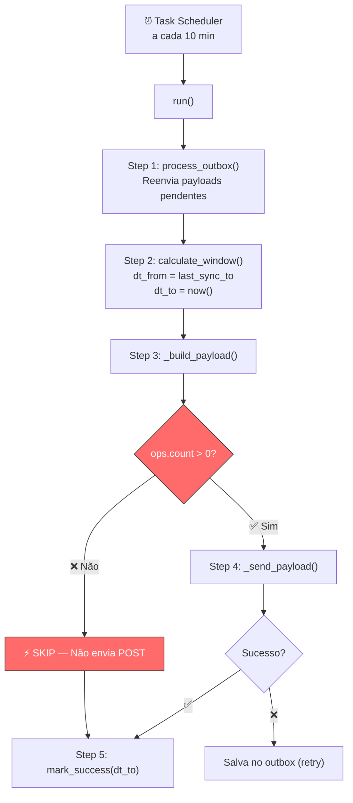
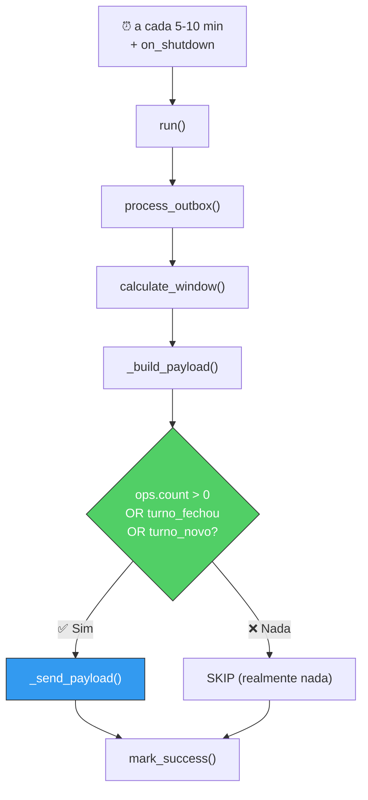

# Análise da Lógica de Sync — Estado Atual + Melhorias

**Data:** 2026-02-11
**Agente:** v2.0.0 | Schema v2.0
**Arquivos analisados:** `runner.py`, `state.py`, `queries.py`, `agent.py`, `payload.py`

---

## 1. Fluxo Atual (Como Funciona Hoje)



### O que cada step faz:

| Step | Arquivo | O que faz |
|---|---|---|
| `process_outbox()` | `sender.py` | Reenvia JSONs que falharam (outbox/) |
| `calculate_window()` | `state.py:90` | `dt_from = last_sync_to`, `dt_to = now()` |
| `get_operation_ids()` | `queries.py:342` | Busca `id_operacao` de vendas (op=1, cancelado=0) na janela |
| `get_turnos_in_window()` | `queries.py:107` | Busca turnos que **tiveram vendas** na janela |
| `get_current_turno()` | `queries.py:74` | Fallback: busca turno mais recente da loja |
| `ops.count == 0` → **SKIP** | `runner.py:86` | Se não há vendas na janela, **não faz POST** |

---

## 2. 🚨 BUG CRÍTICO: Fechamento de Turno Sem Vendas

### O Cenário

```
20:00  ──── Última venda do turno ────────────
20:10  ──── Agente roda: ops=2, envia POST ✅
20:20  ──── Agente roda: ops=0, SKIP ❌
20:30  ──── Agente roda: ops=0, SKIP ❌
20:40  ──── Operador fecha o turno ────────────
20:50  ──── Agente roda: ops=0, SKIP ❌  ⬅️ BUG!
21:00  ──── PC desligado ──────────────────────
```

**Resultado:** O backend **nunca sabe** que o turno foi fechado. Nunca recebe:
- `fechamento_declarado` (valores que o operador declarou)
- `falta_caixa` (diferenças sistema vs real)
- `fechado: true`

### Causa Raiz (2 problemas)

**Problema 1 — Gate check em `runner.py:85-89`:**
```python
# Step 3.5: Skip sending if no operations (saves bandwidth)
if payload.ops.count == 0:
    logger.info("No new sales in window — skipping POST")
    self.window_calculator.mark_success(dt_to)
    return True  # ⬅️ Nunca envia o POST
```

O agente decide "sem vendas = nada para enviar". Mas **fechamento de turno não é venda** — é `operacao = 9`.

**Problema 2 — Query `get_turnos_in_window` (queries.py:127-134):**
```sql
WHERE t.id_turno IN (
    SELECT DISTINCT op.id_turno
    FROM dbo.operacao_pdv op
    WHERE op.operacao = 1        -- ⬅️ Só busca turnos COM vendas!
      AND op.cancelado = 0
      AND op.data_hora_termino >= ?
      AND op.data_hora_termino < ?
)
```

Turnos são encontrados apenas se tiveram **vendas (op=1)** na janela. Fechamento (op=9) não conta.

---

## 3. Outros Gaps Identificados

### Gap 2: Sem detecção de turno novo aberto

Se um turno novo abre mas ainda não tem vendas, o backend não sabe. O primeiro POST só virá quando a primeira venda acontecer.

### Gap 3: Race condition no fechamento

Se o turno fecha entre `get_turnos_in_window` e `get_turno_closure_values`, os dados de fechamento podem ser parciais.

### Gap 4: Turno que cruza meia-noite

Turno que abre às 22h e fecha às 02h pode não ser capturado corretamente, pois a janela de 10m pode pegar apenas a cauda.

### Gap 5: PC desligado antes do agente rodar

Se o operador fecha o turno às 20:41 e desliga o PC às 20:42 (antes do ciclo de 20:50), o fechamento nunca é enviado.

---

## 4. Proposta de Melhoria: "Turno-Aware Sync"

### Princípio

> **O agente deve enviar POST quando há dados RELEVANTES, não apenas vendas.**

Dados relevantes = vendas (op=1) **OU** fechamento de turno (op=9) **OU** abertura de turno novo.

### 4.1 Mudança em `queries.py` — Nova query para detectar turnos com atividade

```python
def get_turnos_with_activity(
    self,
    dt_from: datetime,
    dt_to: datetime,
    id_ponto_venda: int,
) -> list[dict[str, Any]]:
    """
    Get turnos that had ANY activity in the window:
    - Sales (op=1)
    - Closure (op=9)
    - Shortage (op=4)
    OR turnos that CLOSED in the window (data_hora_termino within range).
    """
    query = """
        SELECT DISTINCT
            t.id_turno,
            t.sequencial,
            t.fechado,
            t.data_hora_inicio,
            t.data_hora_termino,
            t.id_usuario AS id_operador,
            u.nome AS nome_operador
        FROM dbo.turno t
        LEFT JOIN dbo.usuario u ON u.id_usuario = t.id_usuario
        WHERE t.id_ponto_venda = ?
          AND (
            -- Caso 1: turno teve alguma operação na janela
            t.id_turno IN (
                SELECT DISTINCT op.id_turno
                FROM dbo.operacao_pdv op
                WHERE op.operacao IN (1, 4, 9)
                  AND op.cancelado = 0
                  AND op.data_hora_termino IS NOT NULL
                  AND op.data_hora_termino >= ?
                  AND op.data_hora_termino < ?
            )
            -- Caso 2: turno FECHOU dentro da janela
            OR (
                t.fechado = 1
                AND t.data_hora_termino >= ?
                AND t.data_hora_termino < ?
            )
            -- Caso 3: turno está ABERTO agora (para status)
            OR (
                t.fechado = 0
                AND t.data_hora_termino IS NULL
            )
          )
        ORDER BY t.data_hora_inicio
    """
    results = self.db.execute_query(
        query, (id_ponto_venda, dt_from, dt_to, dt_from, dt_to)
    )
    return results
```

### 4.2 Mudança em `runner.py` — Não pular quando há turno fechado

```python
def run(self) -> bool:
    # ... steps 1-3 ...

    # Step 3.5: Decidir se POST é necessário
    has_sales = payload.ops.count > 0
    has_closed_turno = any(t.fechado for t in payload.turnos)
    has_turnos = len(payload.turnos) > 0

    if not has_sales and not has_closed_turno:
        logger.info("No sales and no turno closure — skipping POST")
        self.window_calculator.mark_success(dt_to)
        return True

    if not has_sales and has_closed_turno:
        logger.info("⚠️ No new sales but turno CLOSED — sending POST for closure data")

    # Step 4: Send payload
    result = self._send_payload(payload)
    # ...
```

### 4.3 Mudança no `_build_turnos` — Usar nova query

```python
def _build_turnos(self, dt_from, dt_to) -> list[TurnoDetail]:
    # Usar nova query que inclui fechamentos
    turnos_raw = self.queries.get_turnos_with_activity(
        dt_from, dt_to, self.settings.store_id_ponto_venda
    )

    if not turnos_raw:
        current = self.queries.get_current_turno(self.settings.store_id_ponto_venda)
        if current:
            turnos_raw = [current]

    # ... rest stays the same ...
```

### 4.4 Adicionar campo `tipo_evento` no payload (opcional)

Para o backend saber por quê recebeu o POST:

```json
{
  "schema_version": "2.0",
  "event_type": "turno_closure",
  "turnos": [{
    "fechado": true,
    "fechamento_declarado": { ... },
    "falta_caixa": { ... }
  }],
  "vendas": [],
  "ops": { "count": 0, "ids": [] }
}
```

Valores possíveis de `event_type`:
- `"sales"` — payload normal com vendas
- `"turno_closure"` — turno fechou, sem vendas novas
- `"turno_opening"` — turno novo abriu
- `"mixed"` — vendas + fechamento

---

## 5. Sobre o Cenário "PC Desliga"

### Problema

O agente roda via Task Scheduler a cada 10 minutos. Se o operador:
1. Fecha o turno às 20:41
2. Desliga o PC às 20:42
3. Próximo ciclo seria às 20:50 — **nunca roda**

### Soluções Possíveis

| Solução | Complexidade | Confiabilidade |
|---|---|---|
| **A. Registrar trigger "on shutdown"** no Task Scheduler | Baixa | ⚠️ Média — Windows pode não dar tempo |
| **B. Rodar agente em --loop (APScheduler)** com intervalo menor (2-3 min) | Baixa | ⚠️ Média — mesmo problema de timing |
| **C. Hook no ERP Hiper** para chamar o agente no fechamento | Alta | ✅ Alta — mas depende de acesso ao ERP |
| **D. Trigger de DB** — SQL Server trigger que marca "precisa sync" | Média | ✅ Alta |

### Proposta: Combinação A + intervalo menor

**1) Adicionar task "on shutdown":**
```powershell
# No install.ps1, adicionar:
$triggerShutdown = New-ScheduledTaskTrigger -AtStartup  # Ou EventTrigger
# Alternativamente, usar evento EventID 1074 (shutdown initiated)
```

**2) Reduzir intervalo para 5 minutos** (trade-off: mais queries no SQL Server, mas janela menor de perda):

```env
SYNC_WINDOW_MINUTES=5
```

**3) Adicionar "last-chance sync" no evento de shutdown do Windows** via PowerShell script:

```powershell
# C:\ProgramData\PDVSyncAgent\on_shutdown.ps1
& "C:\Program Files\PDVSyncAgent\pdv-sync-agent.exe" --config "C:\ProgramData\PDVSyncAgent\.env"
```

---

## 6. Tabela Resumo de Gaps e Soluções

| # | Gap | Impacto | Solução | Esforço | Prioridade |
|---|---|---|---|---|---|
| 1 | **Turno fecha sem vendas → POST skipped** | Backend não sabe que turno fechou | Mudar lógica de skip + nova query | Médio | 🔴 P0 |
| 2 | Turno novo aberto não comunicado | Backend descobre turno tarde | Incluir turno aberto na query | Baixo | 🟡 P1 |
| 3 | PC desliga antes do agente rodar | Último fechamento perdido | Trigger shutdown + intervalo menor | Baixo | 🔴 P0 |
| 4 | Race condition no fechamento | Dados parciais de closure | Lógica retry com verificação | Médio | 🟡 P1 |
| 5 | Turno cruza meia-noite | Split em 2 janelas | Normalização por turno, não janela | Alto | 🟢 P2 |

---

## 7. Fluxo Proposto (Após Correção)



### Antes vs Depois

| Cenário | Antes | Depois |
|---|---|---|
| Vendas normais | ✅ POST | ✅ POST |
| Turno fecha sem vendas novas | ❌ SKIP | ✅ POST com closure |
| Turno novo abre | ❌ SKIP | ✅ POST com turno aberto |
| PC desliga após fechamento | ❌ Perdido | ✅ on_shutdown tenta enviar |
| Janela sem nenhum evento | ✅ SKIP | ✅ SKIP (correto) |
