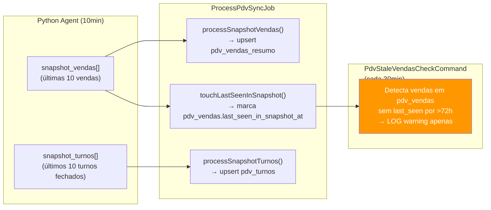
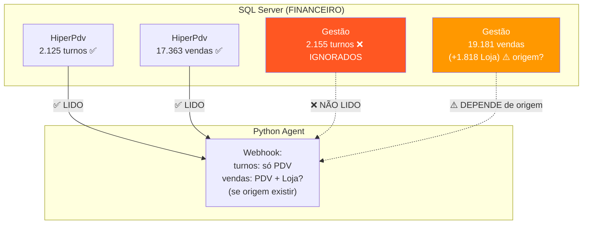
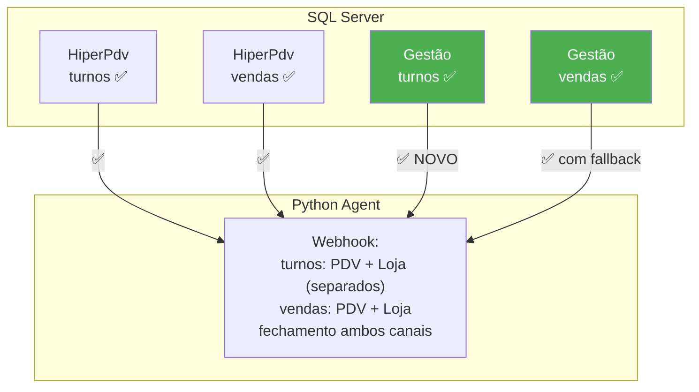

# Análise Profunda: Turnos por Canal, Snapshots e Melhorias — ATUALIZADO COM DADOS REAIS

> **Data:** 2026-02-13  
> **Escopo:** Verificação do comportamento de turnos no HIPER_LOJA, uso dos snapshots, e melhorias.  
> **Dados de Produção:** Loja FINANCEIRO (id_ponto_venda=7, HiperPdv + Hiper Gestão)

---

## 1. RESULTADO DEFINITIVO: Turnos São INDEPENDENTES

> [!CAUTION]
> **HIPÓTESE B CONFIRMADA** — Os turno IDs são **COMPLETAMENTE DIFERENTES** entre HiperPdv e Gestão.
> - **0 de 20** turnos do PDV encontrados no Gestão
> - **0 de 20** turnos do Gestão encontrados no PDV
> - HiperPdv: 2.125 turnos | Gestão: 2.155 turnos (contagens similares, IDs diferentes)

### 1.1 Prova dos Dados de Produção

**Últimos turnos HiperPdv (amostra):**
```
33D4B2BF-253E-40DA-B27F-AB5C4625D621  seq=2  12/02 17:10 → 21:59  op=48
3D7A319F-FA3B-44C9-AB60-61D4AEF064BC  seq=1  12/02 10:09 → 15:57  op=48
```

**Esses mesmos UUIDs NÃO existem na tabela `turno` do Gestão.**  
O Gestão gera seus próprios UUIDs independentes.

### 1.2 Schema da Tabela Turno — DIFERENÇAS ENCONTRADAS

| Coluna | HiperPdv | Gestão | Observação |
|--------|:--------:|:------:|------------|
| `id_turno` | ✅ uniqueidentifier | ✅ uniqueidentifier | Mesmo tipo, IDs diferentes |
| **`id_ponto_venda`** | ✅ int | ❌ **NÃO EXISTE** | ← DIFERENTE! |
| **`id_filial`** | ❌ NÃO EXISTE | ✅ **smallint** | ← Gestão usa `id_filial` |
| `id_usuario` | ✅ int | ✅ **smallint** | Tipo diferente! |
| `data` | ✅ datetime | ✅ datetime | iguais |
| `data_hora_inicio` | ✅ datetime | ✅ datetime | iguais |
| `data_hora_termino` | ✅ datetime (NULL) | ✅ datetime (NULL) | iguais |
| `fechado` | ✅ bit | ✅ bit | iguais |
| `sequencial` | ✅ int | ✅ int | iguais |

> [!WARNING]
> A query do agente Python em `queries_gestao.py` **NÃO pode usar `id_ponto_venda`** para buscar turnos do Gestão — precisa usar **`id_filial`** em vez disso.

---

## 2. DESCOBERTA CRÍTICA: Coluna `origem` NÃO Existe Nesta Loja

O diagnóstico revelou:
```
AVISO: coluna 'origem' NAO existe em operacao_pdv do Gestao
```

> [!CAUTION]
> **IMPACTO CRÍTICO:** Todas as queries em `queries_gestao.py` filtram por `origem = 2`. Se essa coluna não existe no banco Gestão desta loja, **TODAS as queries Gestão falham com erro SQL!**
>
> Isso significa que nesta loja, as vendas da Loja podem estar em outro lugar ou o campo `origem` é exclusivo de certas versões do sistema Hiper.

**Porém**, o TESTE 11 (colisão) usou cross-database join com `g.origem=2` e **RETORNOU DADOS**. Isso sugere que a coluna pode existir mas o check de `INFORMATION_SCHEMA` falhou por algum motivo (case sensitivity, views, etc.). **Necessita investigação adicional.**

### Vendas Gestão vs PDV — Números Brutos

| Banco | Vendas (op=1) | Turnos | Fechamentos (op=9) | Faltas (op=4) | Usuários | Produtos |
|-------|:------------:|:------:|:-----------------:|:-------------:|:--------:|:--------:|
| HiperPdv | 17.363 | 2.125 | 2.121 | 269 | 101 | 6.247 |
| Gestão | 19.181 | 2.155 | 2.152 | 271 | 101 | 6.247 |

> [!IMPORTANT]
> O Gestão tem **1.818 vendas a mais** que o HiperPdv. Essas são provavelmente as vendas HIPER_LOJA que só existem no Gestão, representando ~9,5% do total.

---

## 3. Colisão de `id_operacao` CONFIRMADA

```
id_operacao | PDV data          | Gestão data
43939       | 01/08/2025 17:38  | 08/02/2026 19:03
43455       | 07/07/2025 12:56  | 22/01/2026 21:48
41041       | 09/05/2025 18:19  | 02/12/2025 16:40
```

O mesmo `id_operacao` aponta para vendas **COMPLETAMENTE DIFERENTES** nos dois bancos. O campo `canal` (`HIPER_CAIXA` vs `HIPER_LOJA`) é **ESSENCIAL** para deduplicação correta.

O PHP já faz isso corretamente — upsert por `(store_pdv_id, canal, id_operacao)`.

---

## 4. Meios de Pagamento — Gestão é Multi-Filial

| Banco | Finalizadores |
|-------|:------------:|
| HiperPdv | 10 (únicos) |
| Gestão | 113 (10 × ~12 filiais) |

O Gestão duplica finalizadores por filial. A query do agente precisa filtrar por filial ou usar `DISTINCT` para evitar duplicatas no payload.

---

## 5. O que o PHP Faz com os Snapshots

### 5.1 Fluxo Completo



### 5.2 Resposta: O PHP usa snapshots para validar vendas que ficaram para trás?

| Aspecto | Funciona? | Como |
|---------|:---------:|------|
| Marcar vendas como "vistas" no snapshot | ✅ | `touchLastSeenInSnapshot` atualiza `pdv_vendas.last_seen_in_snapshot_at` |
| Detectar vendas "stale" (não vistas) | ✅ | `PdvStaleVendasCheckCommand` verifica a cada 30min |
| **Auto-inserir vendas faltantes** | ❌ | Apenas grava LOG, não cria vendas |
| **Auto-inserir itens/pagamentos faltantes** | ❌ | Snapshot só tem resumo (qtd, total) |
| Atualizar turnos passados | ✅ | `processSnapshotTurnos` faz upsert em `pdv_turnos` |

> [!WARNING]
> **O sistema de snapshots é PASSIVO.** Ele detecta gaps mas NÃO os corrige automaticamente. Quando o `PdvStaleVendasCheckCommand` encontra vendas stale, ele apenas registra um warning no log — nenhuma ação corretiva é tomada.

---

## 6. Impacto de Não Coletar Turnos do Gestão

Como os turnos são independentes, **todas as vendas HIPER_LOJA referenciam turnos que NUNCA foram enviados ao PHP**:

```
pdv_vendas no PHP:
  canal = "HIPER_LOJA"
  id_turno = "ABC-GESTAO-TURNO-123"     ← Este turno NÃO existe em pdv_turnos!
```

**Consequências:**

| Funcionalidade | Impacto |
|---------------|---------|
| Relatório de turnos | ❌ ~9,5% das vendas (HIPER_LOJA) ficam sem turno associado |
| Fechamento de caixa (sistema vs declarado) | ❌ Valores de fechamento dos turnos Gestão são perdidos |
| Ranking por turno | ⚠️ Vendas Loja ficam em turno "desconhecido" |
| Snapshot de turnos | ❌ Só envia últimos 10 turnos PDV, nunca Gestão |

---

## 7. Melhorias Necessárias — Prioritárias

### 7.1 Python Agent — AÇÃO IMEDIATA

#### M1: Coletar Turnos do Gestão (🔴 CRÍTICO)

Nova query em `queries_gestao.py`:
```python
def get_loja_turnos_with_activity(self, dt_from, dt_to, id_filial):
    query = """
        SELECT DISTINCT
            CONVERT(VARCHAR(36), t.id_turno) AS id_turno,
            t.id_filial,          -- NÃO id_ponto_venda!
            t.sequencial, t.fechado,
            t.data_hora_inicio, t.data_hora_termino,
            t.id_usuario AS id_operador,
            u.nome AS nome_operador,
            u.login AS login_operador
        FROM dbo.turno t
        LEFT JOIN dbo.usuario u ON u.id_usuario = t.id_usuario
        WHERE t.id_filial = ?     -- NÃO id_ponto_venda!
          AND (
            t.id_turno IN (
                SELECT DISTINCT op.id_turno
                FROM dbo.operacao_pdv op
                WHERE op.operacao IN (1, 4, 9)
                  AND op.cancelado = 0
                  AND op.data_hora_termino >= ?
                  AND op.data_hora_termino < ?
                  AND op.id_filial = ?
            )
            OR (t.fechado = 0 AND t.data_hora_termino IS NULL)
          )
        ORDER BY t.data_hora_inicio
    """
```

> [!IMPORTANT]
> **NÃO deve mesclar com turnos PDV** — são turnos diferentes! Devem ser enviados como array separado ou com flag `canal="HIPER_LOJA"` para o PHP saber a origem.

#### M2: Verificar se `origem` Existe Antes de Filtrar (🔴 CRÍTICO)

```python
# Antes de rodar qualquer query, verificar:
def _check_origem_column_exists(self):
    query = """
        SELECT 1 FROM INFORMATION_SCHEMA.COLUMNS
        WHERE TABLE_NAME='operacao_pdv' AND COLUMN_NAME='origem'
    """
    result = self.db.execute_query(query)
    return len(result) > 0
```

Se `origem` não existir, o agente precisa de fallback:
- **Opção A:** Todas as vendas no Gestão são Loja (sem filtro `origem=2`)
- **Opção B:** Filtrar por exclusão (vendas que NÃO existem no HiperPdv)

#### M3: Coletar Fechamento/Falta dos Turnos Gestão (🟡 MÉDIO)

O Gestão TEM op=9 (2.152 registros) e op=4 (271 registros). Novas queries:
```python
def get_loja_turno_closure_values(self, id_turno, id_filial):
    # Mesma lógica de get_turno_closure_values mas usando id_filial
```

#### M4: Adicionar `login_vendedor` nas queries Loja (🟡)

```diff
- uv.nome AS nome_vendedor
+ uv.nome AS nome_vendedor,
+ uv.login AS login_vendedor
```

### 7.2 PHP Backend

| # | Melhoria | Prioridade | Detalhe |
|---|----------|:----------:|---------|
| P1 | Aceitar `turnos_loja[]` no webhook | 🔴 | Novo array separado para turnos do Gestão |
| P2 | Back-fill vendas do snapshot | 🟡 | Criar vendas header quando ausentes |
| P3 | Alertas ativos no stale check | 🟡 | Notificação em vez de só log |
| P4 | Endpoint extrato detalhado | 🟡 | Dados JÁ estão no banco, falta API |

---

## 8. Script de Verificação Adicional

Para confirmar se `origem` realmente existe ou não, peça para rodar na loja:

```powershell
$S="localhost\HIPER"; $c=New-Object System.Data.SqlClient.SqlConnection("Server=$S;Database=Hiper;Integrated Security=True;TrustServerCertificate=True;");$c.Open();$cmd=$c.CreateCommand();$cmd.CommandText="SELECT TOP 1 * FROM INFORMATION_SCHEMA.COLUMNS WHERE TABLE_NAME='operacao_pdv' AND COLUMN_NAME LIKE '%origem%'";$a=New-Object System.Data.SqlClient.SqlDataAdapter($cmd);$d=New-Object System.Data.DataSet;[void]$a.Fill($d);$c.Close();if($d.Tables[0].Rows.Count -gt 0){"ORIGEM EXISTE: $($d.Tables[0].Rows[0]['COLUMN_NAME']) tipo=$($d.Tables[0].Rows[0]['DATA_TYPE'])"}else{"ORIGEM NAO EXISTE"}; $c2=New-Object System.Data.SqlClient.SqlConnection("Server=$S;Database=Hiper;Integrated Security=True;TrustServerCertificate=True;");$c2.Open();$cmd2=$c2.CreateCommand();$cmd2.CommandText="SELECT TOP 3 id_operacao, id_filial, id_usuario, data_hora_termino FROM dbo.operacao_pdv WHERE operacao=1 AND cancelado=0 ORDER BY data_hora_termino DESC";$a2=New-Object System.Data.SqlClient.SqlDataAdapter($cmd2);$d2=New-Object System.Data.DataSet;[void]$a2.Fill($d2);$c2.Close();$d2.Tables[0]|Format-Table -AutoSize
```

---

## 9. Diagrama Estado Atual vs Desejado

### ATUAL (com gaps encontrados):



### DESEJADO:


