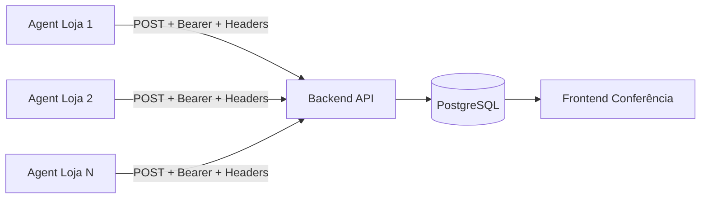
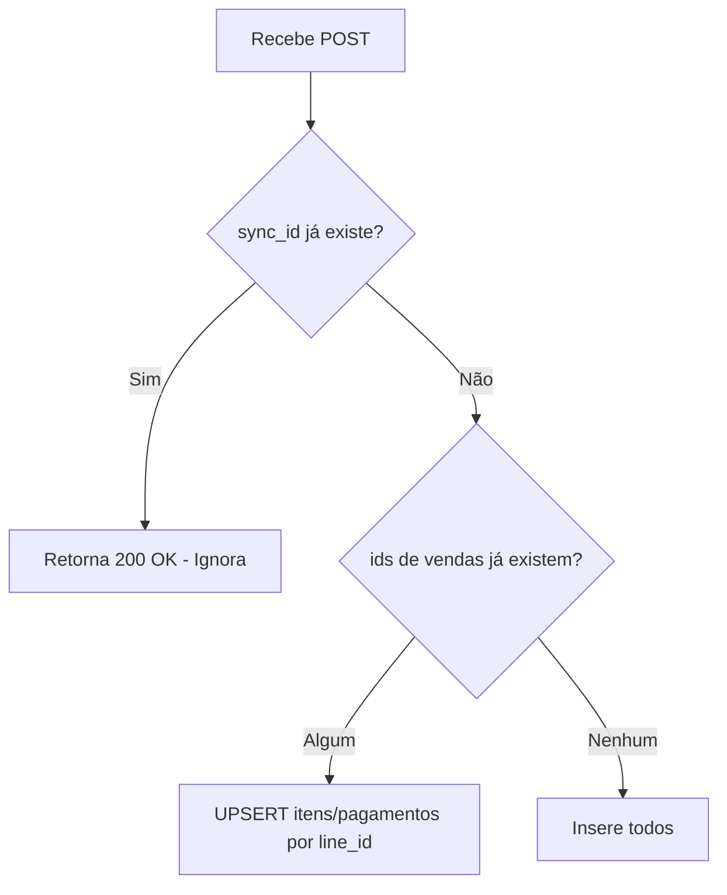

# Backend API — Guia de Integração PDV Sync Agent v2.0

**Data:** 2026-02-11
**Versão do agente:** `2.0.0` | **Schema:** `2.0`
**Para:** Time backend `maiscapinhas-erp-api`
**De:** Time integração PDV

---

## ⚡ O que mudou na v2.0 (AÇÕES NECESSÁRIAS do backend)

> [!IMPORTANT]
> Esta seção lista **tudo que o backend precisa implementar/atualizar** para consumir a v2.0.

### Mudanças que requerem ação do backend

| # | Mudança | Impacto | O que fazer |
|---|---|---|---|
| 1 | **Timezone explícito** `-03:00` | Todos os datetimes agora têm offset | Parsear como `DateTimeOffset` / `Carbon::parse()` |
| 2 | **`schema_version`** na raiz do JSON | Novo campo `"schema_version": "2.0"` | Ler e logar; usar para roteamento de versão |
| 3 | **Header `X-PDV-Schema-Version: 2.0`** | Novo header em cada request | Validar no middleware (opcional) |
| 4 | **Header `X-Request-Id`** (UUID4) | Único por tentativa HTTP | Logar para correlação de debugging |
| 5 | **`line_id` em itens** | PK estável do item no banco de origem | Usar como chave de UPSERT em `pdv_venda_itens` |
| 6 | **`line_no` em itens** | Posição do item na venda (1, 2, 3...) | Armazenar para exibição ordenada |
| 7 | **`line_id` em pagamentos** | PK estável do pagamento na origem | Usar como chave de UPSERT em `pdv_venda_pagamentos` |
| 8 | **Erros HTTP classificados** | 4xx → dead_letter (sem retry), 5xx → retry | Retornar códigos corretos (ver seção 6) |
| 9 | **JSON Schema formal** | Contrato publicado em `schema_v2.0.json` | Validar payloads contra schema (opcional) |

---

## 1. Visão Geral

O **PDV Sync Agent** roda em cada loja e envia dados a cada **10 minutos** via `POST` para o webhook do backend.



**Headers enviados pelo agente:**

```http
POST /api/v1/pdv/sync HTTP/1.1
Authorization: Bearer {token}
Content-Type: application/json
Accept: application/json
X-PDV-Schema-Version: 2.0
X-Request-Id: 8f14e45f-ceea-4780-a5de-8e0f1c0a1b2c
```

| Header | Tipo | Descrição |
|---|---|---|
| `Authorization` | string | `Bearer {token}` fixo por loja |
| `X-PDV-Schema-Version` | string | Versão do schema (`"2.0"`) — para routing futuro |
| `X-Request-Id` | UUID4 | **Único por tentativa HTTP** — cada retry gera novo UUID |

> [!TIP]
> O `X-Request-Id` é diferente do `sync_id`. Um mesmo `sync_id` pode ter múltiplos `X-Request-Id` (retries). Use ambos nos logs para debugging.

---

## 2. Payload JSON v2.0 — Referência Completa

### 2.1 Estrutura raiz

```json
{
  "schema_version": "2.0",
  "agent": { ... },
  "store": { ... },
  "window": { ... },
  "turnos": [ ... ],
  "vendas": [ ... ],
  "resumo": { ... },
  "ops": { ... },
  "integrity": { ... }
}
```

> [!WARNING]
> **`schema_version`** é NOVO na v2.0. Usar este campo (não `agent.version`) para determinar o formato do JSON.
> - `agent.version` = versão do software (ex: `"2.0.0"`, `"2.0.1"`)
> - `schema_version` = versão do contrato de dados (ex: `"2.0"`)

### 2.2 `agent`

| Campo | Tipo | Exemplo | Descrição |
|---|---|---|---|
| `version` | string | `"2.0.0"` | Versão do software do agente |
| `machine` | string | `"DESKTOP-EGBRLLG"` | Nome da máquina da loja |
| `sent_at` | datetime | `"2026-02-10T16:30:00-03:00"` | Quando o JSON foi gerado **⚠️ AGORA COM TIMEZONE** |

### 2.3 `store`

| Campo | Tipo | Exemplo | Descrição |
|---|---|---|---|
| `id_ponto_venda` | int | `10` | ID da loja no HiperPdv (PK no sistema de origem) |
| `nome` | string | `"MC Komprão Centro TJ"` | Nome da loja no HiperPdv |
| `alias` | string | `"Loja 01"` | Alias configurado no .env do agente |

### 2.4 `window`

| Campo | Tipo | Exemplo | Descrição |
|---|---|---|---|
| `from` | datetime | `"2026-02-10T16:20:00-03:00"` | Início da janela **⚠️ COM TIMEZONE** |
| `to` | datetime | `"2026-02-10T16:30:00-03:00"` | Fim da janela **⚠️ COM TIMEZONE** |
| `minutes` | int | `10` | Duração da janela |

> [!NOTE]
> Janelas são sequenciais `[from, to)` e não se sobrepõem. O `from` de um envio é o `to` do anterior.

### 2.5 `turnos[]` — Dados do turno

Sem mudanças estruturais na v2.0. Datetimes agora incluem timezone `-03:00`.

```json
{
  "id_turno": "656335C4-D6C4-455A-8E3D-FF6B3F570C64",
  "sequencial": 2,
  "fechado": true,
  "data_hora_inicio": "2026-02-09T16:26:44-03:00",
  "data_hora_termino": "2026-02-09T21:50:29-03:00",
  "operador": { "id_usuario": 12, "nome": "Loja 01 - Komprao Centro" },
  "totais_sistema": { "total": 1019.70, "qtd_vendas": 7, "por_pagamento": [...] },
  "fechamento_declarado": { "total": 940.70, "por_pagamento": [...] },
  "falta_caixa": { "total": 79.00, "por_pagamento": [...] }
}
```

### 2.6 `vendas[]` — ⚠️ COM NOVOS CAMPOS

```json
{
  "id_operacao": 12380,
  "data_hora": "2026-02-09T16:26:59-03:00",
  "id_turno": "656335C4-D6C4-455A-8E3D-FF6B3F570C64",
  "total": 129.00,
  "itens": [
    {
      "line_id": 87432,
      "line_no": 1,
      "id_produto": 5402,
      "codigo_barras": "7205",
      "nome": "Cap. Samsung S25 Special",
      "qtd": 1,
      "preco_unit": 29.00,
      "total": 29.00,
      "desconto": 0.00,
      "vendedor": { "id_usuario": 80, "nome": "Daren" }
    },
    {
      "line_id": 87433,
      "line_no": 2,
      "id_produto": 477,
      "codigo_barras": "168",
      "nome": "Película Hidrogel Fosca Rock Space",
      "qtd": 1,
      "preco_unit": 100.00,
      "total": 100.00,
      "desconto": 0.00,
      "vendedor": { "id_usuario": 80, "nome": "Daren" }
    }
  ],
  "pagamentos": [
    {
      "line_id": 45201,
      "id_finalizador": 4,
      "meio": "Cartão de crédito",
      "valor": 129.00,
      "troco": 0.00,
      "parcelas": 1
    }
  ]
}
```

#### Campos NOVOS na v2.0

| Campo | Tipo | Descrição |
|---|---|---|
| **`itens[].line_id`** | int \| null | **PK do item no banco de origem** (`id_item_operacao_pdv`). Estável, imutável, globalmente único com `store_id`. |
| **`itens[].line_no`** | int \| null | **Posição sequencial** do item na venda (1, 2, 3...). Útil para exibição. |
| **`pagamentos[].line_id`** | int \| null | **PK do pagamento no banco de origem** (`id_finalizador_operacao_pdv`). Estável, imutável. |

> [!IMPORTANT]
> **`line_id` é a chave para UPSERT granular.** Com este campo, o backend pode atualizar itens e pagamentos individualmente sem precisar deletar e reinserir tudo.
>
> **Chave composta:** `(store_id, line_id)` é globalmente única para itens e pagamentos.

---

## 3. Anti-Duplicação



**Três camadas de proteção:**

1. **`sync_id`** — idempotência total (SHA256 determinístico de `store_id + from + to`)
2. **`ops.ids`** — deduplicação por `id_operacao` (PK da venda)
3. **`line_id`** *(NOVO)* — UPSERT granular por item/pagamento

> [!CAUTION]
> **SEMPRE verifique `sync_id` antes de processar.** O agente pode reenviar payloads da fila offline.

---

## 4. Schema PostgreSQL Atualizado

### 4.1 Tabelas (com novos campos)

```sql
-- Sincronizações recebidas (anti-duplicação)
CREATE TABLE pdv_syncs (
    id              SERIAL PRIMARY KEY,
    sync_id         VARCHAR(64) UNIQUE NOT NULL,
    schema_version  VARCHAR(10) DEFAULT '2.0',    -- NOVO
    store_id        INTEGER NOT NULL,
    store_alias     VARCHAR(50),
    window_from     TIMESTAMPTZ NOT NULL,          -- MUDOU: com timezone
    window_to       TIMESTAMPTZ NOT NULL,          -- MUDOU: com timezone
    agent_version   VARCHAR(10),
    agent_machine   VARCHAR(100),
    request_id      VARCHAR(36),                   -- NOVO: X-Request-Id do header
    ops_count       INTEGER DEFAULT 0,
    warnings        JSONB DEFAULT '[]',
    received_at     TIMESTAMPTZ DEFAULT NOW()
);

-- Turnos (UPSERT por id_turno)
CREATE TABLE pdv_turnos (
    id              SERIAL PRIMARY KEY,
    id_turno        VARCHAR(36) UNIQUE NOT NULL,
    store_id        INTEGER NOT NULL,
    sequencial      SMALLINT,
    fechado         BOOLEAN DEFAULT FALSE,
    data_hora_inicio    TIMESTAMPTZ,              -- MUDOU: com timezone
    data_hora_termino   TIMESTAMPTZ,              -- MUDOU: com timezone
    operador_id     INTEGER,
    operador_nome   VARCHAR(200),
    total_sistema       DECIMAL(12,2) DEFAULT 0,
    total_declarado     DECIMAL(12,2),
    total_falta         DECIMAL(12,2),
    updated_at      TIMESTAMPTZ DEFAULT NOW()
);

-- Totais por meio de pagamento por turno (sem mudanças)
CREATE TABLE pdv_turno_pagamentos (
    id              SERIAL PRIMARY KEY,
    id_turno        VARCHAR(36) NOT NULL REFERENCES pdv_turnos(id_turno),
    tipo            VARCHAR(20) NOT NULL,
    id_finalizador  INTEGER,
    meio_pagamento  VARCHAR(100),
    total           DECIMAL(12,2) DEFAULT 0,
    qtd_vendas      INTEGER DEFAULT 0,
    UNIQUE(id_turno, tipo, id_finalizador)
);

-- Vendas individuais
CREATE TABLE pdv_vendas (
    id              SERIAL PRIMARY KEY,
    id_operacao     INTEGER NOT NULL,
    store_id        INTEGER NOT NULL,
    id_turno        VARCHAR(36) REFERENCES pdv_turnos(id_turno),
    data_hora       TIMESTAMPTZ,                   -- MUDOU: com timezone
    total           DECIMAL(12,2) DEFAULT 0,
    sync_id         VARCHAR(64) REFERENCES pdv_syncs(sync_id),
    UNIQUE(id_operacao, store_id)
);

-- Itens de cada venda — NOVOS CAMPOS
CREATE TABLE pdv_venda_itens (
    id              SERIAL PRIMARY KEY,
    line_id         INTEGER NOT NULL,              -- NOVO: PK do item na origem
    id_operacao     INTEGER NOT NULL,
    store_id        INTEGER NOT NULL,
    line_no         SMALLINT,                      -- NOVO: posição na venda
    id_produto      INTEGER NOT NULL,
    codigo_barras   VARCHAR(50),
    nome_produto    VARCHAR(300),
    qtd             DECIMAL(10,3) DEFAULT 1,
    preco_unit      DECIMAL(12,2) DEFAULT 0,
    total           DECIMAL(12,2) DEFAULT 0,
    desconto        DECIMAL(12,2) DEFAULT 0,
    vendedor_id     INTEGER,
    vendedor_nome   VARCHAR(200),
    UNIQUE(line_id, store_id)                      -- NOVO: dedup por line_id
);

-- Pagamentos de cada venda — NOVOS CAMPOS
CREATE TABLE pdv_venda_pagamentos (
    id              SERIAL PRIMARY KEY,
    line_id         INTEGER NOT NULL,              -- NOVO: PK do pagamento na origem
    id_operacao     INTEGER NOT NULL,
    store_id        INTEGER NOT NULL,
    id_finalizador  INTEGER,
    meio_pagamento  VARCHAR(100),
    valor           DECIMAL(12,2) DEFAULT 0,
    troco           DECIMAL(12,2) DEFAULT 0,
    parcelas        SMALLINT DEFAULT 1,
    UNIQUE(line_id, store_id)                      -- NOVO: dedup por line_id
);

-- Índices
CREATE INDEX idx_syncs_store ON pdv_syncs(store_id, window_from);
CREATE INDEX idx_turnos_store_data ON pdv_turnos(store_id, data_hora_inicio);
CREATE INDEX idx_vendas_turno ON pdv_vendas(id_turno);
CREATE INDEX idx_vendas_data ON pdv_vendas(store_id, data_hora);
CREATE INDEX idx_itens_operacao ON pdv_venda_itens(id_operacao, store_id);
CREATE INDEX idx_itens_line ON pdv_venda_itens(line_id, store_id);
CREATE INDEX idx_pagamentos_operacao ON pdv_venda_pagamentos(id_operacao, store_id);
CREATE INDEX idx_pagamentos_line ON pdv_venda_pagamentos(line_id, store_id);
```

> [!IMPORTANT]
> **Mudanças chave:**
> - Todos os campos `TIMESTAMP` → `TIMESTAMPTZ` (suporte a timezone)
> - `line_id` + `UNIQUE(line_id, store_id)` em itens e pagamentos (UPSERT granular)
> - `schema_version` e `request_id` em `pdv_syncs`

---

## 5. Lógica de Processamento (Webhook)

### 5.1 Fluxo ao receber POST

```php
public function sync(Request $request)
{
    $payload = $request->json()->all();
    $storeId = $payload['store']['id_ponto_venda'];
    $syncId = $payload['integrity']['sync_id'];
    $requestId = $request->header('X-Request-Id');

    // 1. Anti-duplicação por sync_id
    if (PdvSync::where('sync_id', $syncId)->exists()) {
        Log::info("Duplicate sync ignored", compact('syncId', 'requestId'));
        return response()->json(['status' => 'ok', 'sync_id' => $syncId], 200);
    }

    // 2. Salvar sync metadata
    PdvSync::create([
        'sync_id'        => $syncId,
        'schema_version' => $payload['schema_version'] ?? '1.0',
        'store_id'       => $storeId,
        'store_alias'    => $payload['store']['alias'],
        'window_from'    => Carbon::parse($payload['window']['from']),
        'window_to'      => Carbon::parse($payload['window']['to']),
        'agent_version'  => $payload['agent']['version'],
        'agent_machine'  => $payload['agent']['machine'],
        'request_id'     => $requestId,
        'ops_count'      => $payload['ops']['count'] ?? 0,
        'warnings'       => $payload['integrity']['warnings'] ?? [],
    ]);

    // 3. UPSERT turnos
    foreach ($payload['turnos'] as $turno) {
        PdvTurno::updateOrCreate(
            ['id_turno' => $turno['id_turno']],
            [
                'store_id'          => $storeId,
                'sequencial'        => $turno['sequencial'],
                'fechado'           => $turno['fechado'],
                'data_hora_inicio'  => Carbon::parse($turno['data_hora_inicio']),
                'data_hora_termino' => $turno['data_hora_termino']
                    ? Carbon::parse($turno['data_hora_termino']) : null,
                'operador_id'       => $turno['operador']['id_usuario'] ?? null,
                'operador_nome'     => $turno['operador']['nome'] ?? null,
                'total_sistema'     => $turno['totais_sistema']['total'] ?? 0,
                'total_declarado'   => $turno['fechamento_declarado']['total'] ?? null,
                'total_falta'       => $turno['falta_caixa']['total'] ?? null,
            ]
        );
    }

    // 4. UPSERT vendas + itens + pagamentos
    foreach ($payload['vendas'] as $venda) {
        PdvVenda::updateOrCreate(
            ['id_operacao' => $venda['id_operacao'], 'store_id' => $storeId],
            [
                'id_turno'  => $venda['id_turno'],
                'data_hora' => Carbon::parse($venda['data_hora']),
                'total'     => $venda['total'],
                'sync_id'   => $syncId,
            ]
        );

        // UPSERT itens por line_id (NOVO!)
        foreach ($venda['itens'] as $item) {
            PdvVendaItem::updateOrCreate(
                ['line_id' => $item['line_id'], 'store_id' => $storeId],
                [
                    'id_operacao'   => $venda['id_operacao'],
                    'line_no'       => $item['line_no'],
                    'id_produto'    => $item['id_produto'],
                    'codigo_barras' => $item['codigo_barras'],
                    'nome_produto'  => $item['nome'],
                    'qtd'           => $item['qtd'],
                    'preco_unit'    => $item['preco_unit'],
                    'total'         => $item['total'],
                    'desconto'      => $item['desconto'],
                    'vendedor_id'   => $item['vendedor']['id_usuario'] ?? null,
                    'vendedor_nome' => $item['vendedor']['nome'] ?? null,
                ]
            );
        }

        // UPSERT pagamentos por line_id (NOVO!)
        foreach ($venda['pagamentos'] as $pag) {
            PdvVendaPagamento::updateOrCreate(
                ['line_id' => $pag['line_id'], 'store_id' => $storeId],
                [
                    'id_operacao'    => $venda['id_operacao'],
                    'id_finalizador' => $pag['id_finalizador'],
                    'meio_pagamento' => $pag['meio'],
                    'valor'          => $pag['valor'],
                    'troco'          => $pag['troco'],
                    'parcelas'       => $pag['parcelas'] ?? 1,
                ]
            );
        }
    }

    Log::info("Sync processed", compact('syncId', 'storeId', 'requestId'));
    return response()->json(['status' => 'created', 'sync_id' => $syncId], 201);
}
```

### 5.2 Middleware sugerido (validação)

```php
public function handle($request, Closure $next)
{
    // 1. Logar X-Request-Id
    $requestId = $request->header('X-Request-Id', 'no-id');
    Log::withContext(['pdv_request_id' => $requestId]);

    // 2. Validar schema_version (opcional)
    $schemaVersion = $request->header('X-PDV-Schema-Version');
    if ($schemaVersion && !in_array($schemaVersion, ['1.0', '2.0'])) {
        return response()->json([
            'error' => 'unsupported_schema',
            'message' => "Schema version $schemaVersion not supported"
        ], 422);
    }

    return $next($request);
}
```

---

## 6. Matriz de Erros HTTP (ATUALIZADA)

> [!CAUTION]
> Na v2.0, o agente **classifica respostas HTTP**: 4xx → dead_letter (sem retry), 5xx → retry.
> É fundamental retornar os códigos corretos.

| HTTP Status | Significado | O agente faz... | Backend deve retornar |
|---|---|---|---|
| **200** | Duplicado (sync_id já existe) | ✅ Sucesso, avança state | `{"status":"ok","sync_id":"..."}` |
| **201** | Criado com sucesso | ✅ Sucesso, avança state | `{"status":"created","sync_id":"..."}` |
| **400** | Payload malformado | 🔴 **Dead letter (sem retry)** | `{"error":"bad_request","details":"..."}` |
| **401/403** | Token inválido | 🔴 **Dead letter (sem retry)** | `{"error":"unauthorized"}` |
| **404** | Endpoint não encontrado | 🔴 **Dead letter (sem retry)** | — |
| **409** | Conflito de dados | 🔴 **Dead letter (sem retry)** | `{"error":"conflict","sync_id":"..."}` |
| **422** | Validação falhou | 🔴 **Dead letter (sem retry)** | `{"error":"validation","details":[...]}` |
| **429** | Rate limit | 🔴 **Dead letter (sem retry)** | `Retry-After: 60` (header) |
| **500** | Erro do servidor | 🟡 **Outbox → retry em 10min** | — |
| **502/503** | Serviço indisponível | 🟡 **Outbox → retry em 10min** | — |

> [!IMPORTANT]
> **Dead letter** = o payload vai para `dead_letter/` e **NUNCA será reenviado** automaticamente. Se o backend retornar 422 para um payload válido, esse dado será **perdido**.
>
> **Outbox** = o payload será reenviado a cada 10 min, até **50 tentativas** (máx 7 dias TTL). Depois vai para dead_letter.

### Parâmetros de retry do agente

| Parâmetro | Valor |
|---|---|
| Tentativas por envio (rede) | **3** com backoff 2s→4s→8s→max 30s |
| Max retries outbox | **50 tentativas** |
| TTL outbox | **7 dias** |
| Retry errors | `Timeout`, `ConnectionError` |
| Sem retry (dead_letter) | `400`, `401`, `403`, `404`, `409`, `422`, `429` |

---

## 7. Timezone — Regras para o Backend

> [!WARNING]
> **BREAKING CHANGE**: Todos os datetimes agora incluem offset `-03:00`.
> Se o backend estava assumindo UTC ou naive, **precisa atualizar**.

### Formato antigo (v1.0):
```json
"sent_at": "2026-02-10T21:12:56.620869"
```

### Formato novo (v2.0):
```json
"sent_at": "2026-02-10T21:12:56.620869-03:00"
```

### Como processar em Laravel:

```php
// Carbon parseia automaticamente com timezone
$sentAt = Carbon::parse($payload['agent']['sent_at']);
// → 2026-02-10 21:12:56 America/Sao_Paulo

// Para armazenar, use colunas TIMESTAMPTZ no PostgreSQL
// Carbon cuida da conversão automaticamente
```

### Camposs afetados:

| Seção | Campo | Antes | Agora |
|---|---|---|---|
| `agent` | `sent_at` | naive | `-03:00` |
| `window` | `from`, `to` | naive | `-03:00` |
| `vendas[]` | `data_hora` | naive | `-03:00` |
| `turnos[]` | `data_hora_inicio`, `data_hora_termino` | naive | `-03:00` |

---

## 8. Sugestões de Lógicas Novas para o Backend

### 8.1 Dashboard de Saúde do Sync

Com `X-Request-Id` e os dados de retry, o backend pode montar um dashboard:

```sql
-- Lojas que não sincronizaram nas últimas 2h (problemas)
SELECT DISTINCT store_id, store_alias, MAX(received_at) AS last_sync
FROM pdv_syncs
GROUP BY store_id, store_alias
HAVING MAX(received_at) < NOW() - INTERVAL '2 hours';

-- Volume de syncs por loja por hora (monitoramento)
SELECT store_id, DATE_TRUNC('hour', received_at) AS hora,
       COUNT(*) AS syncs, SUM(ops_count) AS total_vendas
FROM pdv_syncs
WHERE received_at >= NOW() - INTERVAL '24 hours'
GROUP BY store_id, hora
ORDER BY store_id, hora;
```

### 8.2 UPSERT Granular por Item (line_id)

Antes: para atualizar itens de uma venda, era preciso `DELETE + INSERT`.
Agora: UPSERT direto usando `line_id`.

```sql
-- PostgreSQL: UPSERT nativo
INSERT INTO pdv_venda_itens (line_id, store_id, id_operacao, line_no, ...)
VALUES ($1, $2, $3, $4, ...)
ON CONFLICT (line_id, store_id)
DO UPDATE SET
    line_no = EXCLUDED.line_no,
    qtd = EXCLUDED.qtd,
    preco_unit = EXCLUDED.preco_unit,
    total = EXCLUDED.total;
```

### 8.3 Correlação de Request (debugging)

```php
// Salvar o request_id junto com o sync
$requestId = $request->header('X-Request-Id');
Log::info("PDV sync received", [
    'sync_id'    => $syncId,
    'request_id' => $requestId,
    'store_id'   => $storeId,
]);

// Quando o time da loja reportar problema:
// "O sync da loja 10 das 16:30 falhou"
// → Buscar no log por request_id para ver exatamente o que aconteceu
```

### 8.4 Validação por Schema Version

```php
// Roteamento por versão do schema
$schemaVersion = $payload['schema_version'] ?? '1.0';

match ($schemaVersion) {
    '2.0' => $this->processV2($payload),
    '1.0' => $this->processV1($payload),  // legado
    default => response()->json(['error' => 'unsupported_schema'], 422),
};
```

### 8.5 Detecção de Anomalias

Com `integrity.warnings[]`:

```php
// Alertar quando há vendas sem vendedor atribuído
if (!empty($payload['integrity']['warnings'])) {
    foreach ($payload['integrity']['warnings'] as $w) {
        Log::warning("PDV data quality", [
            'store_id' => $storeId,
            'warning'  => $w,
        ]);
    }
}
```

---

## 9. JSON Schema Formal

O **contrato formal** está publicado em `docs/schema_v2.0.json` (JSON Schema Draft 2020-12).

O backend pode usar para **validação automática** de payloads:

```php
// Com league/json-schema (Composer)
use JsonSchema\Validator;

$validator = new Validator();
$validator->validate($payload, (object)['$ref' => 'file:///path/to/schema_v2.0.json']);

if (!$validator->isValid()) {
    return response()->json([
        'error' => 'validation',
        'details' => $validator->getErrors()
    ], 422);
}
```

**Definições no schema:** 17 modelos (AgentInfo, StoreInfo, WindowInfo, TurnoDetail, SaleDetail, ProductItem, SalePayment, etc.)

---

## 10. Exemplo de Payload Real v2.0

```json
{
  "schema_version": "2.0",
  "agent": {
    "version": "2.0.0",
    "machine": "DESKTOP-EGBRLLG",
    "sent_at": "2026-02-10T23:15:29.564132-03:00"
  },
  "store": {
    "id_ponto_venda": 10,
    "nome": "Loja 1 - MC Komprão Centro TJ",
    "alias": "Loja 01"
  },
  "window": {
    "from": "2026-02-10T21:02:56-03:00",
    "to": "2026-02-10T21:12:56-03:00",
    "minutes": 10
  },
  "turnos": [
    {
      "id_turno": "6A91E9F2-FF8C-4E40-BA90-8BF04B889A57",
      "sequencial": 1,
      "fechado": false,
      "data_hora_inicio": "2026-02-10T08:00:00-03:00",
      "data_hora_termino": null,
      "operador": { "id_usuario": 5, "nome": "Carlos" },
      "totais_sistema": {
        "total": 1250.50,
        "qtd_vendas": 15,
        "por_pagamento": [
          { "id_finalizador": 1, "meio": "Dinheiro", "total": 450.00, "qtd_vendas": 6 },
          { "id_finalizador": 4, "meio": "Cartão de Crédito", "total": 800.50, "qtd_vendas": 9 }
        ]
      },
      "fechamento_declarado": null,
      "falta_caixa": null
    }
  ],
  "vendas": [
    {
      "id_operacao": 12380,
      "data_hora": "2026-02-10T21:05:30-03:00",
      "id_turno": "6A91E9F2-FF8C-4E40-BA90-8BF04B889A57",
      "total": 129.00,
      "itens": [
        {
          "line_id": 87432,
          "line_no": 1,
          "id_produto": 5402,
          "codigo_barras": "7205",
          "nome": "Cap. Samsung S25 Special",
          "qtd": 1,
          "preco_unit": 29.00,
          "total": 29.00,
          "desconto": 0.00,
          "vendedor": { "id_usuario": 80, "nome": "Daren" }
        },
        {
          "line_id": 87433,
          "line_no": 2,
          "id_produto": 477,
          "codigo_barras": "168",
          "nome": "Película Hidrogel Fosca Rock Space",
          "qtd": 1,
          "preco_unit": 100.00,
          "total": 100.00,
          "desconto": 0.00,
          "vendedor": { "id_usuario": 80, "nome": "Daren" }
        }
      ],
      "pagamentos": [
        {
          "line_id": 45201,
          "id_finalizador": 4,
          "meio": "Cartão de crédito",
          "valor": 129.00,
          "troco": 0.00,
          "parcelas": 1
        }
      ]
    }
  ],
  "resumo": {
    "by_vendor": [
      { "id_usuario": 80, "nome": "Daren", "qtd_cupons": 1, "total_vendido": 129.00 }
    ],
    "by_payment": [
      { "id_finalizador": 4, "meio": "Cartão de crédito", "total": 129.00 }
    ]
  },
  "ops": { "count": 1, "ids": [12380] },
  "integrity": {
    "sync_id": "a3b8d1b6f076acb3c62d21f95130741fd286aeb6991a5940e8dc8c72927314ef",
    "warnings": []
  }
}
```

---

## 11. Checklist de Implementação para o Backend

- [ ] Atualizar migrations: `TIMESTAMP` → `TIMESTAMPTZ` nas tabelas PDV
- [ ] Adicionar colunas `line_id`, `line_no` em `pdv_venda_itens`
- [ ] Adicionar coluna `line_id` em `pdv_venda_pagamentos`
- [ ] Adicionar colunas `schema_version`, `request_id` em `pdv_syncs`
- [ ] Criar `UNIQUE(line_id, store_id)` em itens e pagamentos
- [ ] Atualizar webhook para usar `updateOrCreate` com `line_id`
- [ ] Ler e logar `X-Request-Id` header
- [ ] Classificar responses HTTP corretamente (200/201 vs 422 vs 500)
- [ ] Validar payloads com `schema_v2.0.json` (opcional)
- [ ] Testar com payload de exemplo acima
