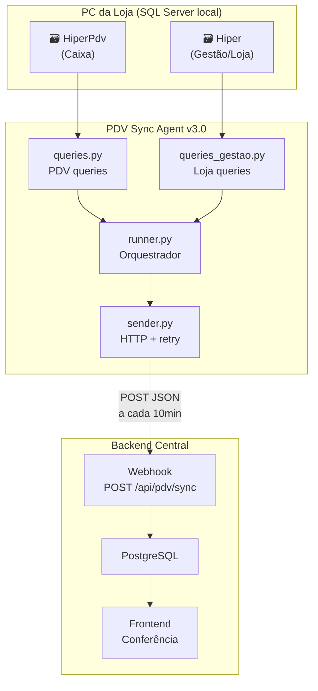
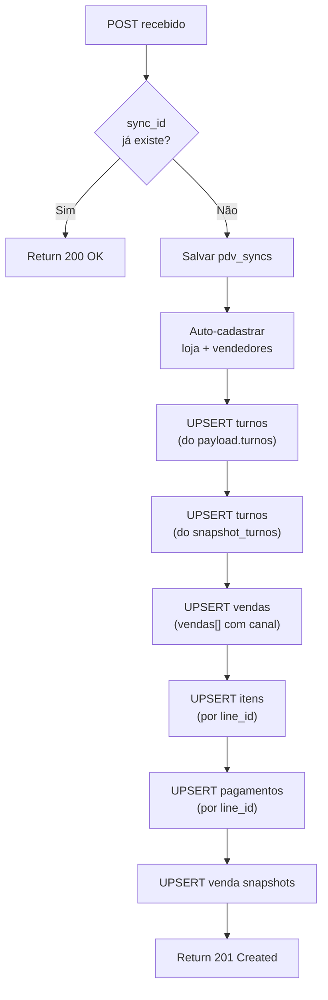

# Backend API — Guia de Integração PDV Sync Agent v3.0

**Data:** 2026-02-11
**Versão do agente:** `3.0.0` | **Schema:** `3.0`
**Para:** Time Backend (API/Webhook)
**De:** Time Integração PDV

---

## ⚡ Resumo Executivo — O que mudou na v3.0

> [!IMPORTANT]
> A v3.0 é a maior atualização desde a criação do agente. Introduz **dual-database** (Hiper Caixa + Hiper Loja),
> **snapshots para verificação/upsert**, campo **canal** para distinguir origem, e corrige o bug crítico de
> fechamento de turno invisível.

| # | Novidade v3.0 | Impacto Backend |
|---|---|---|
| 1 | **Dual-database**: HiperPdv (Caixa) + Hiper (Gestão/Loja) | Vendas agora vêm de 2 canais |
| 2 | **Campo `canal`** em vendas (`HIPER_CAIXA` / `HIPER_LOJA`) | Armazenar e filtrar por canal |
| 3 | **`snapshot_turnos[]`** — últimos 10 turnos fechados | Verificação + UPSERT de turnos antigos |
| 4 | **`snapshot_vendas[]`** — últimas 10 vendas (ambos canais) | Verificação + UPSERT de vendas antigas |
| 5 | **`ops.loja_count` + `ops.loja_ids`** | IDs de operações do Hiper Loja separados |
| 6 | **`event_type`** dinâmico (`sales`, `turno_closure`, `mixed`) | Backend sabe o motivo do POST |
| 7 | **Turno-aware sync** — fechamento detectado sem vendas | Dados de closure nunca são perdidos |
| 8 | **`responsavel`** em TurnoDetail e TurnoSnapshot | Vendedor principal por turno |
| 9 | **Trigger on_shutdown** — sync antes do PC desligar | Reduz perda de dados |
| 10 | **IDs universais** — usuarios/lojas compartilhados entre DBs | Requer normalização no backend |

---

## 1. Arquitetura — Os 2 Sistemas Hiper

### 1.1 Hiper Caixa (HiperPdv) — O PDV Tradicional

| Aspecto | Detalhe |
|---|---|
| **Database** | `HiperPdv` (SQL Server local) |
| **Função** | Caixa do ponto de venda — registra vendas presenciais |
| **Como funciona** | Operador abre turno → registra vendas → fecha turno |
| **Tabelas-chave** | `operacao_pdv`, `item_operacao_pdv`, `finalizador_operacao_pdv`, `turno`, `usuario`, `ponto_venda` |
| **Operações** | `op=1` Venda, `op=4` Falta de Caixa, `op=9` Fechamento de Turno |
| **Conceito central** | **Turno** = período de trabalho do caixa (abertura → fechamento) |

### 1.2 Hiper Loja (Hiper Gestão) — Vendas pelo Sistema de Gestão

| Aspecto | Detalhe |
|---|---|
| **Database** | `Hiper` (SQL Server local, mesma instância) |
| **Função** | Vendas feitas pelo módulo de gestão/balcão (não pelo caixa) |
| **Como funciona** | Vendedor registra venda diretamente no sistema de gestão |
| **Tabelas-chave** | Mesmas tabelas (`operacao_pdv`, `item_operacao_pdv`...) mas com coluna `origem=2` |
| **Diferença principal** | Não tem conceito de "turno" próprio — usa `id_turno` do caixa |
| **Filtro** | `WHERE operacao = 1 AND cancelado = 0 AND origem = 2` |

### 1.3 Diagrama de Arquitetura



### 1.4 Descoberta Importante: IDs Universais

> [!WARNING]
> **Lojas e vendedores são UNIVERSAIS entre os bancos.** O `id_usuario` e `id_ponto_venda` são os mesmos em
> HiperPdv e Hiper Gestão. Isso significa que o mesmo vendedor (ex: `id_usuario=80, nome="Daren"`) aparece em
> ambos os bancos com o mesmo ID.
>
> **Porém**, os nomes podem ter variações (espaços, casing) entre bancos. O backend DEVE normalizar.

Cada loja tem seu **banco local independente**, mas os IDs de entidades são compartilhados globalmente:

| Entidade | Universal? | Exemplo |
|---|---|---|
| `id_usuario` (operador/vendedor) | ✅ Sim | `id=80` = "Daren" em todas as lojas |
| `id_ponto_venda` (loja) | ✅ Sim | `id=13` = "Porto Belo" em todos os DBs |
| `id_produto` | ✅ Sim | `id=5402` = mesmo produto em todos |
| `id_finalizador` (meio pagamento) | ✅ Sim | `id=4` = "Cartão de Crédito" |
| `id_operacao` (venda) | ❌ **NÃO** | Gerado localmente, pode colidir entre lojas |
| `id_turno` | ❌ **NÃO** | UUID gerado localmente |

---

## 2. Recomendação: Tabelas de Normalização no Backend

> [!IMPORTANT]
> Recomendamos criar tabelas separadas de normalização para **lojas** e **usuários** no banco de dados do backend.
> Isso dá flexibilidade para padronizar nomes, adicionar metadados, e preparar para futuras fontes de dados.

### 2.1 Schema de Normalização Sugerido

```sql
-- ═══════════════════════════════════════════
-- TABELAS DE NORMALIZAÇÃO (Master Data)
-- ═══════════════════════════════════════════

-- Lojas (master, nome padronizado)
CREATE TABLE pdv_lojas (
    id                  SERIAL PRIMARY KEY,
    id_ponto_venda      INTEGER UNIQUE NOT NULL,  -- ID do sistema Hiper
    nome_padronizado    VARCHAR(200) NOT NULL,     -- Nome definido pelo time
    nome_hiper          VARCHAR(200),              -- Nome original do Hiper
    alias               VARCHAR(50),               -- Apelido do .env (ex: "porto-belo-13")
    cnpj                VARCHAR(20),
    cidade              VARCHAR(100),
    uf                  CHAR(2),
    endereco            VARCHAR(300),
    cep                 VARCHAR(10),
    telefone            VARCHAR(20),
    email               VARCHAR(200),
    ativa               BOOLEAN DEFAULT TRUE,
    fonte               VARCHAR(50) DEFAULT 'HIPER', -- Preparado para outros sistemas
    created_at          TIMESTAMPTZ DEFAULT NOW(),
    updated_at          TIMESTAMPTZ DEFAULT NOW()
);

-- Usuários/Vendedores/Operadores (master, nome padronizado)
CREATE TABLE pdv_usuarios (
    id                  SERIAL PRIMARY KEY,
    id_usuario_hiper    INTEGER UNIQUE NOT NULL,    -- ID do sistema Hiper (universal)
    nome_padronizado    VARCHAR(200) NOT NULL,       -- Nome definido pelo time
    nome_hiper          VARCHAR(200),                -- Nome original do Hiper
    login_hiper         VARCHAR(100),
    papel               VARCHAR(50) DEFAULT 'VENDEDOR', -- VENDEDOR, OPERADOR, GERENTE
    ativo               BOOLEAN DEFAULT TRUE,
    fonte               VARCHAR(50) DEFAULT 'HIPER',
    created_at          TIMESTAMPTZ DEFAULT NOW(),
    updated_at          TIMESTAMPTZ DEFAULT NOW()
);

-- Meios de pagamento (master)
CREATE TABLE pdv_meios_pagamento (
    id                  SERIAL PRIMARY KEY,
    id_finalizador      INTEGER UNIQUE NOT NULL,
    nome_padronizado    VARCHAR(100) NOT NULL,
    nome_hiper          VARCHAR(100),
    categoria           VARCHAR(50),  -- DINHEIRO, CREDITO, DEBITO, PIX, VALE
    ativo               BOOLEAN DEFAULT TRUE,
    created_at          TIMESTAMPTZ DEFAULT NOW()
);
```

### 2.2 Lógica de Auto-cadastro (UPSERT on Sync)

Ao receber um payload, o backend deve fazer UPSERT automático nessas tabelas:

```php
// Ao processar o sync, auto-cadastrar a loja se não existir
PdvLoja::updateOrCreate(
    ['id_ponto_venda' => $payload['store']['id_ponto_venda']],
    [
        'nome_hiper'       => $payload['store']['nome'],
        'alias'            => $payload['store']['alias'],
        'nome_padronizado' => $payload['store']['nome'], // Pode ser editado depois
    ]
);

// Auto-cadastrar vendedores encontrados nas vendas
foreach ($payload['vendas'] as $venda) {
    foreach ($venda['itens'] as $item) {
        if ($item['vendedor'] && $item['vendedor']['id_usuario']) {
            PdvUsuario::firstOrCreate(
                ['id_usuario_hiper' => $item['vendedor']['id_usuario']],
                [
                    'nome_hiper'       => $item['vendedor']['nome'],
                    'nome_padronizado' => $item['vendedor']['nome'],
                ]
            );
        }
    }
}
```

### 2.3 Benefícios da Normalização

| Benefício | Sem Normalização | Com Normalização |
|---|---|---|
| Nome padronizado | ❌ "Loja 1 - MC Komprão Centro TJ" vs "MC Komprao Centro" | ✅ "Komprão Centro Tijucas" |
| Filtros limpos | ❌ Buscar por nome exato do Hiper | ✅ Buscar por nome padronizado |
| Outra fonte de dados | ❌ Reescrever tudo | ✅ Adicionar `fonte='OUTRO_ERP'` |
| Desativar vendedor | ❌ Impossível | ✅ `UPDATE SET ativo = false` |
| Categorizar pagamentos | ❌ Strings livres | ✅ `categoria = 'PIX'` |

---

## 3. Payload JSON v3.0 — Estrutura Completa

### 3.1 Estrutura Raiz

```json
{
    "schema_version": "3.0",
    "event_type": "sales | turno_closure | mixed",
    "agent": { "version": "3.0.0", "machine": "PC-LOJA", "sent_at": "..." },
    "store": { "id_ponto_venda": 13, "nome": "...", "alias": "porto-belo-13" },
    "window": { "from": "...", "to": "...", "minutes": 10 },
    "turnos": [ { "TurnoDetail..." } ],
    "vendas": [ { "SaleDetail com canal..." } ],
    "resumo": { "by_vendor": [...], "by_payment": [...] },
    "snapshot_turnos": [ { "TurnoSnapshot..." } ],
    "snapshot_vendas": [ { "VendaSnapshot..." } ],
    "ops": { "count": 5, "ids": [...], "loja_count": 2, "loja_ids": [...] },
    "integrity": { "sync_id": "sha256...", "warnings": [] }
}
```

### 3.2 Campos NOVOS na v3.0 (vs v2.0)

| Campo | Tipo | Descrição |
|---|---|---|
| **`vendas[].canal`** | `"HIPER_CAIXA"` \| `"HIPER_LOJA"` | Origem da venda |
| **`turnos[].responsavel`** | `OperatorInfo` | Vendedor principal do turno (mais itens vendidos) |
| **`snapshot_turnos[]`** | `TurnoSnapshot[]` | Últimos 10 turnos fechados (verificação) |
| **`snapshot_vendas[]`** | `VendaSnapshot[]` | Últimas 10 vendas de ambos canais |
| **`ops.loja_count`** | `int` | Quantidade de operações Hiper Loja na janela |
| **`ops.loja_ids`** | `int[]` | IDs das operações Hiper Loja |
| **`event_type`** | `string` | `sales`, `turno_closure`, ou `mixed` |

### 3.3 TurnoSnapshot (NOVO)

Enviado em **todo payload** — últimos 10 turnos fechados da loja, independente da janela.

```json
{
    "id_turno": "656335C4-D6C4-455A-8E3D-FF6B3F570C64",
    "sequencial": 2,
    "fechado": true,
    "data_hora_inicio": "2026-02-09T08:00:00-03:00",
    "data_hora_termino": "2026-02-09T14:30:00-03:00",
    "duracao_minutos": 390,
    "periodo": "MATUTINO",
    "operador": { "id_usuario": 12, "nome": "Carlos" },
    "responsavel": { "id_usuario": 80, "nome": "Daren" },
    "qtd_vendas": 45,
    "total_vendas": 12500.00,
    "qtd_vendedores": 3
}
```

**Uso no backend:** UPSERT por `id_turno`. Garante que turnos antigos que não foram recebidos corretamente sejam inseridos/atualizados.

### 3.4 VendaSnapshot (NOVO)

Últimas 10 vendas combinando PDV + Loja, ordenadas por data.

```json
{
    "id_operacao": 12380,
    "canal": "HIPER_CAIXA",
    "data_hora_inicio": "2026-02-09T16:26:44-03:00",
    "data_hora_termino": "2026-02-09T16:26:59-03:00",
    "duracao_segundos": 15,
    "id_turno": "656335C4-D6C4-455A-8E3D-FF6B3F570C64",
    "turno_seq": 2,
    "vendedor": { "id_usuario": 80, "nome": "Daren" },
    "qtd_itens": 3,
    "total_itens": 129.00
}
```

**Uso no backend:** Verificar se os dados recentes batem. UPSERT por `(id_operacao, store_id)`.

---

## 4. Lógica de UPSERT para Snapshots

> [!IMPORTANT]
> Snapshots servem como **mecanismo de auto-correção**. A cada sync, o agente envia os últimos 10 turnos/vendas.
> O backend deve fazer UPSERT, atualizando dados que possam ter sido inseridos incorretamente.

### 4.1 UPSERT de Turno Snapshots

```php
foreach ($payload['snapshot_turnos'] as $snap) {
    PdvTurno::updateOrCreate(
        ['id_turno' => $snap['id_turno']],
        [
            'store_id'            => $storeId,
            'sequencial'          => $snap['sequencial'],
            'fechado'             => $snap['fechado'],
            'data_hora_inicio'    => Carbon::parse($snap['data_hora_inicio']),
            'data_hora_termino'   => isset($snap['data_hora_termino'])
                                     ? Carbon::parse($snap['data_hora_termino']) : null,
            'duracao_minutos'     => $snap['duracao_minutos'] ?? null,
            'periodo'             => $snap['periodo'] ?? null,
            'operador_id'         => $snap['operador']['id_usuario'] ?? null,
            'operador_nome'       => $snap['operador']['nome'] ?? null,
            'responsavel_id'      => $snap['responsavel']['id_usuario'] ?? null,
            'responsavel_nome'    => $snap['responsavel']['nome'] ?? null,
            'qtd_vendas'          => $snap['qtd_vendas'] ?? 0,
            'total_vendas'        => $snap['total_vendas'] ?? 0,
            'qtd_vendedores'      => $snap['qtd_vendedores'] ?? 0,
        ]
    );
}
```

### 4.2 UPSERT de Venda Snapshots

```php
foreach ($payload['snapshot_vendas'] as $snap) {
    PdvVendaResumo::updateOrCreate(
        ['id_operacao' => $snap['id_operacao'], 'store_id' => $storeId],
        [
            'canal'             => $snap['canal'],
            'data_hora_inicio'  => isset($snap['data_hora_inicio'])
                                   ? Carbon::parse($snap['data_hora_inicio']) : null,
            'data_hora_termino' => isset($snap['data_hora_termino'])
                                   ? Carbon::parse($snap['data_hora_termino']) : null,
            'duracao_segundos'  => $snap['duracao_segundos'] ?? null,
            'id_turno'          => $snap['id_turno'] ?? null,
            'turno_seq'         => $snap['turno_seq'] ?? null,
            'vendedor_id'       => $snap['vendedor']['id_usuario'] ?? null,
            'vendedor_nome'     => $snap['vendedor']['nome'] ?? null,
            'qtd_itens'         => $snap['qtd_itens'] ?? 0,
            'total_itens'       => $snap['total_itens'] ?? 0,
        ]
    );
}
```

---

## 5. Schema PostgreSQL Atualizado (v3.0)

### 5.1 Novas tabelas e campos

```sql
-- Adicionar ao pdv_turnos existente:
ALTER TABLE pdv_turnos ADD COLUMN IF NOT EXISTS duracao_minutos INTEGER;
ALTER TABLE pdv_turnos ADD COLUMN IF NOT EXISTS periodo VARCHAR(20);
ALTER TABLE pdv_turnos ADD COLUMN IF NOT EXISTS responsavel_id INTEGER;
ALTER TABLE pdv_turnos ADD COLUMN IF NOT EXISTS responsavel_nome VARCHAR(200);
ALTER TABLE pdv_turnos ADD COLUMN IF NOT EXISTS qtd_vendas INTEGER DEFAULT 0;
ALTER TABLE pdv_turnos ADD COLUMN IF NOT EXISTS total_vendas DECIMAL(12,2) DEFAULT 0;
ALTER TABLE pdv_turnos ADD COLUMN IF NOT EXISTS qtd_vendedores INTEGER DEFAULT 0;

-- Adicionar canal às vendas:
ALTER TABLE pdv_vendas ADD COLUMN IF NOT EXISTS canal VARCHAR(20) DEFAULT 'HIPER_CAIXA';

-- Tabela para snapshot de vendas resumidas (opcional, para dashboard rápido)
CREATE TABLE IF NOT EXISTS pdv_vendas_resumo (
    id              SERIAL PRIMARY KEY,
    id_operacao     INTEGER NOT NULL,
    store_id        INTEGER NOT NULL,
    canal           VARCHAR(20) DEFAULT 'HIPER_CAIXA',
    data_hora_inicio    TIMESTAMPTZ,
    data_hora_termino   TIMESTAMPTZ,
    duracao_segundos    INTEGER,
    id_turno        VARCHAR(36),
    turno_seq       SMALLINT,
    vendedor_id     INTEGER,
    vendedor_nome   VARCHAR(200),
    qtd_itens       INTEGER DEFAULT 0,
    total_itens     DECIMAL(12,2) DEFAULT 0,
    updated_at      TIMESTAMPTZ DEFAULT NOW(),
    UNIQUE(id_operacao, store_id)
);

-- Índices
CREATE INDEX IF NOT EXISTS idx_vendas_canal ON pdv_vendas(canal);
CREATE INDEX IF NOT EXISTS idx_turnos_periodo ON pdv_turnos(store_id, periodo);
CREATE INDEX IF NOT EXISTS idx_turnos_responsavel ON pdv_turnos(responsavel_id);
CREATE INDEX IF NOT EXISTS idx_resumo_vendedor ON pdv_vendas_resumo(vendedor_id, store_id);
```

---

## 6. Casos de Uso do Backend — Requisitos de Negócio

### 6.1 Fechamento de Caixa por Turno

```sql
-- Selecionar loja + data + turno → ver totais por meio de pagamento
SELECT
    t.id_turno, t.sequencial, t.fechado, t.periodo,
    t.data_hora_inicio, t.data_hora_termino,
    t.operador_nome, t.responsavel_nome,
    t.total_sistema, t.total_declarado, t.total_falta,
    tp.meio_pagamento, tp.tipo, tp.total AS total_meio, tp.qtd_vendas
FROM pdv_turnos t
LEFT JOIN pdv_turno_pagamentos tp ON tp.id_turno = t.id_turno
WHERE t.store_id = :store_id
  AND t.data_hora_inicio::DATE = :data
ORDER BY t.sequencial, tp.tipo;
```

**Filtros disponíveis:** loja, data, turno (sequencial), período (MATUTINO/VESPERTINO/NOTURNO)

O campo `tipo` em `pdv_turno_pagamentos` indica:
- `sistema` → totais calculados pelo sistema (vendas reais)
- `declarado` → valores declarados pelo operador no fechamento
- `falta` → diferença (sistema - declarado)

### 6.2 Vendas por Vendedor com Filtros

```sql
-- Ranking de vendedores por período
SELECT
    u.nome_padronizado AS vendedor,
    COUNT(DISTINCT vi.id_operacao) AS qtd_vendas,
    SUM(vi.total) AS total_vendido,
    SUM(vi.qtd) AS total_itens
FROM pdv_venda_itens vi
JOIN pdv_vendas v ON v.id_operacao = vi.id_operacao AND v.store_id = vi.store_id
LEFT JOIN pdv_usuarios u ON u.id_usuario_hiper = vi.vendedor_id
WHERE vi.store_id = :store_id
  AND v.data_hora BETWEEN :data_inicio AND :data_fim
  AND (:canal IS NULL OR v.canal = :canal)
  AND (:vendedor_id IS NULL OR vi.vendedor_id = :vendedor_id)
GROUP BY u.nome_padronizado
ORDER BY total_vendido DESC;
```

### 6.3 Saber se Turno está Aberto ou Fechado

```sql
-- Turno atual da loja (aberto)
SELECT * FROM pdv_turnos
WHERE store_id = :store_id AND fechado = FALSE
ORDER BY data_hora_inicio DESC LIMIT 1;

-- Turno de um dia + loja específica
SELECT
    id_turno, sequencial, fechado, periodo,
    data_hora_inicio, data_hora_termino,
    CASE WHEN fechado THEN 'FECHADO' ELSE 'ABERTO' END AS status
FROM pdv_turnos
WHERE store_id = :store_id
  AND data_hora_inicio::DATE = :data
ORDER BY sequencial;
```

### 6.4 Ranking de Vendas

```sql
-- Ranking mensal por vendedor, por loja
SELECT
    l.nome_padronizado AS loja,
    u.nome_padronizado AS vendedor,
    COUNT(DISTINCT vi.id_operacao) AS qtd_vendas,
    SUM(vi.total) AS total_vendido,
    RANK() OVER (PARTITION BY vi.store_id ORDER BY SUM(vi.total) DESC) AS ranking
FROM pdv_venda_itens vi
JOIN pdv_vendas v ON v.id_operacao = vi.id_operacao AND v.store_id = vi.store_id
JOIN pdv_lojas l ON l.id_ponto_venda = vi.store_id
LEFT JOIN pdv_usuarios u ON u.id_usuario_hiper = vi.vendedor_id
WHERE v.data_hora >= DATE_TRUNC('month', CURRENT_DATE)
GROUP BY l.nome_padronizado, u.nome_padronizado, vi.store_id
ORDER BY vi.store_id, ranking;
```

---

## 7. Melhorias para ser à Prova de Falhas

### 7.1 Resiliência já implementada no Agente v3.0

| Mecanismo | Como funciona |
|---|---|
| **Outbox queue** | Se o POST falha (5xx/rede), payload salvo em `outbox/` e reenviado a cada 10min |
| **Dead letter** | Erros 4xx (payload inválido) vão para `dead_letter/` sem retry |
| **Retry com backoff** | 3 tentativas com backoff exponencial (2s→4s→8s) |
| **Max retries** | 50 tentativas no outbox, após vai para dead_letter |
| **TTL** | Payloads expiram em 7 dias |
| **Shutdown trigger** | Task `PDVSyncAgent_Shutdown` roda sync antes do PC desligar |
| **sync_id idempotente** | SHA256 determinístico previne duplicação |
| **Turno-aware** | Fechamento de turno sem vendas é detectado e enviado |
| **Snapshots** | Auto-correção via UPSERT dos últimos 10 turnos/vendas |

### 7.2 Recomendações para o Backend

| # | Recomendação | Prioridade |
|---|---|---|
| 1 | **Monitorar lojas silenciosas** — alerta se loja não sincroniza em >2h | 🔴 Alta |
| 2 | **Validar `sync_id` antes de processar** — retornar 200 se já existe | 🔴 Alta |
| 3 | **Log de `X-Request-Id`** para correlação de debugging | 🟡 Média |
| 4 | **UPSERT snapshots** — não ignorar, usar para correção de dados | 🔴 Alta |
| 5 | **Retornar HTTP correto** — 422 só se payload é realmente inválido | 🔴 Alta |
| 6 | **Dashboard de saúde** — volume por loja por hora | 🟡 Média |
| 7 | **Auto-cadastro** de vendedores/lojas nas tabelas de normalização | 🟡 Média |
| 8 | **Detectar anomalias** via `integrity.warnings[]` | 🟢 Baixa |

### 7.3 Monitoramento — Queries úteis

```sql
-- Lojas que não sincronizaram nas últimas 2h
SELECT l.nome_padronizado, s.store_alias, MAX(s.received_at) AS last_sync
FROM pdv_syncs s
LEFT JOIN pdv_lojas l ON l.id_ponto_venda = s.store_id
GROUP BY l.nome_padronizado, s.store_alias
HAVING MAX(s.received_at) < NOW() - INTERVAL '2 hours';

-- Volume de syncs por loja (últimas 24h)
SELECT store_id, store_alias,
       COUNT(*) AS syncs,
       SUM(ops_count) AS total_vendas,
       MIN(received_at) AS primeiro, MAX(received_at) AS ultimo
FROM pdv_syncs
WHERE received_at >= NOW() - INTERVAL '24 hours'
GROUP BY store_id, store_alias;
```

---

## 8. Fluxo Completo de Processamento (Webhook v3.0)



---

## 9. Checklist de Implementação Backend v3.0

### Migrations
- [ ] Adicionar colunas `duracao_minutos`, `periodo`, `responsavel_id/nome`, `qtd_vendas`, `total_vendas`, `qtd_vendedores` em `pdv_turnos`
- [ ] Adicionar coluna `canal` em `pdv_vendas`
- [ ] Criar tabela `pdv_vendas_resumo` (snapshot vendas)
- [ ] Criar tabela `pdv_lojas` (normalização)
- [ ] Criar tabela `pdv_usuarios` (normalização)
- [ ] Criar tabela `pdv_meios_pagamento` (normalização)
- [ ] Criar índices de performance

### Webhook
- [ ] Aceitar `schema_version: "3.0"` no middleware
- [ ] Processar `snapshot_turnos[]` com UPSERT
- [ ] Processar `snapshot_vendas[]` com UPSERT
- [ ] Armazenar `canal` (`HIPER_CAIXA` / `HIPER_LOJA`) nas vendas
- [ ] Processar `ops.loja_count` e `ops.loja_ids` para dedup de vendas Loja
- [ ] Auto-cadastrar lojas e vendedores nas tabelas master

### Dashboard/API
- [ ] Endpoint de fechamento de caixa por turno (filtros: loja, data, turno)
- [ ] Endpoint de vendas com filtros (vendedor, loja, canal, período)
- [ ] Ranking de vendedores (diário, semanal, mensal)
- [ ] Dashboard de saúde (lojas ativas, última sincronização)
- [ ] Alertas para lojas silenciosas (>2h sem sync)
