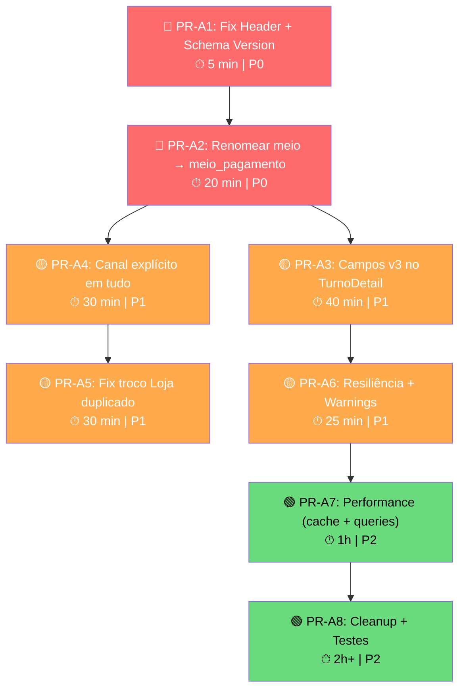

# PR Tasks — PDV Sync Agent v3.0 Melhorias

**Data:** 2026-02-12
**Projeto:** `pdv-sync-agent` (Python)
**Baseado em:** [ANALISE_AGENT_WORKFLOW_V3.md](file:///c:/Users/Usuario/Desktop/maiscapinhas/chupacabra/pdv-sync-agent/docs/ANALISE_AGENT_WORKFLOW_V3.md)

---

## Grafo de Dependências



> [!IMPORTANT]
> **PR-A1 e PR-A2 são blockers funcionais.** Sem eles, colunas no banco ficam NULL e o header envia versão errada. Devem ser feitos juntos num único deploy.

---

## 🔴 PR-A1: Fix Header Schema Version (P0)

**Problema:** Header `X-PDV-Schema-Version` hardcoded como `"2.0"` enquanto payload envia `schema_version: "3.0"`.
**Impacto:** Backend pode rejeitar ou processar com parser errado.
**Depende de:** Nada

### Subtask A1.1 — Corrigir header em sender.py

| | |
|---|---|
| **Arquivo** | [sender.py](file:///c:/Users/Usuario/Desktop/maiscapinhas/chupacabra/pdv-sync-agent/src/sender.py#L195-L202) |
| **Linha** | 201 |
| **Tipo** | Fix 1 linha |

```diff
# sender.py — _get_headers()
 from . import SCHEMA_VERSION

 def _get_headers(self) -> dict[str, str]:
     return {
         "Authorization": f"Bearer {self.token}",
         "Content-Type": "application/json",
         "Accept": "application/json",
-        "X-PDV-Schema-Version": "2.0",
+        "X-PDV-Schema-Version": SCHEMA_VERSION,
     }
```

### Subtask A1.2 — Validar que `SCHEMA_VERSION` está correto

| | |
|---|---|
| **Arquivo** | [\_\_init\_\_.py](file:///c:/Users/Usuario/Desktop/maiscapinhas/chupacabra/pdv-sync-agent/src/__init__.py) |
| **Check** | `SCHEMA_VERSION = "3.0"` ✅ já está correto |

### Verificação PR-A1

```bash
# Grep para confirmar que não há mais "2.0" hardcoded
grep -rn "2\.0" src/sender.py
# Deve retornar 0 resultados
```

---

## 🔴 PR-A2: Renomear `meio` → `meio_pagamento` (P0)

**Problema:** O agente serializa campo como `"meio"` mas o backend PHP lê `"meio_pagamento"` — resultado: colunas `meio_pagamento` em **4 tabelas** ficam sempre NULL.
**Impacto:** Perda total de nome dos meios de pagamento nas vendas e turnos.
**Depende de:** PR-A1 (deploy junto)

### Subtask A2.1 — Renomear em `SalePayment`

| | |
|---|---|
| **Arquivo** | [payload.py](file:///c:/Users/Usuario/Desktop/maiscapinhas/chupacabra/pdv-sync-agent/src/payload.py#L160-L170) |
| **Modelo** | `SalePayment` |
| **Tabela backend afetada** | `pdv_venda_pagamentos.meio_pagamento` |

```diff
 class SalePayment(BaseModel):
     """Individual payment in a sale."""
     line_id: Optional[int] = None
     id_finalizador: Optional[int] = None
-    meio: Optional[str] = None
+    meio_pagamento: Optional[str] = None
     valor: Decimal = Decimal("0.00")
     valor_troco: Decimal = Decimal("0.00")
     parcela: Optional[int] = None
```

**Atualizar `build_sale_details()` em payload.py que popula esse campo:**

```diff
 # payload.py — build_sale_details(), seção de pagamentos (~linha 470)
 pay_obj = SalePayment(
     line_id=pay.get("line_id"),
     id_finalizador=pay.get("id_finalizador"),
-    meio=pay.get("meio_pagamento"),
+    meio_pagamento=pay.get("meio_pagamento"),
     valor=Decimal(str(pay.get("valor", 0))),
     valor_troco=Decimal(str(pay.get("valor_troco", 0))),
     parcela=pay.get("parcela"),
 )
```

### Subtask A2.2 — Renomear em `PaymentTotal`

| | |
|---|---|
| **Arquivo** | [payload.py](file:///c:/Users/Usuario/Desktop/maiscapinhas/chupacabra/pdv-sync-agent/src/payload.py#L95-L100) |
| **Modelo** | `PaymentTotal` |
| **Tabelas afetadas** | `pdv_turno_pagamentos.meio_pagamento` (sistema, declarado, falta) |

```diff
 class PaymentTotal(BaseModel):
     """Payment total by method for a turno."""
     id_finalizador: Optional[int] = None
-    meio: Optional[str] = None
+    meio_pagamento: Optional[str] = None
     qtd_vendas: int = 0
     total: Decimal = Decimal("0.00")
```

**Atualizar `_build_turnos()` em runner.py que popula esse campo (3 lugares):**

```diff
 # runner.py — _build_turnos(), seção totais_sistema (~linha 305)
 PaymentTotal(
     id_finalizador=pm.get("id_finalizador"),
-    meio=pm.get("meio_pagamento"),
+    meio_pagamento=pm.get("meio_pagamento"),
     qtd_vendas=pm.get("qtd_vendas", 0),
     total=Decimal(str(pm.get("total_pago", 0))),
 )
```

```diff
 # runner.py — _build_turnos(), seção fechamento_declarado (~linha 330)
 PaymentTotal(
     id_finalizador=cv.get("id_finalizador"),
-    meio=cv.get("meio_pagamento"),
+    meio_pagamento=cv.get("meio_pagamento"),
     total=Decimal(str(cv.get("total_declarado", 0))),
 )
```

```diff
 # runner.py — _build_turnos(), seção falta_caixa (~linha 345)
 PaymentTotal(
     id_finalizador=sv.get("id_finalizador"),
-    meio=sv.get("meio_pagamento"),
+    meio_pagamento=sv.get("meio_pagamento"),
     total=Decimal(str(sv.get("total_falta", 0))),
 )
```

### Subtask A2.3 — Renomear em `PaymentMethod` (resumo)

| | |
|---|---|
| **Arquivo** | [payload.py](file:///c:/Users/Usuario/Desktop/maiscapinhas/chupacabra/pdv-sync-agent/src/payload.py#L213-L222) |
| **Modelo** | `PaymentMethod` |
| **Contexto** | Backend não processa resumo ainda, mas o nome deve ser consistente |

```diff
 class PaymentMethod(BaseModel):
     """Payment aggregated by method."""
     id_finalizador: Optional[int] = None
-    meio: Optional[str] = None
+    meio_pagamento: Optional[str] = None
     qtd_vendas: int = 0
     total_pago: Decimal = Decimal("0.00")
```

**Atualizar `build_payload()` em payload.py que popula (~linha 530):**

```diff
 PaymentMethod(
     id_finalizador=pm.get("id_finalizador"),
-    meio=pm.get("meio_pagamento"),
+    meio_pagamento=pm.get("meio_pagamento"),
     qtd_vendas=pm.get("qtd_vendas", 0),
     total_pago=Decimal(str(pm.get("total_pago", 0))),
 )
```

### Verificação PR-A2

```bash
# Confirmar que não sobrou nenhum "meio" isolado nos modelos
grep -n "meio:" src/payload.py
# Deve retornar 0 (só "meio_pagamento:")

# Confirmar que os builders usam o novo nome
grep -n "meio=" src/payload.py src/runner.py
# Deve retornar 0 (só "meio_pagamento=")
```

---

## 🟡 PR-A3: Adicionar campos v3 ao TurnoDetail (P1)

**Problema:** Backend lê 5 campos de `turnos[]` que o `TurnoDetail` não envia. Dados só chegam via snapshot (atrasado).
**Impacto:** Colunas v3 em `pdv_turnos` ficam NULL/0 até o próximo snapshot.
**Depende de:** PR-A2 (para consistência de nomes)

### Subtask A3.1 — Adicionar campos ao modelo `TurnoDetail`

| | |
|---|---|
| **Arquivo** | [payload.py](file:///c:/Users/Usuario/Desktop/maiscapinhas/chupacabra/pdv-sync-agent/src/payload.py#L124-L136) |

```diff
 class TurnoDetail(BaseModel):
     """Detailed turno with closure and shortage data."""
     id_turno: str
     sequencial: Optional[int] = None
     fechado: bool = False
     data_hora_inicio: Optional[datetime] = None
     data_hora_termino: Optional[datetime] = None
+    duracao_minutos: Optional[int] = None
+    periodo: Optional[str] = None  # "manha", "tarde", "noite"
     id_operador: Optional[int] = None
     nome_operador: Optional[str] = None
+    id_responsavel: Optional[int] = None
+    nome_responsavel: Optional[str] = None
+    qtd_vendas: int = 0
+    total_vendas: Decimal = Decimal("0.00")
+    qtd_vendedores: int = 0
     totais_sistema: Optional[TurnoTotaisSistema] = None
     fechamento_declarado: Optional[TurnoFechamento] = None
     falta_caixa: Optional[TurnoFaltaCaixa] = None
```

### Subtask A3.2 — Adicionar query `get_turno_responsavel` (já existe!)

A query `get_turno_responsavel()` já existe em [queries.py:680-707](file:///c:/Users/Usuario/Desktop/maiscapinhas/chupacabra/pdv-sync-agent/src/queries.py#L680-L707). Só não é chamada dentro de `_build_turnos()`.

### Subtask A3.3 — Popular campos v3 no `_build_turnos()` de runner.py

| | |
|---|---|
| **Arquivo** | [runner.py](file:///c:/Users/Usuario/Desktop/maiscapinhas/chupacabra/pdv-sync-agent/src/runner.py#L280-L320) |

```diff
 # runner.py — _build_turnos(), ao construir TurnoDetail:
+
+ # Calcular campos v3
+ duracao = None
+ periodo = None
+ if turno_row.get("data_hora_inicio") and turno_row.get("data_hora_termino"):
+     delta = turno_row["data_hora_termino"] - turno_row["data_hora_inicio"]
+     duracao = int(delta.total_seconds() / 60)
+     hora = turno_row["data_hora_inicio"].hour
+     if hora < 12:
+         periodo = "manha"
+     elif hora < 18:
+         periodo = "tarde"
+     else:
+         periodo = "noite"
+
+ # Responsável (vendedor com mais itens)
+ responsavel = self.queries.get_turno_responsavel(id_turno)
+ id_responsavel = responsavel["id_usuario"] if responsavel else None
+ nome_responsavel = responsavel["nome"] if responsavel else None
+
+ # Contagem de vendas do turno (no escopo da window)
+ # Já temos sales_in_turno pela lógica existente
+ qtd_vendas_turno = len([s for s in vendas if s.get("id_turno") == id_turno])
+ total_vendas_turno = sum(s.get("total", 0) for s in vendas if s.get("id_turno") == id_turno)
+ qtd_vendedores = len(set(
+     s.get("id_usuario_vendedor") for s in sale_items
+     if s.get("id_turno") == id_turno and s.get("id_usuario_vendedor")
+ ))

 detail = TurnoDetail(
     id_turno=id_turno,
     sequencial=turno_row.get("sequencial"),
     fechado=bool(turno_row.get("fechado")),
     data_hora_inicio=turno_row.get("data_hora_inicio"),
     data_hora_termino=turno_row.get("data_hora_termino"),
+    duracao_minutos=duracao,
+    periodo=periodo,
     id_operador=turno_row.get("id_operador"),
     nome_operador=turno_row.get("nome_operador"),
+    id_responsavel=id_responsavel,
+    nome_responsavel=nome_responsavel,
+    qtd_vendas=qtd_vendas_turno,
+    total_vendas=Decimal(str(total_vendas_turno)),
+    qtd_vendedores=qtd_vendedores,
     totais_sistema=totais_sistema,
     fechamento_declarado=fechamento,
     falta_caixa=falta,
 )
```

### Subtask A3.4 — Adicionar tiebreaker no `get_turno_responsavel`

| | |
|---|---|
| **Arquivo** | [queries.py:696-698](file:///c:/Users/Usuario/Desktop/maiscapinhas/chupacabra/pdv-sync-agent/src/queries.py#L696-L698) |

```diff
 WHERE ov.id_turno = ?
   AND ov.operacao = 1 AND ov.cancelado = 0 AND iv.cancelado = 0
 GROUP BY uv.id_usuario, uv.nome
-ORDER BY COUNT(*) DESC
+ORDER BY COUNT(*) DESC, SUM(iv.valor_total_liquido) DESC, uv.id_usuario ASC
```

O tiebreaker garante resultado determinístico quando dois vendedores têm mesmo COUNT.

### Verificação PR-A3

```python
# Construir payload e verificar que campos v3 estão presentes
payload = build_payload(...)
turno = payload["turnos"][0]
assert "duracao_minutos" in turno
assert "periodo" in turno
assert turno["qtd_vendas"] > 0  # se houve vendas
assert turno["total_vendas"] > 0
```

---

## 🟡 PR-A4: Canal explícito em tudo (P1)

**Problema:** Canal é patcheado pós-build e omitido do resumo. Se alguém chamar builder diretamente, esquece o canal.
**Impacto:** Dados misturados sem discriminador no resumo; fragilidade no builder.
**Depende de:** PR-A2

### Subtask A4.1 — Aceitar `canal` como parâmetro em `build_sale_details()`

| | |
|---|---|
| **Arquivo** | [payload.py](file:///c:/Users/Usuario/Desktop/maiscapinhas/chupacabra/pdv-sync-agent/src/payload.py#L406-L410) |

```diff
 def build_sale_details(
     sale_items: list[dict],
     sale_payments: list[dict],
+    canal: str = "HIPER_CAIXA",
 ) -> list[SaleDetail]:
```

```diff
 # Dentro do builder, ao criar SaleDetail:
 detail = SaleDetail(
     id_operacao=op_id,
+    canal=canal,
     data_hora=data_hora,
```

### Subtask A4.2 — Remover patch manual no runner

| | |
|---|---|
| **Arquivo** | [runner.py](file:///c:/Users/Usuario/Desktop/maiscapinhas/chupacabra/pdv-sync-agent/src/runner.py#L419-L422) |

```diff
-vendas = build_sale_details(sale_items, sale_payments)
-for v in vendas:
-    v.canal = canal
+vendas = build_sale_details(sale_items, sale_payments, canal="HIPER_CAIXA")
```

```diff
 # Para Loja:
-vendas_loja = build_sale_details(loja_items, loja_payments)
-for v in vendas_loja:
-    v.canal = "HIPER_LOJA"
+vendas_loja = build_sale_details(loja_items, loja_payments, canal="HIPER_LOJA")
```

### Subtask A4.3 — Adicionar `canal` em `VendorSale` e `PaymentMethod`

| | |
|---|---|
| **Arquivo** | [payload.py](file:///c:/Users/Usuario/Desktop/maiscapinhas/chupacabra/pdv-sync-agent/src/payload.py#L200-L222) |

```diff
 class VendorSale(BaseModel):
     """Sales aggregated by vendor."""
+    canal: str = "HIPER_CAIXA"
     id_ponto_venda: Optional[int] = None
     id_turno: Optional[str] = None
     id_usuario: Optional[int] = None

 class PaymentMethod(BaseModel):
     """Payment aggregated by method."""
+    canal: str = "HIPER_CAIXA"
     id_finalizador: Optional[int] = None
```

### Subtask A4.4 — Setar canal ao popular resumos no runner

| | |
|---|---|
| **Arquivo** | [runner.py](file:///c:/Users/Usuario/Desktop/maiscapinhas/chupacabra/pdv-sync-agent/src/runner.py#L190-L192) |

```diff
 # PDV resumo
 sales_by_vendor_pdv = self.queries.get_sales_by_vendor(dt_from, dt_to)
+for sv in sales_by_vendor_pdv:
+    sv["canal"] = "HIPER_CAIXA"
 
 # Loja resumo  
 sales_by_vendor_loja = self.gestao_queries.get_loja_sales_by_vendor(...)
+for sv in sales_by_vendor_loja:
+    sv["canal"] = "HIPER_LOJA"
```

E o mesmo para `payments_by_method`. Depois no `build_payload()`:

```diff
 VendorSale(
+    canal=v.get("canal", "HIPER_CAIXA"),
     id_ponto_venda=v.get("id_ponto_venda"),
```

### Verificação PR-A4

```bash
# Confirmar que todo SaleDetail tem canal explícito
grep -n "canal" src/payload.py src/runner.py
# Todos os builders devem passar canal como argumento
```

---

## 🟡 PR-A5: Fix troco Loja duplicado (P1)

**Problema:** Troco na Gestão é por operação (`operacao_pdv.ValorTroco`), mas a query joga o mesmo valor em **todos** os finalizadores. Se uma venda tem Dinheiro + Cartão, ambos recebem o troco completo.
**Depende de:** PR-A4

### Subtask A5.1 — Limitar troco ao finalizador "Dinheiro"

| | |
|---|---|
| **Arquivo** | [queries_gestao.py](file:///c:/Users/Usuario/Desktop/maiscapinhas/chupacabra/pdv-sync-agent/src/queries_gestao.py#L168-L191) |

**Opção A (melhor):** Só atribuir troco ao primeiro finalizador com `id_finalizador = 1` (dinheiro):

```diff
 SELECT
     fo.id_finalizador_operacao_pdv AS line_id,
     fo.id_operacao,
     fo.id_finalizador,
     fpv.nome AS meio_pagamento,
     fo.valor,
-    ops.valor_troco_op AS valor_troco,
+    CASE WHEN fo.id_finalizador = 1 THEN ops.valor_troco_op ELSE 0 END AS valor_troco,
     fo.parcela
```

**Opção B (alternativa segura):** Usar ROW_NUMBER para atribuir troco só à primeira linha:

```sql
ROW_NUMBER() OVER (PARTITION BY fo.id_operacao ORDER BY fo.id_finalizador) AS rn
-- Depois: CASE WHEN rn = 1 THEN valor_troco ELSE 0 END
```

> [!WARNING]
> Confirmar com a equipe qual é o `id_finalizador` de Dinheiro na base real. Geralmente é 1, mas pode variar por deployment.

### Verificação PR-A5

```python
# Testar com uma venda que tem 2+ finalizadores
payments = gestao_queries.get_loja_sale_payments(dt_from, dt_to, filial)
for p in payments:
    if p["id_finalizador"] != 1:
        assert p["valor_troco"] == 0, f"Troco deveria ser 0 para não-dinheiro"
```

---

## 🟡 PR-A6: Resiliência + Warnings (P1)

**Problema:** Falhas silenciosas e falta de informação diagnóstica no payload.
**Depende de:** PR-A3

### Subtask A6.1 — Warning quando Gestão DB falha

| | |
|---|---|
| **Arquivo** | [runner.py](file:///c:/Users/Usuario/Desktop/maiscapinhas/chupacabra/pdv-sync-agent/src/runner.py#L180-L186) |

```diff
 except Exception as e:
     logger.warning(f"[Gestão] Failed to fetch Loja data: {e}")
+    warnings.append(f"GESTAO_DB_FAILURE: {str(e)[:200]}")
     loja_ids = []
     vendas_loja = []
```

### Subtask A6.2 — Health check pré-ciclo

| | |
|---|---|
| **Arquivo** | [runner.py](file:///c:/Users/Usuario/Desktop/maiscapinhas/chupacabra/pdv-sync-agent/src/runner.py#L50-L60) |

```diff
 def run(self) -> bool:
+    # Pre-flight: verify main DB connectivity
+    ok, msg = self.db.test_connection()
+    if not ok:
+        logger.error(f"HiperPdv connection failed — skipping cycle: {msg}")
+        return False
+
     # Process outbox first
     self.sender.process_outbox()
```

### Subtask A6.3 — Backoff entre retries do outbox

| | |
|---|---|
| **Arquivo** | [sender.py](file:///c:/Users/Usuario/Desktop/maiscapinhas/chupacabra/pdv-sync-agent/src/sender.py#L306-L310) |

```diff
+import time
+
 for i, filepath in enumerate(pending):
+    if i > 0:
+        time.sleep(2)  # Backoff 2s entre retries para evitar rajada
+
     envelope = self.outbox.load(filepath)
```

### Verificação PR-A6

```python
# Testar que warning aparece quando Gestão falha
# Mock a conexão Gestão para falhar
payload = runner.run()
assert any("GESTAO_DB_FAILURE" in w for w in payload["integrity"]["warnings"])
```

---

## 🟢 PR-A7: Performance (P2)

**Depende de:** PR-A6

### Subtask A7.1 — Cache de `table_has_column()`

| | |
|---|---|
| **Arquivo** | [db.py](file:///c:/Users/Usuario/Desktop/maiscapinhas/chupacabra/pdv-sync-agent/src/db.py#L149-L164) |

```diff
 class DatabaseConnection:
     def __init__(self, settings: Settings):
         self.settings = settings
         self._connection: Optional[pyodbc.Connection] = None
         self._connection_string_override: Optional[str] = None
+        self._column_cache: dict[str, list[str]] = {}

     def get_table_columns(self, table_name: str) -> list[str]:
+        if table_name in self._column_cache:
+            return self._column_cache[table_name]
+
         query = """..."""
         with self.cursor() as cursor:
             cursor.execute(query, (table_name,))
-            return [row[0] for row in cursor.fetchall()]
+            columns = [row[0] for row in cursor.fetchall()]
+            self._column_cache[table_name] = columns
+            return columns
```

**Impacto:** Elimina ~5 queries `INFORMATION_SCHEMA.COLUMNS` por ciclo de sync.

### Subtask A7.2 — Reescrever snapshot queries com CTEs

| | |
|---|---|
| **Arquivo** | [queries.py](file:///c:/Users/Usuario/Desktop/maiscapinhas/chupacabra/pdv-sync-agent/src/queries.py#L572-L630) |

Substituir 5 subqueries correlacionadas por CTEs + JOINs (ver diff completo na [ANALISE](file:///c:/Users/Usuario/Desktop/maiscapinhas/chupacabra/pdv-sync-agent/docs/ANALISE_AGENT_WORKFLOW_V3.md#perf-1-subqueries-correlacionadas-nos-snapshots)).

**Impacto:** De 50 subqueries para 3 CTEs por execução do snapshot.

### Verificação PR-A7

```python
import time
# Benchmark antes e depois
t0 = time.time()
queries.get_turno_snapshot(id_ponto_venda, limit=10)
t1 = time.time()
print(f"Snapshot query: {t1-t0:.3f}s")
# Target: < 500ms
```

---

## 🟢 PR-A8: Cleanup + Testes (P2)

**Depende de:** PR-A7

### Subtask A8.1 — Remover código morto

| Arquivo | O que remover |
|---|---|
| [payload.py:253-262](file:///c:/Users/Usuario/Desktop/maiscapinhas/chupacabra/pdv-sync-agent/src/payload.py#L253-L262) | Classe `TurnoInfo` (legacy, nunca usada) |

### Subtask A8.2 — Atualizar docstrings

| Arquivo | De | Para |
|---|---|---|
| [payload.py:1](file:///c:/Users/Usuario/Desktop/maiscapinhas/chupacabra/pdv-sync-agent/src/payload.py#L1) | `"""...v2.0."""` | `"""...v3.0."""` |

### Subtask A8.3 — Adicionar testes unitários

| Teste | O que cobre | Prioridade |
|---|---|---|
| `test_build_sale_details_canal` | Canal é propagado corretamente por `build_sale_details()` | Alta |
| `test_payment_field_names` | Todos os modelos usam `meio_pagamento` e não `meio` | Alta |
| `test_turno_detail_v3_fields` | `TurnoDetail` inclui campos v3 quando dados disponíveis | Média |
| `test_outbox_retry_lifecycle` | Save → Load → Increment → Dead letter flow | Média |
| `test_window_calculator_edge_cases` | Midnight, DST, janela > 24h | Baixa |

---

## Checklist de Deploy

```
Ordem obrigatória:
──────────────────

□ PR-A1 + PR-A2 (deploy juntos — são breaking changes)
  ├─ Fix header 2.0 → SCHEMA_VERSION
  └─ Renomear meio → meio_pagamento (3 modelos + builders)

□ PR-A3 (pode ir separado)
  └─ Campos v3 no TurnoDetail + tiebreaker responsável

□ PR-A4 (pode ir junto com A3)
  └─ Canal explícito em builders e resumos

□ PR-A5 (pode ir separado)
  └─ Fix troco Loja duplicado

□ PR-A6 (pode ir separado)
  └─ Warnings + health check + outbox backoff

□ PR-A7 + PR-A8 (melhorias sem impacto funcional)
  └─ Cache, queries otimizadas, cleanup, testes
```

> [!IMPORTANT]
> **Coordenação com Backend:** Os PRs A1-A2 do agente **não precisam de mudança no backend** — o PHP já lê `meio_pagamento` e `X-PDV-Schema-Version`. Basta o agente começar a enviar corretamente. Os PRs A3-A4 enviam campos extras que o backend já aceita (colunas já existem via migrations 000250-000320). Zero risco de incompatibilidade.

---

## Mapa de Arquivos Afetados

| Arquivo | PR-A1 | PR-A2 | PR-A3 | PR-A4 | PR-A5 | PR-A6 | PR-A7 | PR-A8 |
|---|---|---|---|---|---|---|---|---|
| `__init__.py` | ✅ import | | | | | | | |
| `sender.py` | ✅ header | | | | | ✅ backoff | | |
| `payload.py` | | ✅ 3 modelos | ✅ TurnoDetail | ✅ VendorSale, PaymentMethod | | | | ✅ cleanup |
| `runner.py` | | ✅ 3 builders | ✅ _build_turnos | ✅ build_sale_details, resumos | | ✅ warnings + healthcheck | | |
| `queries.py` | | | ✅ tiebreaker | | | | ✅ CTE snapshots | |
| `queries_gestao.py` | | | | | ✅ troco fix | | | |
| `db.py` | | | | | | | ✅ cache | |
