# PR Tasks — PDV Sync v3.0 Backend Integration

**Data:** 2026-02-12
**Projeto:** `maiscapinhas-erp-api`
**Baseado em:** [RESPOSTAS_POS_ANALISE_BACKEND_v3.md](file:///c:/Users/Usuario/Desktop/maiscapinhas/chupacabra/pdv-sync-agent/docs/RESPOSTAS_POS_ANALISE_BACKEND_v3.md)
**Agente:** `pdv-sync-agent` v3.0.0

---

## Sumário do Estado Atual

> [!NOTE]
> Análise realizada sobre **22 migrations** (14 originais + 8 novas de 2026-02-12), o `ProcessPdvSyncJob.php` (1582 linhas), `PdvSyncController.php` (503 linhas) e `config/pdv.php`.

### ✅ Já implementado (migrations 2026-02-12)

| Componente | Migration | Status |
|---|---|---|
| `canal` em `pdv_vendas` + unique constraint canônica | `000250_add_canal_to_pdv_vendas_table` | ✅ Migrado |
| Campos v3 em `pdv_turnos` (periodo, responsavel, duracao, totais) | `000260_add_v3_fields_to_pdv_turnos_table` | ✅ Migrado |
| Tabela `pdv_vendas_resumo` (snapshot vendas) | `000270_create_pdv_vendas_resumo_table` | ✅ Migrado |
| `ops_loja_count` + `ops_loja_ids` em `pdv_syncs` | `000280_add_ops_loja_to_pdv_syncs_table` | ✅ Migrado |
| Tabela `pdv_lojas` (dimensão) | `000290_create_pdv_lojas_table` | ✅ Migrado |
| Tabela `pdv_usuarios` (dimensão) | `000300_create_pdv_usuarios_table` | ✅ Migrado |
| Tabela `pdv_meios_pagamento` (dimensão) | `000310_create_pdv_meios_pagamento_table` | ✅ Migrado |
| Snapshot counts em `pdv_syncs` | `000320_add_snapshot_counts_to_pdv_syncs_table` | ✅ Migrado |

### ✅ Já implementado no Job

| Funcionalidade | Localização |
|---|---|
| `resolveVendaCanal()` extrai `canal` do payload por venda | `ProcessPdvSyncJob.php:437-442` |
| UPSERT `pdv_vendas` com chave `['store_pdv_id', 'canal', 'id_operacao']` | `ProcessPdvSyncJob.php:596-601` |
| `processSnapshotVendas()` → UPSERT em `pdv_vendas_resumo` | `ProcessPdvSyncJob.php:694-779` |
| `processSnapshotTurnos()` → UPSERT em `pdv_turnos` | `ProcessPdvSyncJob.php:785+` |

### ❌ Ainda faltando

| Componente | Problema | Referência |
|---|---|---|
| `pdv_venda_itens` — sem coluna `canal` | Colisão line_id entre canais | P0.1 |
| `pdv_venda_pagamentos` — sem coluna `canal` | Colisão line_id entre canais | P0.1/P0.2 |
| Item/pagamento rows não incluem `canal` | Job monta rows sem campo | Job:504-522 |
| UPSERT de itens usa `['store_pdv_id', 'line_id']` sem `canal` | Sobrescreve dados cross-canal | Job:640-644 |
| UPSERT de pagamentos usa `['store_pdv_id', 'line_id']` sem `canal` | Idem | Job:654-658 |
| Header bug no agente (`X-PDV-Schema-Version: "2.0"`) | Mismatch header ≠ body | P0.3 |
| `falta_caixa` negativo tratamento no dashboard | Sobra de caixa | P1.3 |
| Auto-população de tabelas dimensão via payload | pdv_usuarios, pdv_lojas, pdv_meios_pagamento | P3.2 |
| `last_seen_in_snapshot_at` em pdv_vendas | Tracking de cancelamento | P0.4 |

---

## 🔴 PR #1 — Canal em Tabelas Filhas (P0 BLOCKER)

**Branch:** `feat/pdv-canal-child-tables`
**Prioridade:** 🔴 P0 — Sem isso, dados de canais diferentes podem se sobrescrever
**Risco:** ALTO — Altera unique constraints em tabelas com dados em produção

### Contexto

A coluna `canal` já foi adicionada em `pdv_vendas` (migration 000250) e o UPSERT do job já usa `['store_pdv_id', 'canal', 'id_operacao']`. Porém, as tabelas filhas (`pdv_venda_itens`, `pdv_venda_pagamentos`) **não têm** a coluna `canal`, e o UPSERT ainda usa `['store_pdv_id', 'line_id']` sem discriminar canal.

**Problema real:** Uma venda `id_operacao=12380` do `HIPER_CAIXA` e outra `id_operacao=12380` do `HIPER_LOJA` podem ter itens com `line_id=50000`. Sem `canal` na chave, o segundo sobrescreve o primeiro.

### Tarefas

#### 1.1 — Migration: Adicionar `canal` em `pdv_venda_itens`

- [ ] **Criar migration** `2026_02_12_000330_add_canal_to_pdv_venda_children_tables.php`
- [ ] Adicionar coluna `canal VARCHAR(20) DEFAULT 'HIPER_CAIXA'` em `pdv_venda_itens`
  - `$table->string('canal', 20)->default('HIPER_CAIXA')->after('store_id');`
- [ ] Backfill: popular `canal` a partir do JOIN com `pdv_vendas`:
  ```php
  DB::statement("
      UPDATE pdv_venda_itens i
      JOIN pdv_vendas v ON v.store_pdv_id = i.store_pdv_id
          AND v.id_operacao = i.id_operacao
      SET i.canal = v.canal
      WHERE i.canal IS NULL OR i.canal = ''
  ");
  ```
- [ ] Dropar unique index antigo `pdv_venda_itens_unique_line_id` = `(store_pdv_id, line_id)`
- [ ] Criar nova unique: `(store_pdv_id, canal, line_id)` nomeada `pdv_venda_itens_unique_canal_line_id`
- [ ] Dropar unique index `pdv_venda_itens_unique_row_hash` = `(store_pdv_id, id_operacao, row_hash)`
- [ ] Criar nova unique: `(store_pdv_id, canal, id_operacao, row_hash)` nomeada `pdv_venda_itens_unique_canal_row_hash`
- [ ] Dropar unique index `pdv_venda_itens_unique_line` = `(store_pdv_id, id_operacao, line_no)`
- [ ] Criar nova unique: `(store_pdv_id, canal, id_operacao, line_no)` nomeada `pdv_venda_itens_unique_canal_line`
- [ ] Adicionar index standalone: `canal` nomeado `pdv_venda_itens_idx_canal`

#### 1.2 — Migration: Adicionar `canal` em `pdv_venda_pagamentos`

- [ ] Na mesma migration:
- [ ] Adicionar coluna `canal VARCHAR(20) DEFAULT 'HIPER_CAIXA'` em `pdv_venda_pagamentos`
- [ ] Backfill: popular `canal` a partir do JOIN com `pdv_vendas`
- [ ] Dropar unique `pdv_venda_pagamentos_unique_line_id` = `(store_pdv_id, line_id)`
- [ ] Criar nova unique: `(store_pdv_id, canal, line_id)` nomeada `pdv_venda_pagamentos_unique_canal_line_id`
- [ ] Dropar unique `pdv_venda_pagamentos_unique_row_hash` = `(store_pdv_id, id_operacao, row_hash)`
- [ ] Criar nova unique: `(store_pdv_id, canal, id_operacao, row_hash)` nomeada `pdv_venda_pagamentos_unique_canal_row_hash`
- [ ] Dropar unique `pdv_venda_pagamentos_unique_line` = `(store_pdv_id, id_operacao, line_no)`
- [ ] Criar nova unique: `(store_pdv_id, canal, id_operacao, line_no)` nomeada `pdv_venda_pagamentos_unique_canal_line`
- [ ] Adicionar index standalone: `canal` nomeado `pdv_venda_pagamentos_idx_canal`

#### 1.3 — Job: Propagar `canal` para rows de itens e pagamentos

- [ ] **Arquivo:** [ProcessPdvSyncJob.php](file:///c:/Users/Usuario/Desktop/maiscapinhas/maiscapinhas-erp-api/app/Jobs/ProcessPdvSyncJob.php)
- [ ] Na construção do `$itemRow` (linhas 504-522), adicionar:
  ```diff
   $itemRow = [
       'store_pdv_id' => $storePdvId,
       'store_id' => $storeId,
  +    'canal' => $canal,
       'id_operacao' => $idOperacao,
  ```
- [ ] Na construção do `$pagamentoRow` (linhas 571-585), adicionar:
  ```diff
   $pagamentoRow = [
       'store_pdv_id' => $storePdvId,
       'store_id' => $storeId,
  +    'canal' => $canal,
       'id_operacao' => $idOperacao,
  ```

#### 1.4 — Job: Atualizar chaves UPSERT

- [ ] **Linha 640-644** — Itens por line_id:
  ```diff
  - ['store_pdv_id', 'line_id'],
  + ['store_pdv_id', 'canal', 'line_id'],
  ```
- [ ] **Linha 647-651** — Itens fallback por row_hash:
  ```diff
  - ['store_pdv_id', 'id_operacao', 'row_hash'],
  + ['store_pdv_id', 'canal', 'id_operacao', 'row_hash'],
  ```
- [ ] **Linha 654-658** — Pagamentos por line_id:
  ```diff
  - ['store_pdv_id', 'line_id'],
  + ['store_pdv_id', 'canal', 'line_id'],
  ```
- [ ] **Linha 673-676** — Pagamentos fallback por row_hash:
  ```diff
  - ['store_pdv_id', 'id_operacao', 'row_hash'],
  + ['store_pdv_id', 'canal', 'id_operacao', 'row_hash'],
  ```

#### 1.5 — Job: Adicionar `canal` às listas de update columns

- [ ] Em `$itemUpdateColumnsByLineId` (linhas 603-618), adicionar `'canal'`
- [ ] Em `$itemUpdateColumnsFallback` (linhas 620-634), adicionar `'canal'`
- [ ] Nos update columns dos pagamentos (linhas 658-670 e 677-687), adicionar `'canal'`

#### 1.6 — Testes

- [ ] Criar teste unitário: item com mesmo `line_id` em canais diferentes não colide
- [ ] Criar teste unitário: pagamento com mesmo `line_id` em canais diferentes não colide
- [ ] Criar teste: UPSERT de mesmo canal + `line_id` atualiza corretamente
- [ ] Verificar que migration rollback funciona (testar `down()`)

### Arquivos modificados

| Arquivo | Tipo |
|---|---|
| `database/migrations/2026_02_12_000330_add_canal_to_pdv_venda_children_tables.php` | [NEW] |
| `app/Jobs/ProcessPdvSyncJob.php` | [MODIFY] |
| `tests/Feature/ProcessPdvSyncJobTest.php` (ou similar) | [NEW/MODIFY] |

---

## 🔴 PR #2 — Fix Header Schema Version no Agente (P0)

**Branch:** `fix/pdv-agent-schema-version-header`
**Prioridade:** 🔴 P0 — Header `2.0` conflita com body `3.0`
**Risco:** BAIXO — Mudança de 1 linha

### Contexto

O agente envia `X-PDV-Schema-Version: "2.0"` hardcoded (sender.py:201), enquanto o body diz `schema_version: "3.0"`. O controller em produção (linhas 96-106) **deveria rejeitar** com 422 por mismatch, levantando dúvida sobre se essa validação está ativa.

### Tarefas

#### 2.1 — Fix no Agente

- [ ] **Arquivo:** [sender.py](file:///c:/Users/Usuario/Desktop/maiscapinhas/chupacabra/pdv-sync-agent/src/sender.py)
- [ ] Importar `SCHEMA_VERSION` no topo do arquivo (se não importado):
  ```python
  from . import SCHEMA_VERSION
  ```
- [ ] Alterar `_get_headers()` (linha 201):
  ```diff
  - "X-PDV-Schema-Version": "2.0",
  + "X-PDV-Schema-Version": SCHEMA_VERSION,
  ```

#### 2.2 — Config no Backend

- [ ] **Arquivo:** [config/pdv.php](file:///c:/Users/Usuario/Desktop/maiscapinhas/maiscapinhas-erp-api/config/pdv.php)
- [ ] Verificar se `supported_schema_versions` inclui `'3.0'`
  - Atual no código: default `['3.0']` (linha 81-82 do controller)
  - Verificar em `.env` se há override: `PDV_SUPPORTED_SCHEMA_VERSIONS`
- [ ] Se config file lista apenas `['2.0']`, atualizar para `['2.0', '3.0']`

#### 2.3 — Validação

- [ ] Confirmar que após fix, header e body dizem `3.0`
- [ ] Verificar que o mismatch check (controller:96-106) não rejeita
- [ ] Testar cenário: agente v3 → backend aceita payload → job processa

### Arquivos modificados

| Arquivo | Projeto | Tipo |
|---|---|---|
| `src/sender.py` | pdv-sync-agent | [MODIFY] |
| `config/pdv.php` | maiscapinhas-erp-api | [MODIFY] (se necessário) |

---

## 🟡 PR #3 — População automática de tabelas dimensão (P1)

**Branch:** `feat/pdv-auto-populate-dimension-tables`
**Prioridade:** 🟡 P1
**Risco:** BAIXO — Apenas insere dados novos, não altera existentes

### Contexto

As tabelas `pdv_lojas`, `pdv_usuarios` e `pdv_meios_pagamento` foram criadas (migrations 000290-310) mas **não são populadas automaticamente** pelo `ProcessPdvSyncJob`. Atualmente precisam ser cadastradas manualmente.

### Tarefas

#### 3.1 — Auto-cadastro de meios de pagamento

- [ ] No `ProcessPdvSyncJob`, ao processar pagamentos:
  - [ ] Coletar todos os pares `(id_finalizador, meio_pagamento)` do payload
  - [ ] UPSERT em `pdv_meios_pagamento` com:
    - `id_finalizador` (unique key)
    - `nome_padronizado` = `meio_pagamento` do payload
    - `nome_hiper` = `meio_pagamento` do payload
    - `categoria` = inferir via pattern matching:
      ```php
      private function inferPaymentCategory(string $nome): string
      {
          $nome = mb_strtolower($nome);
          return match(true) {
              str_contains($nome, 'dinheiro') => 'DINHEIRO',
              str_contains($nome, 'débito') || str_contains($nome, 'debito') => 'DEBITO',
              str_contains($nome, 'crédito') || str_contains($nome, 'credito') => 'CREDITO',
              str_contains($nome, 'pix') => 'PIX',
              str_contains($nome, 'cheque') => 'CHEQUE',
              str_contains($nome, 'vale') => 'VALE',
              default => 'OUTROS',
          };
      }
      ```

#### 3.2 — Auto-cadastro de usuários (vendedores/operadores)

- [ ] Ao processar itens (vendedor) e turnos (operador):
  - [ ] Coletar pares `(id_usuario, nome)` de vendedores e operadores
  - [ ] UPSERT em `pdv_usuarios`:
    - `id_usuario_hiper` (unique key)
    - `nome_padronizado` e `nome_hiper` do payload
    - `papel`: `'VENDEDOR'` se veio de item, `'OPERADOR'` se veio de turno (cuidar duplicatas)

#### 3.3 — Testes

- [ ] Testar que um finalizador novo é cadastrado automaticamente
- [ ] Testar que um vendedor novo é cadastrado automaticamente
- [ ] Testar edempotência: segundo envio do mesmo meio não cria duplicata

### Arquivos modificados

| Arquivo | Tipo |
|---|---|
| `app/Jobs/ProcessPdvSyncJob.php` | [MODIFY] |
| `tests/Feature/PdvDimensionAutoPopulateTest.php` | [NEW] |

---

## 🟡 PR #4 — Tratamento de `falta_caixa` negativo (P1)

**Branch:** `feat/pdv-falta-caixa-sobra`
**Prioridade:** 🟡 P1
**Risco:** BAIXO — Apenas lógica de exibição/validação

### Contexto

O campo `falta_caixa.total` pode ser **negativo**, indicando **sobra de caixa** (operador tem mais do que o sistema espera). Fórmula do Hiper: `sistema - declarado`. O agente repassa o valor sem transformar.

### Tarefas

#### 4.1 — Backend: Aceitar valores negativos

- [ ] Verificar que a coluna `falta_caixa_*` nas tabelas permite valores negativos
  - Tipo `decimal(14,2)` com sinal — ✅ já permite
- [ ] Verificar que **não há validação** no job que rejeita ou zera negativos
  - Buscar por `abs()`, `max(0, ...)`, ou checks `< 0` nos campos de falta

#### 4.2 — Dashboard: Exibir corretamente

- [ ] Onde exibir `falta_caixa`:
  - `> 0` → label "Falta" + cor vermelha
  - `< 0` → label "Sobra" + cor verde + exibir valor absoluto
  - `= 0` → label "Conferido" + cor neutra
- [ ] Em endpoints de API que retornam fechamento de turno:
  - [ ] Incluir campo computed `falta_caixa_tipo`: `'FALTA'` | `'SOBRA'` | `'CONFERIDO'`

#### 4.3 — Testes

- [ ] Teste com `falta_caixa.total = -15.50` (sobra)
- [ ] Teste com `falta_caixa.total = 30.00` (falta)
- [ ] Teste com `falta_caixa.total = 0.00` (conferido)

---

## 🟢 PR #5 — Tracking de cancelamento via snapshot (P2)

**Branch:** `feat/pdv-last-seen-in-snapshot`
**Prioridade:** 🟢 P2
**Risco:** BAIXO

### Contexto

Vendas canceladas no Hiper **simplesmente desaparecem** dos próximos syncs. Não existe evento de cancelamento. A estratégia é usar o campo `last_seen_in_snapshot_at` para detectar vendas que sumiram.

### Tarefas

#### 5.1 — Migration: Adicionar campo em `pdv_vendas`

- [ ] Criar migration `add_last_seen_in_snapshot_at_to_pdv_vendas.php`
- [ ] Adicionar:
  ```php
  $table->dateTime('last_seen_in_snapshot_at')->nullable();
  $table->index('last_seen_in_snapshot_at');
  ```

#### 5.2 — Job: Atualizar ao processar snapshot

- [ ] Em `processSnapshotVendas()`, após UPSERT em `pdv_vendas_resumo`:
  - [ ] Coletar todos os `id_operacao` + `canal` presentes no snapshot
  - [ ] Executar UPDATE em `pdv_vendas`:
    ```php
    DB::table('pdv_vendas')
        ->where('store_pdv_id', $storePdvId)
        ->whereIn(DB::raw("CONCAT(canal, ':', id_operacao)"), $canaloIds)
        ->update(['last_seen_in_snapshot_at' => now()]);
    ```

#### 5.3 — Alerta de possível cancelamento

- [ ] Criar Artisan Command `PdvStaleVendasCheckCommand`:
  - Detectar vendas com `last_seen_in_snapshot_at < now() - 72h` e `created_at > now() - 7d`
  - Logar/alertar como possível cancelamento
  - **NÃO cancelar automaticamente** — apenas gerar alerta

#### 5.4 — Testes

- [ ] Teste: venda presente no snapshot atualiza `last_seen_in_snapshot_at`
- [ ] Teste: venda ausente do snapshot NÃO é alterada
- [ ] Teste: comando detecta vendas stale corretamente

---

## 🟢 PR #6 — Tiebreaker do `responsavel` no Agente (P2 futuro)

**Branch:** `feat/pdv-agent-responsavel-tiebreaker`
**Prioridade:** 🟢 P2 — Planejado para v3.1
**Projeto:** pdv-sync-agent

### Contexto

A query `get_turno_responsavel` em [queries.py:688](file:///c:/Users/Usuario/Desktop/maiscapinhas/chupacabra/pdv-sync-agent/src/queries.py#L688) usa `ORDER BY COUNT(*) DESC` sem tiebreaker. Empates resultam em seleção arbitrária pelo SQL Server.

### Tarefas

- [ ] Alterar query para:
  ```sql
  ORDER BY COUNT(*) DESC, SUM(iv.valor_total_liquido) DESC, uv.id_usuario ASC
  ```
- [ ] Documentar a regra de desempate no docstring
- [ ] Incrementar SCHEMA_VERSION para `"3.1"` (se houver outras mudanças)

---

## Mapa de Dependências entre PRs

```mermaid
graph TD
    PR1["🔴 PR #1<br/>Canal em Tabelas Filhas"]
    PR2["🔴 PR #2<br/>Fix Header Agente"]
    PR3["🟡 PR #3<br/>Tabelas Dimensão"]
    PR4["🟡 PR #4<br/>falta_caixa negativo"]
    PR5["🟢 PR #5<br/>Tracking cancelamento"]
    PR6["🟢 PR #6<br/>Tiebreaker responsavel"]
    
    PR2 -->|"Agente antes"| PR1
    PR1 -->|"Schema correto"| PR3
    PR1 -->|"canal disponível"| PR5
    PR3 -.->|"independente"| PR4
    PR6 -.->|"agente v3.1"| PR5
```



**Ordem recomendada de merge:**
1. **PR #2** (fix header agente) — pré-requisito, 1 linha
2. **PR #1** (canal child tables) — blocker principal
3. **PR #4** (falta_caixa) — pode ir em paralelo com PR#1
4. **PR #3** (dimensões) — após PR#1 ter `canal` nas filhas
5. **PR #5** (tracking cancelamento) — após PR#1
6. **PR #6** (tiebreaker) — futuro, independente

---

## Schema Completo pós-PRs

```
pdv_syncs
├── pdv_sync_payloads (1:1)
├── pdv_vendas (1:N por sync_id)
│   ├── pdv_venda_itens (1:N por store_pdv_id + canal + id_operacao)
│   └── pdv_venda_pagamentos (1:N por store_pdv_id + canal + id_operacao)
├── pdv_turnos (1:N por store_pdv_id)
│   └── pdv_turno_pagamentos (1:N por store_pdv_id + id_turno)
├── pdv_vendas_resumo (snapshot vendas - 1:N)
└── pdv_store_mappings (dimensão)

Tabelas dimensão (independentes):
├── pdv_lojas
├── pdv_usuarios 
└── pdv_meios_pagamento
```

### Unique Constraints finais

| Tabela | Unique Key Atual | Unique Key Alvo |
|---|---|---|
| `pdv_vendas` | `(store_pdv_id, canal, id_operacao)` | ✅ Já correto |
| `pdv_venda_itens` (line_id) | `(store_pdv_id, line_id)` | `(store_pdv_id, canal, line_id)` |
| `pdv_venda_itens` (row_hash) | `(store_pdv_id, id_operacao, row_hash)` | `(store_pdv_id, canal, id_operacao, row_hash)` |
| `pdv_venda_itens` (line_no) | `(store_pdv_id, id_operacao, line_no)` | `(store_pdv_id, canal, id_operacao, line_no)` |
| `pdv_venda_pagamentos` (line_id) | `(store_pdv_id, line_id)` | `(store_pdv_id, canal, line_id)` |
| `pdv_venda_pagamentos` (row_hash) | `(store_pdv_id, id_operacao, row_hash)` | `(store_pdv_id, canal, id_operacao, row_hash)` |
| `pdv_venda_pagamentos` (line_no) | `(store_pdv_id, id_operacao, line_no)` | `(store_pdv_id, canal, id_operacao, line_no)` |
| `pdv_turnos` | `(store_pdv_id, id_turno)` | ✅ Já correto (turno é UUID compartilhado) |
| `pdv_vendas_resumo` | `(store_pdv_id, canal, id_operacao)` | ✅ Já correto |

---

## Checklist de Verificação Pós-Deploy

- [ ] Rodar `php artisan migrate` sem erro
- [ ] Enviar payload v3 com canal HIPER_CAIXA → verifica UPSERT correto
- [ ] Enviar payload v3 com canal HIPER_LOJA → verifica UPSERT correto
- [ ] Enviar payloads com **mesmo id_operacao e line_id** em canais diferentes → verifica que NÃO colidem
- [ ] Verificar que `pdv_meios_pagamento` foi populada automaticamente
- [ ] Verificar que header `X-PDV-Schema-Version: 3.0` é aceito
- [ ] Verificar que `falta_caixa.total` negativo é persistido corretamente
- [ ] Verificar snapshot venda processing popula `pdv_vendas_resumo`
- [ ] Verificar `last_seen_in_snapshot_at` atualizado para vendas no snapshot
