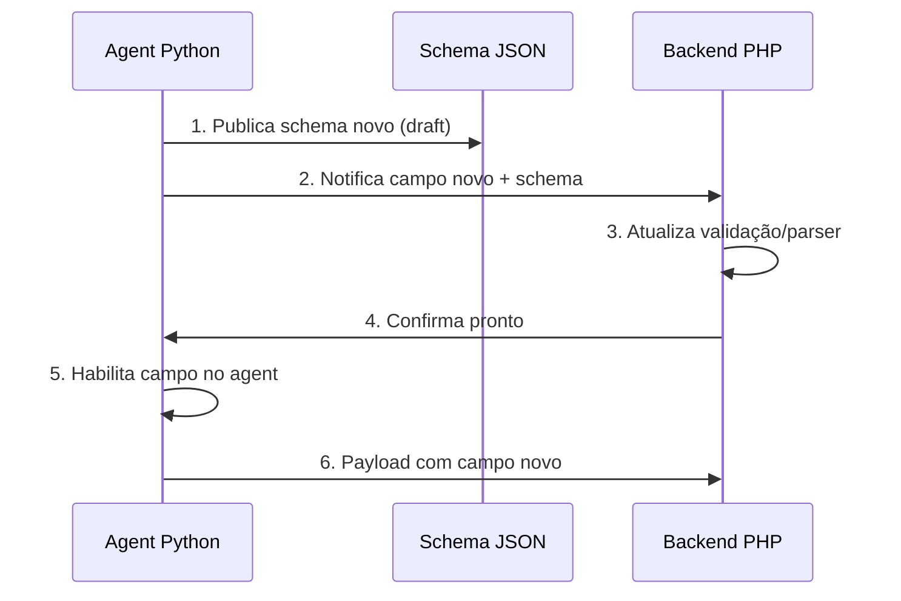

# Respostas do Time Python (Agent v3.0) — Pós E2E

Data: 2026-02-12  
Autor: Time PDV Sync Agent  
Projeto: `pdv-sync-agent v3.0.0`  
Schema: `3.0` | Draft: JSON Schema 2020-12  

---

## Índice

- [P0.1 — sync_id e reprocessamento](#p01)
- [P0.2 — Invariante vendas[] vs ops.*](#p02)
- [P0.3 — Catálogo de warnings](#p03)
- [P0.4 — Payload grande (backlog)](#p04)
- [P0.5 — Semântica do snapshot](#p05)
- [P1.1 — qtd_vendedores no TurnoDetail](#p11)
- [P1.2 — Troco Loja multi-pagamento](#p12)
- [P1.3 — Valores negativos](#p13)
- [P1.4 — id_turno em HIPER_LOJA](#p14)
- [P1.5 — Timezone por loja](#p15)
- [P2.1 — Novos canais](#p21)
- [P2.2 — Evento de cancelamento](#p22)
- [P2.3 — additionalProperties e compatibilidade](#p23)

---

<a name="p01"></a>
## P0.1 — Reprocessamento com mesmo `sync_id` e dados alterados

### Resposta curta
**Sim, `sync_id` é 100% determinístico.** É um SHA-256 de `"store_id|from.isoformat()|to.isoformat()"`.

### Regra final
```
sync_id = SHA256( "{store_id}|{dt_from.isoformat()}|{dt_to.isoformat()}" )
```

> [!IMPORTANT]
> O mesmo `sync_id` **NUNCA** será enviado com conteúdo diferente no corpo principal, 
> **a menos** que o `state.json` seja resetado manualmente na loja (cenário operacional raro).

### Análise detalhada do código

**Geração** — [`payload.py:282-288`](file:///c:/Users/Usuario/Desktop/maiscapinhas/chupacabra/pdv-sync-agent/src/payload.py#L282-L288):
```python
def generate_sync_id(store_id: int, dt_from: datetime, dt_to: datetime) -> str:
    data = f"{store_id}|{dt_from.isoformat()}|{dt_to.isoformat()}"
    return hashlib.sha256(data.encode()).hexdigest()
```

**Janela** — [`state.py:90-115`](file:///c:/Users/Usuario/Desktop/maiscapinhas/chupacabra/pdv-sync-agent/src/state.py#L90-L115):
- `dt_from` = `state.last_sync_to` (salvo após sucesso anterior)
- `dt_to` = `datetime.now(BRT)` no momento da execução
- Após sucesso, `dt_to` é salvo como novo `last_sync_to`

**Cenários de body diferente com mesmo sync_id:**

| Cenário | Pode acontecer? | Risco |
|---|---|---|
| Execução normal | ❌ Impossível | `dt_to` é `now()`, nunca repete |
| Reset manual do state.json | ⚠️ Sim | Operador apaga state → refaz janela antiga |
| Retry de outbox | ❌ Impossível | Outbox reenvia o payload salvo bit-a-bit |
| Máquina parada por horas | ❌ Impossível | `dt_from` avança para `last_sync_to` anterior |

### Impacto para o backend
A idempotência por `sync_id` é **segura**. O único cenário teórico (reset manual) é raro e operacional. Se desejarem proteção extra: comparar `agent.sent_at` — se for diferente para o mesmo `sync_id`, é replay manual.

---

<a name="p02"></a>
## P0.2 — Invariante oficial entre `vendas[]` e `ops.*`

### Resposta curta
**Sim, a regra é válida com uma nuance.**

### Regra final
```
ops.count     == len([v for v in vendas if v.canal == "HIPER_CAIXA"])
ops.loja_count == len([v for v in vendas if v.canal == "HIPER_LOJA"])
len(vendas)   == ops.count + ops.loja_count
```

### Exceção conhecida

> [!WARNING]
> **Existe UMA exceção real:** quando uma operação tem `itens=[]` (todos os itens cancelados).
> 
> O `ops.ids` vem da query `get_operation_ids` que retorna TODOS os `id_operacao` com `operacao=1 AND cancelado=0`.
> Mas `build_sale_details` agrupa por `id_operacao` a partir dos **itens não-cancelados**. Se uma venda teve todos os itens cancelados individualmente (itens `cancelado=1`) mas a operação em si não foi cancelada (`operacao_pdv.cancelado=0`), ela aparece nos `ops.ids` mas NÃO aparece no `vendas[]`.

**Código relevante:**

[`queries.py:419-439`](file:///c:/Users/Usuario/Desktop/maiscapinhas/chupacabra/pdv-sync-agent/src/queries.py#L419-L439) — `get_operation_ids` retorna `WHERE operacao=1 AND cancelado=0`

[`queries.py:445-490`](file:///c:/Users/Usuario/Desktop/maiscapinhas/chupacabra/pdv-sync-agent/src/queries.py#L445-L490) — `get_sale_items` adiciona `WHERE it.cancelado=0`

[`payload.py:469`](file:///c:/Users/Usuario/Desktop/maiscapinhas/chupacabra/pdv-sync-agent/src/payload.py#L469) — `build_sale_details` itera sobre `items_by_op.keys()` (só ops com itens)

**Invariante corrigida:**
```
ops.count >= len([v for v in vendas if v.canal == "HIPER_CAIXA"])
ops.loja_count >= len([v for v in vendas if v.canal == "HIPER_LOJA"])
```

A diferença indica vendas com todos os itens cancelados individualmente — cenário raro.

### Impacto para o backend
Use `>=` em vez de `==` na validação. A diferença é informativa mas não é erro.

---

<a name="p03"></a>
## P0.3 — Taxonomia oficial de `integrity.warnings[]`

### Resposta curta
**3 warnings atualmente, todos em texto livre.**

### Catálogo completo v3.0

O código de warnings está em [`runner.py:445-469`](file:///c:/Users/Usuario/Desktop/maiscapinhas/chupacabra/pdv-sync-agent/src/runner.py#L445-L469):

| # | Prefixo/Padrão | Formato exato | Origem |
|---|---|---|---|
| 1 | `GESTAO_DB_FAILURE:` | `"GESTAO_DB_FAILURE: {mensagem[:200]}"` | Falha na conexão Gestão |
| 2 | `Vendedor NULL` | `"Vendedor NULL encontrado em {N} cupom(s)"` | `id_usuario_vendedor IS NULL` |
| 3 | `Meio de pagamento NULL` | `"Meio de pagamento NULL encontrado"` | `id_finalizador IS NULL` |

### Código-fonte

```python
# runner.py:453-456  — Gestão failure
if self._gestao_warning:
    warnings.append(self._gestao_warning)      # "GESTAO_DB_FAILURE: ..."
    self._gestao_warning = None

# runner.py:458-462  — Vendedor NULL
null_vendors = [v for v in sales_by_vendor if v.get("id_usuario_vendedor") is None]
if null_vendors:
    total_null = sum(v.get("qtd_cupons", 0) for v in null_vendors)
    warnings.append(f"Vendedor NULL encontrado em {total_null} cupom(s)")

# runner.py:464-467  — Meio pagamento NULL
null_payments = [p for p in payments_by_method if p.get("id_finalizador") is None]
if null_payments:
    warnings.append("Meio de pagamento NULL encontrado")
```

### Compromisso de estabilidade

> [!CAUTION]
> Atualmente os warnings são **strings livres**. Não há contrato formal de estabilidade.
> A sugestão do time PHP de migrar para `{code, message}` é aceita para o v3.1.

**Proposta v3.1:**
```json
{
  "warnings": [
    {"code": "GESTAO_DB_FAILURE", "message": "Connection timeout after 30s", "severity": "high"},
    {"code": "VENDEDOR_NULL", "message": "3 cupons sem vendedor", "severity": "low"}
  ]
}
```

### Parse seguro atual para o backend
```php
// Detectar Gestão failure pelo prefixo (seguro):
$isGestaoFailure = str_starts_with($warning, 'GESTAO_DB_FAILURE:');
// Detectar vendedor null:
$isVendedorNull = str_contains($warning, 'Vendedor NULL');
```

---

<a name="p04"></a>
## P0.4 — Payload grande (backlog longo)

### Resposta curta
**Sim, em backlog será um único payload grande. Não existe chunking nem limite.**

### Regra final

A janela é calculada em [`state.py:90-115`](file:///c:/Users/Usuario/Desktop/maiscapinhas/chupacabra/pdv-sync-agent/src/state.py#L90-L115):

```python
if state.last_sync_to:
    dt_from = state.last_sync_to    # ← pode ser horas/dias atrás
else:
    dt_from = now - timedelta(minutes=window_minutes)  # default: 10min

dt_to = now
```

**Se a loja ficou offline por 8h**, `dt_from` será 8h atrás → payload cobre 8h de vendas.

### Limites atuais

| Dimensão | Limite atual | Estimativa prática |
|---|---|---|
| Vendas por payload | ❌ Sem limite | ~50-200 vendas em 8h de backlog típico |
| Itens por payload | ❌ Sem limite | ~500-2000 itens em 8h |
| Tamanho KB/MB | ❌ Sem limite | ~200KB-2MB em backlog de 8h |
| Timeout HTTP | 30s (configurável) | `settings.request_timeout_seconds` |

### Cenário extremo

Com 24h+ de backlog (máquina desligada no final de semana):
- ~500+ vendas, ~5000+ itens → payload de ~5-10MB
- Risco de timeout HTTP de 30s
- Risco de `413 Request Entity Too Large` no nginx

### Impacto para o backend

> [!WARNING]
> **Ação recomendada ao backend:** 
> - Aumentar `client_max_body_size` no nginx para pelo menos `20M`
> - Worker timeout ≥ 60s para payloads grandes
> - Considerar `$request->getContent()` em vez de `$request->json()` para evitar limite de PHP `post_max_size`

### Plano para v3.1
Implementar chunking automático quando `len(vendas) > N` (sugestão: N=100), dividindo em múltiplos payloads com `sync_id` derivado (ex: `sha256_chunk1`, `sha256_chunk2`). **Ainda não implementado.**

---

<a name="p05"></a>
## P0.5 — Semântica de correção por snapshot

### Resposta curta
**Sim, snapshot prevalece. Sem exceção para dados de negócio. Auditoria do backend NÃO deve ser sobrescrita.**

### Regra final

```
snapshot_turnos[]: sempre os últimos 10 turnos FECHADOS (deduplicar por id_turno)
snapshot_vendas[]: sempre as últimas 10 vendas CONCLUÍDAS (mixed PDV+Loja, deduplicar por id_operacao+canal)
```

### Análise do código

**Snapshot de turnos** — [`runner.py:290-338`](file:///c:/Users/Usuario/Desktop/maiscapinhas/chupacabra/pdv-sync-agent/src/runner.py#L290-L338) + [`queries.py:572-630`](file:///c:/Users/Usuario/Desktop/maiscapinhas/chupacabra/pdv-sync-agent/src/queries.py#L572-L630):
- Query: `SELECT TOP 10 ... WHERE fechado=1 ORDER BY data_hora_inicio DESC`
- Inclui: `qtd_vendas`, `total_vendas`, `qtd_vendedores`, `responsavel` (tiebreaker), `duracao_minutos`, `periodo`
- **Dados sempre calculados no momento do envio** — se corrigir um dado no banco da loja, o próximo snapshot reflete a correção

**Snapshot de vendas** — [`runner.py:340-408`](file:///c:/Users/Usuario/Desktop/maiscapinhas/chupacabra/pdv-sync-agent/src/runner.py#L340-L408):
- Combina últimas 10 PDV + últimas 10 Loja → ordena por `data_hora_termino DESC` → pega top 10
- Cada snapshot tem `canal` explícito (`HIPER_CAIXA` ou `HIPER_LOJA`)

### O que NÃO deve ser sobrescrito pelo snapshot

| Campo | Sobrescrever? | Motivo |
|---|---|---|
| `qtd_vendas`, `total_vendas` | ✅ Sim | Dado de negócio, snapshot é verdade |
| `qtd_vendedores` | ✅ Sim | Snapshot calcula preciso |
| `data_hora_inicio/termino` | ✅ Sim | Vem do banco, imutável |
| `responsavel` | ✅ Sim | Recalculado a cada envio |
| Metadados de auditoria do backend | ❌ **Nunca** | `received_at`, `processed_at`, `user_id` do backend |
| `risk_flag` calculado pelo backend | ❌ **Nunca** | Decisão do backend, não do agent |

### Impacto para o backend
```php
// Regra de reconciliação:
$turno = SyncTurno::updateOrCreate(
    ['id_turno' => $snap['id_turno']],  // key
    [
        'qtd_vendas'     => $snap['qtd_vendas'],       // ← sobrescrever
        'total_vendas'   => $snap['total_vendas'],      // ← sobrescrever
        'qtd_vendedores' => $snap['qtd_vendedores'],    // ← sobrescrever
        // NÃO sobrescrever: received_at, risk_flag, processed_by
    ]
);
```

---

<a name="p11"></a>
## P1.1 — `qtd_vendedores` no `turnos[]` detalhe

### Resposta curta
**Confirmado: `turnos[].qtd_vendedores` SEMPRE virá 0 (placeholder).** O valor preciso está **somente** no `snapshot_turnos[]`.

### Código-fonte

[`payload.py:409`](file:///c:/Users/Usuario/Desktop/maiscapinhas/chupacabra/pdv-sync-agent/src/payload.py#L409):
```python
# Note: precise count comes from the snapshot query; here it's a placeholder
qtd_vendedores = 0  # Will be accurate from snapshot
```

[`queries.py:621`](file:///c:/Users/Usuario/Desktop/maiscapinhas/chupacabra/pdv-sync-agent/src/queries.py#L621) — snapshot query:
```sql
(SELECT COUNT(DISTINCT iv2.id_usuario_vendedor)
 FROM dbo.operacao_pdv ov2
 JOIN dbo.item_operacao_pdv iv2 ON iv2.id_operacao = ov2.id_operacao
 WHERE ov2.id_turno = t.id_turno AND ov2.operacao = 1
   AND ov2.cancelado = 0 AND iv2.cancelado = 0
) AS qtd_vendedores
```

### Regra final
```
turnos[].qtd_vendedores = 0                     # SEMPRE placeholder
snapshot_turnos[].qtd_vendedores = COUNT(DISTINCT vendedor)  # PRECISO
```

### Plano v3.1
Implementar a mesma query `COUNT(DISTINCT)` no `build_turno_detail` para tornar o detalhe preciso. Prazo estimado: **próxima release**.

### Impacto para o backend
O backend **deve** preferir `snapshot_turnos[].qtd_vendedores` quando disponível. Para tempo real, ignorar o valor de `turnos[]` ou mostrar como placeholder.

---

<a name="p12"></a>
## P1.2 — Troco em HIPER_LOJA com múltiplos pagamentos

### Resposta curta
**Confirmado: troco agora aparece SOMENTE na 1ª linha de pagamento (rn=1). Não há mais duplicação.**

### Regra final
```sql
-- Loja: troco do operação_pdv.ValorTroco atribuído ao rn=1
CASE WHEN rn = 1 THEN valor_troco_op ELSE 0 END AS valor_troco

-- rn=1 = finalizador com MENOR id_finalizador (ORDER BY id_finalizador ASC)
-- Convenção: id_finalizador=1 é Dinheiro na maioria das instalações HiperERP
```

### Código-fonte

[`queries_gestao.py:156-211`](file:///c:/Users/Usuario/Desktop/maiscapinhas/chupacabra/pdv-sync-agent/src/queries_gestao.py#L156-L211):

```sql
pagamentos AS (
    SELECT
        fo.id_finalizador_operacao_pdv AS line_id,
        fo.id_operacao, fo.id_finalizador,
        fpv.nome AS meio_pagamento, fo.valor,
        ops.valor_troco_op, fo.parcela,
        ROW_NUMBER() OVER (
            PARTITION BY fo.id_operacao
            ORDER BY fo.id_finalizador ASC   -- ← menor id primeiro
        ) AS rn
    FROM ops
    JOIN dbo.finalizador_operacao_pdv fo ...
)
SELECT
    ...,
    CASE WHEN rn = 1 THEN valor_troco_op ELSE 0 END AS valor_troco,
    ...
FROM pagamentos
```

### Diferença entre PDV e Loja

| Canal | Fonte do troco | Lógica |
|---|---|---|
| **HIPER_CAIXA** (PDV) | `finalizador_operacao_pdv.valor_troco` | Cada finalizador tem seu troco nativo |
| **HIPER_LOJA** (Gestão) | `operacao_pdv.ValorTroco` | Valor único por operação → atribuído ao rn=1 |

### Impacto para o backend
O backend pode somar `pagamentos[].troco` sem medo de duplicação em ambos os canais.

---

<a name="p13"></a>
## P1.3 — Campos com valor negativo em venda/item

### Resposta curta
**Não existe filtro de sinal negativo no agent. Valores refletem o banco de dados exatamente como estão.**

### Regra final

| Campo | Pode ser negativo? | Quando |
|---|---|---|
| `itens[].qtd` | ⚠️ Teoricamente sim | Devolução no sistema ERP (raro) |
| `itens[].total` | ⚠️ Teoricamente sim | Devolução ou desconto > valor |
| `itens[].desconto` | ✅ Normal: ≥ 0 | Desconto é valor absoluto |
| `pagamentos[].valor` | ⚠️ Teoricamente sim | Estorno |
| `pagamentos[].troco` | ❌ Sempre ≥ 0 | Troco não pode ser negativo fisicamente |

### Análise do banco

O HiperERP **não** cria operações de devolução como `operacao_pdv` com `operacao=1`. Devoluções usam outro tipo de operação. Portanto:

```
operação=1 AND cancelado=0 → SEMPRE positivo na prática
```

No entanto, o agent **não valida sinais** — se o ERP gravar um valor negativo, ele será propagado.

### Status de `corrections[]` / evento de estorno
**Não implementado no v3.0.** Hoje o agent só captura `operacao=1` (vendas). Devoluções/estornos são invisíveis, ficam para contrato futuro.

### Impacto para o backend
- Tratar `qtd < 0` ou `total < 0` como anomalia para `risk_flag`
- Não subtrair do faturamento — devoluções não entram no payload hoje

---

<a name="p14"></a>
## P1.4 — `id_turno` em vendas HIPER_LOJA

### Resposta curta
**Sim, `id_turno` em HIPER_LOJA pode vir preenchido OU null.**

### Regra final

| Cenário | `id_turno` | Explicação |
|---|---|---|
| Venda Loja com turno aberto | ✅ Preenchido (GUID string) | O ERP associa ao turno do operador |
| Venda Loja sem turno | ❌ `null` | Operação de loja sem caixa/turno |
| Venda PDV (HIPER_CAIXA) | ✅ **Sempre** preenchido | PDV sempre opera dentro de turno |

### Código-fonte

[`queries_gestao.py:100-148`](file:///c:/Users/Usuario/Desktop/maiscapinhas/chupacabra/pdv-sync-agent/src/queries_gestao.py#L100-L148) — `get_loja_sale_items`:
```sql
CONVERT(VARCHAR(36), ops.id_turno) AS id_turno  -- vem da operacao_pdv
```

[`payload.py:455`](file:///c:/Users/Usuario/Desktop/maiscapinhas/chupacabra/pdv-sync-agent/src/payload.py#L455):
```python
"id_turno": str(row["id_turno"]) if row.get("id_turno") else None,
```

### Mutabilidade
Uma venda `HIPER_LOJA` **não muda** de `id_turno` após ser registrada. O campo é imutável no banco.

### Impacto para o backend
```php
// Filtro de turno: tratar null como "sem turno"
$turnoId = $venda['id_turno'] ?? null;
if ($turnoId === null && $venda['canal'] === 'HIPER_LOJA') {
    // Normal — venda da loja sem turno aberto
}
```

---

<a name="p15"></a>
## P1.5 — Timezone por loja

### Resposta curta
**Sim, o agent é fixo em UTC-3 (BRT) para TODAS as lojas. Não há loja planejada fora desse timezone.**

### Código-fonte

[`src/__init__.py:7`](file:///c:/Users/Usuario/Desktop/maiscapinhas/chupacabra/pdv-sync-agent/src/__init__.py#L7):
```python
BRT = timezone(timedelta(hours=-3))
```

Usado em:
- `_aware()` — converte datetime naive para BRT
- `WindowCalculator` — `datetime.now(BRT)`
- `AgentInfo.sent_at` — `datetime.now(BRT)`

### Cenário futuro
Se surgir loja fora de BRT (ex: hora de verão, Amazonas), seria necessário:
1. Adicionar config `TIMEZONE` no `.env`
2. Trocar `BRT` por timezone dinâmico

**Sem previsão de necessidade.** Todas as lojas são na mesma região.

### Impacto para o backend
Seguro assumir `-03:00` em todos os payloads. Validar com `endsWith('-03:00')`.

---

<a name="p21"></a>
## P2.1 — Novos canais além de `HIPER_CAIXA` e `HIPER_LOJA`

### Resposta curta
**Não há previsão de 3º canal no horizonte v3.x.**

### Análise
O HiperERP opera com dois canais de vendas:
- **PDV (Caixa)** → banco `HiperPdv` → sem coluna `origem`
- **Loja (Gestão)** → banco `Hiper` → `origem=2`

Possíveis canais futuros (especulação):
- `HIPER_WEB` — se o ERP lançar módulo de vendas online
- `HIPER_IFOOD` — integração marketplace

### Compromisso
Se surgir novo canal, o time notificará com antecedência o nome sugerido para atualização de observabilidade.

---

<a name="p22"></a>
## P2.2 — Evento explícito de cancelamento/correção

### Resposta curta
**Não implementado no v3.0. Sem plano concreto para v3.1.**

### Status atual
- O agent filtra `cancelado=0` em todas as queries → cancelamentos são invisíveis
- Itens `cancelado=1` dentro de uma venda `cancelado=0` são filtrados (itens individuais removidos)
- Não existe `event_type=cancellation` nem `corrections[]`

### Discussão para v3.1
Opção A: Novo `event_type`:
```json
{"event_type": "cancellation", "cancelamentos": [...]}
```

Opção B: Campo adicional em vendas:
```json
{"vendas": [{"id_operacao": 123, "status": "cancelled", "cancel_reason": "..."}]}
```

**O time Python aguarda proposta do backend para definir o formato preferido.**

---

<a name="p23"></a>
## P2.3 — Estratégia de compatibilidade com `additionalProperties=false`

### Resposta curta
**O fluxo proposto pelo backend está correto.**

### Fluxo acordado



### Mecanismo de proteção

O agent envia `"schema_version": "3.0"` no payload **e** `X-PDV-Schema-Version: 3.0` no header.

Para novos campos:
1. Bump `schema_version` para `3.1`
2. Novos campos são `Optional` com default no agent
3. Backend pode rejeitar schema_version desconhecido com 422

### Impacto para o backend
```php
$version = $request->header('X-PDV-Schema-Version');
if (version_compare($version, '3.0', '>')) {
    // Novo schema — verificar se suportamos
}
```

---

## Resumo de Ações

| ID | Ação | Responsável | Prazo |
|---|---|---|---|
| P0.3 | Migrar warnings para `{code, message}` | Agent | v3.1 |
| P0.4 | Implementar chunking automático | Agent | v3.1 |
| P0.4 | Aumentar `client_max_body_size` nginx | Backend | Imediato |
| P1.1 | Tornar `qtd_vendedores` preciso no detalhe | Agent | v3.1 |
| P1.3 | Definir contrato de cancelamentos | Ambos | Discussão |
| P2.2 | Definir formato `corrections[]` | Ambos | Discussão |
| P2.3 | Documentar changelog por schema version | Agent | v3.1 |

---

## Exemplo de payload v3.0 para referência

```json
{
  "schema_version": "3.0",
  "event_type": "mixed",
  "agent": {
    "version": "3.0.0",
    "machine": "LOJA-PC-01",
    "sent_at": "2026-02-12T10:00:00-03:00"
  },
  "store": {
    "id_ponto_venda": 10,
    "nome": "Mais Capinhas SC-403",
    "alias": "SC403"
  },
  "window": {
    "from": "2026-02-12T09:50:00-03:00",
    "to": "2026-02-12T10:00:00-03:00",
    "minutes": 10
  },
  "turnos": [
    {
      "id_turno": "A1B2C3D4-...",
      "sequencial": 42,
      "fechado": true,
      "data_hora_inicio": "2026-02-12T08:00:00-03:00",
      "data_hora_termino": "2026-02-12T09:55:00-03:00",
      "duracao_minutos": 115,
      "periodo": "MATUTINO",
      "operador": {"id_usuario": 5, "nome": "Ana"},
      "responsavel": {"id_usuario": 7, "nome": "Carlos"},
      "qtd_vendas": 0,
      "total_vendas": "0.00",
      "qtd_vendedores": 0,
      "totais_sistema": {
        "total": "1250.90",
        "qtd_vendas": 15,
        "por_pagamento": [
          {"id_finalizador": 1, "meio": "Dinheiro", "total": "500.00", "qtd_vendas": 8},
          {"id_finalizador": 3, "meio": "Cartão Crédito", "total": "750.90", "qtd_vendas": 10}
        ]
      },
      "fechamento_declarado": {
        "total": "1240.00",
        "por_pagamento": [
          {"id_finalizador": 1, "meio": "Dinheiro", "total": "490.00"},
          {"id_finalizador": 3, "meio": "Cartão Crédito", "total": "750.00"}
        ]
      },
      "falta_caixa": {
        "total": "10.90",
        "por_pagamento": [
          {"id_finalizador": 1, "meio": "Dinheiro", "total": "10.00"},
          {"id_finalizador": 3, "meio": "Cartão Crédito", "total": "0.90"}
        ]
      }
    }
  ],
  "vendas": [
    {
      "id_operacao": 12345,
      "canal": "HIPER_CAIXA",
      "data_hora": "2026-02-12T09:52:00-03:00",
      "id_turno": "A1B2C3D4-...",
      "itens": [
        {
          "line_id": 55001,
          "line_no": 1,
          "id_produto": 2001,
          "codigo_barras": "7891234567890",
          "nome": "Capinha iPhone 15",
          "qtd": "1",
          "preco_unit": "49.90",
          "total": "49.90",
          "desconto": "0.00",
          "vendedor": {"id_usuario": 7, "nome": "Carlos"}
        }
      ],
      "pagamentos": [
        {
          "line_id": 66001,
          "id_finalizador": 1,
          "meio": "Dinheiro",
          "valor": "50.00",
          "troco": "0.10",
          "parcelas": null
        }
      ],
      "total": "49.90"
    },
    {
      "id_operacao": 99001,
      "canal": "HIPER_LOJA",
      "data_hora": "2026-02-12T09:55:00-03:00",
      "id_turno": null,
      "itens": [
        {
          "line_id": 77001,
          "line_no": 1,
          "id_produto": 3005,
          "codigo_barras": "7891234500001",
          "nome": "Película Galaxy S24",
          "qtd": "2",
          "preco_unit": "29.90",
          "total": "59.80",
          "desconto": "0.00",
          "vendedor": {"id_usuario": 7, "nome": "Carlos"}
        }
      ],
      "pagamentos": [
        {
          "line_id": 88001,
          "id_finalizador": 1,
          "meio": "Dinheiro",
          "valor": "100.00",
          "troco": "40.20",
          "parcelas": null
        },
        {
          "line_id": 88002,
          "id_finalizador": 3,
          "meio": "Cartão Crédito",
          "valor": "0.00",
          "troco": "0.00",
          "parcelas": 1
        }
      ],
      "total": "59.80"
    }
  ],
  "snapshot_turnos": [
    {
      "id_turno": "A1B2C3D4-...",
      "sequencial": 42,
      "fechado": true,
      "data_hora_inicio": "2026-02-12T08:00:00-03:00",
      "data_hora_termino": "2026-02-12T09:55:00-03:00",
      "duracao_minutos": 115,
      "periodo": "MATUTINO",
      "operador": {"id_usuario": 5, "nome": "Ana"},
      "responsavel": {"id_usuario": 7, "nome": "Carlos"},
      "qtd_vendas": 15,
      "total_vendas": "1250.90",
      "qtd_vendedores": 2
    }
  ],
  "snapshot_vendas": [
    {
      "id_operacao": 12345,
      "canal": "HIPER_CAIXA",
      "data_hora_inicio": "2026-02-12T09:51:30-03:00",
      "data_hora_termino": "2026-02-12T09:52:00-03:00",
      "duracao_segundos": 30,
      "id_turno": "A1B2C3D4-...",
      "turno_seq": 42,
      "vendedor": {"id_usuario": 7, "nome": "Carlos"},
      "qtd_itens": 1,
      "total_itens": "49.90"
    }
  ],
  "ops": {
    "count": 1,
    "ids": [12345],
    "loja_count": 1,
    "loja_ids": [99001]
  },
  "integrity": {
    "sync_id": "a1b2c3d4e5f6...64chars...",
    "warnings": []
  }
}
```
