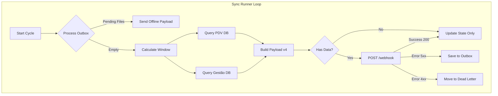

# PDV Sync Agent v4.0 - Technical Deep Dive

Este documento detalha a arquitetura interna, fluxo de dados e mecanismos de resiliência da versão 4.0 do agente.

## 1. Stack Tecnológico

| Componente | Tecnologia | Versão | Justificativa |
|------------|------------|--------|---------------|
| **Runtime** | Python | 3.11+ | Linguagem core. |
| **Build** | PyInstaller | 6.x | Gera executável standalone (sem dependência de Python no cliente). |
| **Database** | pyodbc | 5.0.1 | Driver ODBC padrão de mercado para SQL Server. |
| **HTTP** | requests | 2.31+ | Cliente HTTP robusto. |
| **Resiliência** | tenacity | 8.2+ | Implementa Exponential Backoff e Jitter para retries. |
| **Validação** | Pydantic | 2.5+ | Validação de schema e serialização JSON de alta performance (Rust-based). |
| **Config** | pydantic-settings | 2.1+ | Carregamento robusto de variáveis de ambiente (`.env`). |
| **Logging** | loguru | 0.7+ | Logging thread-safe, rotacionado e estruturado. |
| **Automação** | PowerShell | 5.1+ | Scripts de instalação e update compatíveis com Windows 7+. |

---

## 2. Arquitetura Dual-Database

A v4.0 introduziu a capacidade de conectar em duas instâncias/bancos SQL Server simultaneamente para compor o payload.

### Conexão 1: Frente de Caixa (`HiperPdv`)
*   **Foco:** Vendas rápidas (Cupom Fiscal/NFC-e), Abertura/Fechamento de Caixa, Sangrias.
*   **Tabelas Chave:** `operacao_pdv`, `item_operacao_pdv`, `finalizador_operacao_pdv`, `turno`, `usuario`.
*   **Query Profile:** Busca operações com `operacao=1` (Venda), `operacao=9` (Fechamento/Redução Z) e `operacao=4` (Falta de Caixa).

### Conexão 2: Gestão/Retaguarda (`Hiper`)
*   **Foco:** Vendas faturadas, NFe emitida no escritório, Devoluções de retaguarda.
*   **Diferenças de Schema:**
    *   Usa `id_filial` em vez de `id_ponto_venda`.
    *   Turnos possuem UUIDs independentes do caixa.
    *   Troco (`ValorTroco`) fica na tabela `operacao_pdv`, não nos finalizadores.
*   **Filtro Crítico:** `WHERE origem = 2` (Operações originadas na Retaguarda/Loja).

---

## 3. Estrutura de Dados (Payload v4)

O payload é um JSON estrito validado pelo Pydantic (`src/payload.py`).

### Campos Principais
*   `schema_version`: "4.0.0"
*   `event_type`:
    *   `sales`: Apenas vendas novas.
    *   `turno_closure`: Apenas fechamento de turno (sem vendas novas).
    *   `mixed`: Vendas + Fechamento.
*   `integrity`:
    *   `sync_id`: Hash SHA256(`store_id` + `from_dt` + `to_dt`). Garante idempotência no servidor.
    *   `warnings`: Lista de strings (ex: "GESTAO_DB_FAILURE" se o banco de gestão cair, mas o PDV continuar funcionando).

### Detalhe de Venda (`SaleDetail`)
Normaliza a estrutura de venda, independente se veio do Caixa ou Gestão:
*   `canal`: "HIPER_CAIXA" ou "HIPER_LOJA".
*   `itens`: Lista de produtos com `line_id` estável.
*   `pagamentos`: Lista de meios de pagamento.

### Detalhe de Turno (`TurnoDetail`)
Contéudo rico para auditoria de quebra de caixa:
*   `totais_sistema`: O que o agente calculou somando `op=1`.
*   `fechamento_declarado`: O que o operador digitou (`op=9`).
*   `falta_caixa`: Diferença registrada (`op=4`).

---

## 4. Mecanismos de Resiliência

### Smart Outbox
Se a API falhar (Timeout, DNS, 500, 503):
1.  O payload JSON é salvo em `data/outbox/[timestamp]_[sync_id].json`.
2.  O agente **marca o ciclo como sucesso localmente** (avança o ponteiro `last_sync_to`).
    *   *Por que?* Para não travar a extração de dados novos. O backlog se acumula no disco, não na memória ou no banco.
3.  No próximo ciclo, a **primeira ação** é processar a Outbox.
    *   Arquivos muito antigos (> 7 dias) são movidos para `dead_letter` (TTL).
    *   Arquivos com > 50 retries são movidos para `dead_letter`.

### Dead Letter Queue
Se a API rejeitar o payload (400 Bad Request, 422 Validation Error):
1.  O agente **não retenta**. Erros 4xx indicam que o dado é inválido e retentar é inútil.
2.  O arquivo é movido para `data/dead_letter/` para análise post-mortem.
3.  Isso evita "poison messages" que bloqueiam a fila para sempre.

### Estado Persistente (`state.json`)
*   Arquivo atômico que guarda apenas: `{"last_sync_to": "ISO8601"}`.
*   Se o arquivo corromper, o agente inicia uma janela "fresh" (últimos 10 min) automaticamente.

---

## 5. Deployment e Updates

### Instalação (`install.ps1`)
1.  **ODBC:** Verifica/Instala "ODBC Driver 17 for SQL Server".
2.  **SQL User:**
    *   Tenta criar usuário `pdv_sync` via Windows Auth (se o usuário logado for admin do SQL).
    *   Fallback: Pede credenciais `sa` se falhar.
3.  **Config:** Auto-detecta `STORE_ID_FILIAL` varrendo a tabela `operacao_pdv` (origem=2).
4.  **Serviço:** Cria Task Scheduler rodando como `NT AUTHORITY\SYSTEM` (HighestPrivileges).

### Smart Update (`update_v4.ps1`)
1.  **Backup:** Copia pasta atual para `data/backup/v_YYYYMMDD_HHMMSS`.
2.  **Migração .env:** Lê o `.env` antigo e injeta as chaves novas da v4 (`SQL_DATABASE_GESTAO`, `STORE_ID_FILIAL`) sem perder as credenciais existentes.
3.  **Atomic Swap:** Para o processo, substitui binários, inicia processo.
4.  **Health Check:** Monitora o log por 10 segundos.
    *   Se detectar "Login failed" ou "Process died" -> **Auto Rollback**.
    *   Restaura binários e `.env` do backup automaticamente.
